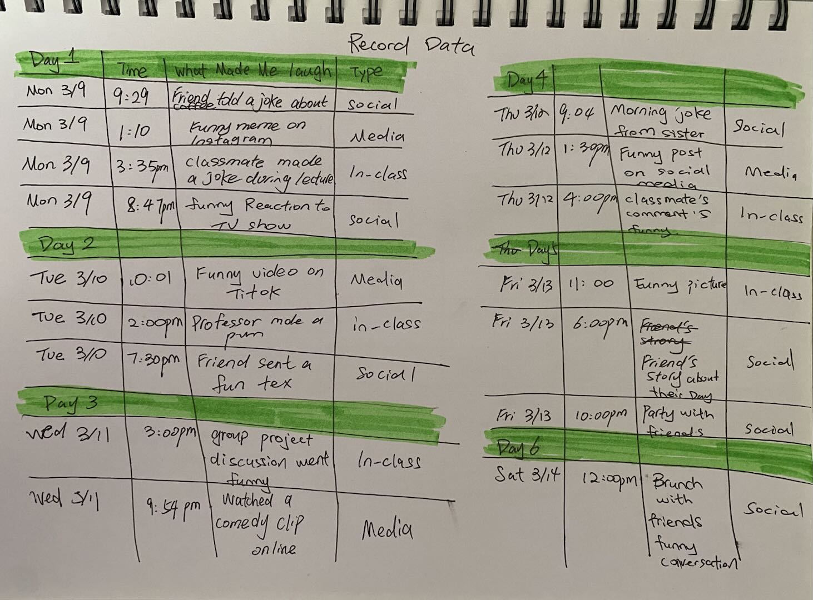
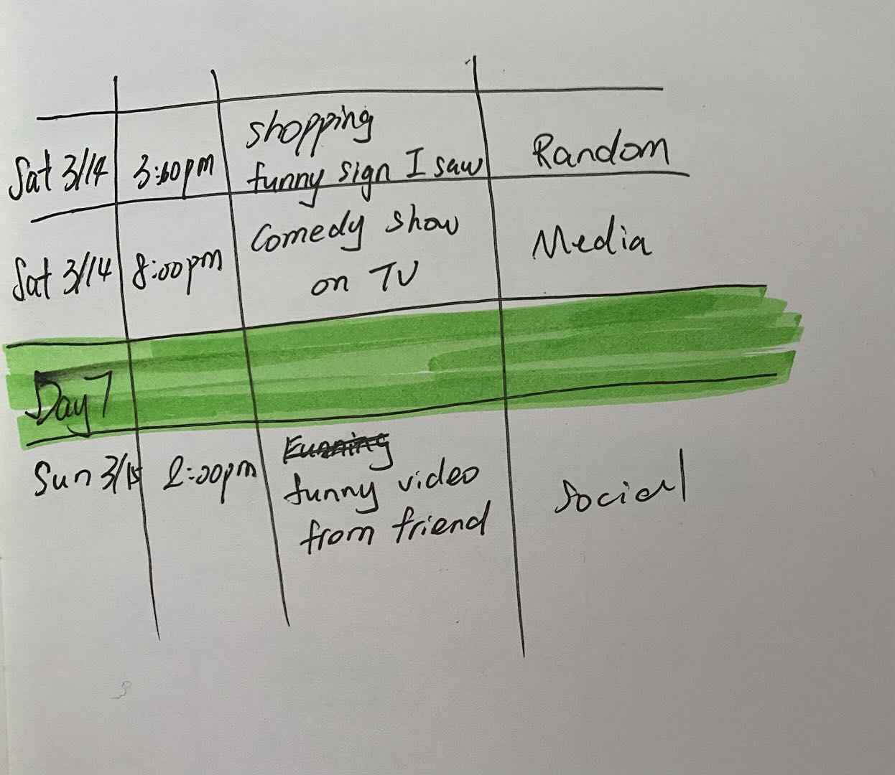
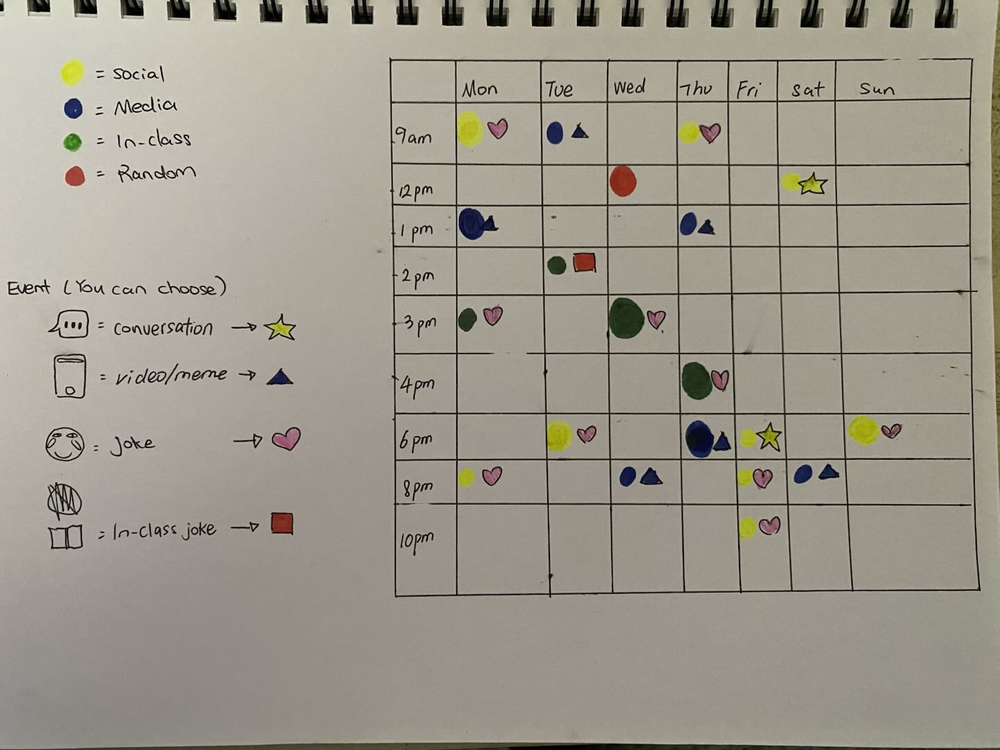

# Week 01

[← Back to Home](../index.md)

## Documentation 

### What I Chose to Track: What Makes Me Laugh and When

For this week's data portrait, I chose to track **what makes me laugh and when** throughout the week. Laughter is something I experience almost every day but never really stopped to notice or analyze. I was curious about what triggers my laughter and whether there are patterns in when I laugh the most.

### Why I Chose This Topic

I selected this topic because laughter is a universal human experience, yet we rarely think about *why* we laugh or *what* makes us laugh. This topic aligns well with the course's emphasis on personal, humanistic data—laughter is emotional, social, and deeply personal. It also allowed me to collect data that was specific, observable, and easy to record without needing any special tools. By tracking what makes me laugh, I hoped to discover patterns in my daily life that I normally overlook.

### Data Collection Process

I kept a small notebook with me and recorded every time I laughed throughout the day. For each entry, I noted the time of day, what made me laugh, and who was involved. I used simple categories to classify what made me laugh:
- Social (friends, conversations)
- Media (videos, memes, social media)
- In-class (professor jokes, classmate comments)
- Random (unexpected moments)

### Visualisation Approach

For my hand-drawn data portrait, I created a weekly timeline showing each day from morning to night. Each time I laughed, I drew a colored dot on the timeline. The color represents where the laughter happened:
- **Yellow** = Social laughter (with friends, in conversation)
- **Blue** = Media laughter (videos, memes, social media)
- **Green** = In-class laughter (professor jokes, discussions)
- **Pink** = Random/Unexpected laughter

The size of each dot represents how hard I laughed (small = chuckle, large = big laugh). On the back of my card, I created a legend explaining my color and size coding system.

## My Weekly Laughter Data

### Data Collection Table

| Day | Time | What Made Me Laugh | Type |
|-----|------|-------------------|------|
| Mon 3/9 | 9:29am | Friend told a joke about coffee | 🟡 Social |
| Mon 3/9 | 1:10pm | Funny meme on Instagram | 🔵 Media |
| Mon 3/9 | 3:35pm | Classmate made a joke during lecture | 🟢 In-class |
| Mon 3/9 | 8:47pm | Funny reaction to TV show | 🟡 Social |
| Tue 3/10 | 10:01am | Funny video on TikTok | 🔵 Media |
| Tue 3/10 | 2:00pm | Professor made a pun | 🟢 In-class |
| Tue 3/10 | 7:30pm | Friend sent a funny text | 🟡 Social |
| Wed 3/11 | 3:00pm | Group project discussion went funny | 🟢 In-class |
| Wed 3/11 | 9:54pm | Watched a comedy clip online | 🔵 Media |
| Thu 3/12 | 9:04am | Morning joke from roommate | 🟡 Social |
| Thu 3/12 | 1:30pm | Funny post on social media | 🔵 Media |
| Thu 3/12 | 4:00pm | Classmate's comment funny | 🟢 In-class |
| Fri 3/13 | 11:00am | Funny picture | 🟢 In-class |
| Fri 3/13 | 6:00pm | Friend's story about their day | 🟡 Social |
| Fri 3/13 | 10:00pm | Party with friends - lots of laughing | 🟡 Social |
| Sat 3/14 | 12:00pm | Brunch with friends - funny conversations | 🟡 Social |
| Sat 3/14 | 3:00pm | Shopping - funny sign I saw | 🔴 Random |
| Sat 3/14 | 8:00pm | Comedy show on TV | 🔵 Media |
| Sun 3/15 | 2:00pm | Funny video from friend | 🟡 Social |

### Legend

- 🟡 **Yellow** = Social (friends, conversations)
- 🔵 **Blue** = Media (videos, memes, social media)
- 🟢 **Green** = In-class (professor jokes, discussions)
- 🔴 **Pink** = Random/Unexpected moments

### Data Collection Process## Images & Media

## Images & Media

*Hand-drawn data portrait showing what makes me laugh throughout the week*

*Data table version showing all recorded laughter events*

*This data portrait tracks when I laugh and what makes me laugh over one week (Monday March 9 to Sunday March 15).
Total: 21 laughter events recorded throughout the week*

## Reflection

### What did you choose to track, and why?

I chose to track **what makes me laugh and when** because laughter is something I experience daily but never really think about. I was curious about the patterns in my laughter—when do I laugh the most? What triggers it? Who makes me laugh the most? This topic also felt aligned with the course's humanistic approach to data, as laughter is emotional, social, and deeply personal.

### What was it like to collect and visualise this data?

Collecting the data was surprisingly fun and eye-opening. Every time I laughed, I tried to pause and note what caused it. Some moments were easy to record, like watching a funny video or hearing a joke from a friend. However, other moments were spontaneous conversations that I had to remember afterward, which made me more aware of the small moments of joy throughout my day. Visualising the data was the most creative part of this exercise—I invented a color system based on where the laughter occurred and used dot size to show intensity.

### What did you notice that I wouldn't have otherwise?

I noticed that my **laughter peaks in the afternoon** (around 3-4pm) when energy is low and people make jokes to stay awake in class. I also realised that **social laughter is the most intense**—my biggest laughs came from interactions with friends, not from watching videos alone. On weekends, I laugh more freely and more often, especially Saturday night when I'm relaxed and spending time with friends.

### What choices did you make for your data collection? What does it emphasise? What is left out?

I recorded the time, trigger, and who was involved whenever I laughed. This emphasises the social context of laughter—who I'm with and what we're doing together. The colour system shows where laughter happens most often. What is left out: body language, the full conversation context, and how laughter affected my mood afterward.

### How does this exercise relate to data humanism and the *Dear Data* project?

This exercise relates directly to **data humanism** and the *Dear Data* project. Like Giorgia Lupi advocates, I treated my personal data with empathy and humanity—laughter is imperfect, spontaneous, and hard to capture in numbers. My hand-drawn portrait follows the *Dear Data* tradition of making everyday moments meaningful through personal visualisation.

### Any other reflections?

This exercise made me more grateful for the small moments of joy in my day. Before, I didn't realise how much laughter is woven into my daily life until I started tracking it. Data doesn't have to be serious to be meaningful—sometimes it's about celebrating the happy moments and appreciating the people who make us laugh.

---
## AI Usage Statement

*Document any use of AI tools under an AI Usage Statement heading. Explain which tools you used and describe how you used them. Reference any AI-generated content (see [QuickCite](https://auckland.libguides.com/referencing-generative-ai-tools) for guidance).*
