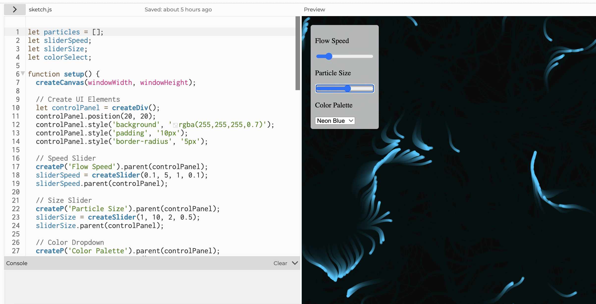

# Week 02

[← Back to Home](../index.md)

## Documentation

### What I Chose to Work With

I decided to use the same data from my first week about what makes me laugh and when I laugh because I already knew the information very well. I kept the same colors for the different categories like yellow for social and blue for media so that my new project matches my old drawing. Using the same data helped me focus more on learning how to use the computer code instead of worrying about new information.

For this week, I experient p5.js by following the slides, and here are the pictures:

## Vibe coding activity

<iframe
  src="https://youtu.be/embed/MM_422nqPE8"
  width="560" 
  height="315">
</iframe>

I made a moving picture that looks like a glowing cloud on my computer screen and I used Google Gemini to help me vibe code this project. When I run this code you see many small colored dots that flow like water or smoke in the dark. I used a special math trick called noise to make the movement look very smooth and natural instead of jumpy. You can use the control box I made to change the art while it moves because I added a slider for speed and another slider to change the size of the dots. I also added a menu so you can choose different colors like blue or orange. The dots leave soft trails behind them because the background is a little bit clear which makes it look like a glowing nebula. By writing this code with AI I learned how one blueprint can control hundreds of shapes at the same time to make a complex and interactive scene.

### Iteration 1: "Gorgeous Drawbridge"

The first version of my project is a tool that lets people use buttons to choose what they want to see on the screen. Each button shows a different category of laughter and the colors change when you click them to show if they are on or off. This version is very good because it gives the person looking at it a lot of control and it shows the total count for each type of laughter at the bottom.

### Iteration 2: "Periodic Opossum"

The second version of my project is a timeline that shows the days from Monday to Sunday to help people see when I laugh. Instead of using buttons to hide things this version shows everything at once but organizes the circles by the time of day. This is helpful because it shows if I laugh more in the morning or at night and it helps people see my patterns throughout the whole week.

**Why keep both:**
- "Gorgeous Drawbridge" emphasizes **user control** (viewers choose what to see)
- "Periodic Opossum" emphasizes **temporal patterns** (when do I laugh most?)
- Both represent valid design decisions for different exploration goals

### Tools and Learning

I used an AI tool to help me write the code because I am still learning how to use the programming language called p5.js. I told the AI what I wanted in simple words and it gave me the code to start my project but I had to fix some parts myself when the pictures were not in the right place. This taught me how to make buttons and how to use math to put my data in the correct spots on the screen.

From this process, I learned:
- How to use DOM elements in p5.js (createButton)
- How to use conditional logic to filter data
- How to position elements using time-based coordinates
- That AI-generated code sometimes needs adjustment—initial versions had positioning issues that I had to fix

---

## Images & Media

### Iteration 1: Gorgeous Drawbridge

*Interactive p5.js sketch with toggle buttons for different laughter types*

### Gorgeous Drawbridge record

*Interactive p5.js sketch with toggle buttons for different laughter types*

### Iteration 2: Periodic Opossum

*Timeline-based visualization showing when laughter events occur throughout the week*

---

## Reflection

### My Data Choices
I decided to use the same information from the first week about what makes me laugh and when it happens because I already spent a lot of time collecting this data and I understood it very well. My data has nineteen different times that I laughed and each one shows the day and the time and what made me laugh and the type of laughter it was. I also kept the same colors like yellow for social and blue for media and green for class and red for random things because I wanted it to look the same as my first drawing. Keeping everything the same allowed me to spend my time learning how to make the computer code work instead of trying to find new information to use.

### Choosing Interactive Parts
I made two different versions of my project to show how people can play with the data in different ways. The first version is called Gorgeous Drawbridge and it uses four buttons that let people turn different laughter types on or off to see what they want. The second version is called Periodic Opossum and it uses a timeline to show when I laugh during the week from Monday to Sunday. I chose these two ways because the buttons feel very natural for a user and the timeline helps people see the order of events. Both of these versions use the same data but they help the person looking at it find different kinds of answers.

### What Viewers Can Learn
When people use my interactive project they can see patterns that are very hard to find in a normal hand drawing that does not move. In the first version people can quickly see that social laughter is the most common because they can click the buttons and count the items easily. In the second version people can look at the timeline to see if I laugh more in the morning or the afternoon or if some days are much funnier than others. This kind of active looking is not possible with a paper drawing because a drawing shows everything at the same time and does not let you change the view.

### Using AI Tools
I used a special way of coding with an AI, like Google Gemimi to help me build both of my project versions because I am still a student learning how to use the code. I talked to the AI in regular language to explain what I wanted and it helped me create the first part of the code. This process taught me how to make buttons on a screen and how to use logic to hide or show different pieces of data. I also learned that AI code is not always perfect and I had to fix some mistakes manually when the shapes were not in the right places on my screen.

### Future Ideas
If I had more time to work on this project I would add more features to make it even better for the user. I would like to add a menu where people can choose just one specific day to look at or a slider that changes the view slowly. I also want to add smooth animations so the circles fade in and out when someone clicks a button instead of just appearing quickly. It would also be great if a person could click on a single dot to see a small box with a story about why I was laughing at that exact moment.

### Final Thoughts
This project changed the way I think about showing data because I realized that letting a person interact with a screen tells a story. When a viewer makes choices about what to see they are following their own interest and asking their own questions. My hand drawing from the first week was very personal but these digital versions are more like tools for exploring information. Both ways are very important because they tell different stories about my life using the same data and they show that there are many ways to solve a design problem. Creating two versions helped me understand that one design might focus on categories while another design might focus on time and both are very useful.

---
## Reference
Tutorials Page:
p5.js. (n.d.). Tutorials. Retrieved October 24, 2023, from https://p5js.org/tutorials/

Reference Page:
p5.js. (n.d.). Reference. Retrieved October 24, 2023, from https://p5js.org/reference/

## AI Usage Statement

I used **vibe coding** (Google Gemini) to help generate both iterations of the p5.js sketch. I described my requirements in plain language, reviewed the generated code, and made adjustments as needed.
