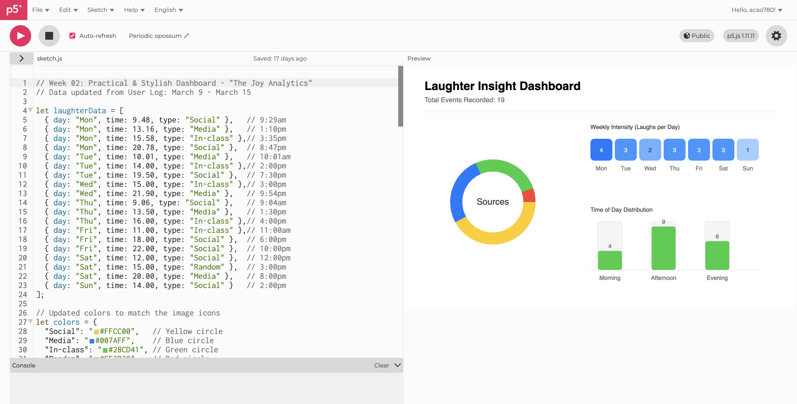
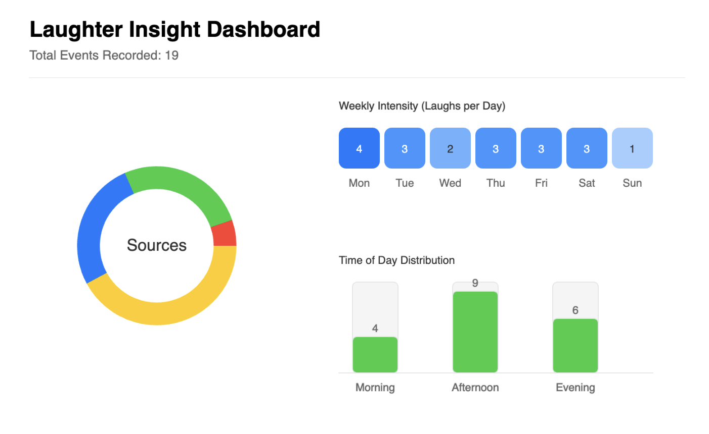

# Week 02

[← Back to Home](../index.md)

## Documentation

### What I Chose to Work With

For this week's interactive data portrait, I chose to continue with the **same data from Week 1**—"what makes me laugh and when". I collected 19 laughter events over one week, each with a day, time, what caused the laughter, and type (Social, Media, In-class, Random). I kept the same color coding system to maintain consistency with my hand-drawn portrait.

For this week, I experient p5.js by following the slides, and here are the pictures:

### Iteration 1: "Gorgeous Drawbridge"

My first iteration is called **"Gorgeous Drawbridge"** — a filter-based interface where users can toggle different laughter types on or off using buttons.

**Key features:**
- Four toggle buttons for each category (Social, Media, In-class, Random)
- Each button shows the count for that category
- Active categories are highlighted in their color; inactive ones are grayed out
- Counter at the bottom shows how many items are currently displayed

**Why this approach:**
- Buttons are familiar and intuitive for users
- The toggle mechanic gives viewers direct control over what they see
- Extends my original visual system from Week 1 (color-coded categories)

### Iteration 2: "Periodic Opossum"

My second iteration is called **"Periodic Opossum"** — a timeline-based dashboard that organizes laughter events by day of the week.

**Key features:**
- Horizontal timeline showing days (Mon-Sun)
- Events displayed as colored circles positioned by time of day
- Visual legend showing category colors
- Shows distribution of laughter types across the week at a glance

**What changed from Iteration 1:**
- Replaced filtering with timeline visualization
- Data is always visible but organized chronologically
- Emphasizes **when** laughter happens, not just **what type**

**Why keep both:**
- "Gorgeous Drawbridge" emphasizes **user control** (viewers choose what to see)
- "Periodic Opossum" emphasizes **temporal patterns** (when do I laugh most?)
- Both represent valid design decisions for different exploration goals

### Tools and Learning

I used **vibe coding** (AI-assisted coding) to create both sketches. I described what I wanted in plain language to an LLM, which generated the initial code structure. This was helpful because I'm still learning p5.js.

From this process, I learned:
- How to use DOM elements in p5.js (createButton)
- How to use conditional logic to filter data
- How to position elements using time-based coordinates
- That AI-generated code sometimes needs adjustment—initial versions had positioning issues that I had to fix

---

## Images & Media

### Iteration 1: Gorgeous Drawbridge

*Interactive p5.js sketch with toggle buttons for different laughter types*

*Interactive p5.js sketch with toggle buttons for different laughter types*

## Gorgeous Drawbridge record

*Interactive p5.js sketch with toggle buttons for different laughter types*

### Iteration 2: Periodic Opossum

*Timeline-based visualization showing when laughter events occur throughout the week*

*Timeline-based visualization showing when laughter events occur throughout the week*
---

## Reflection

### What data and visual aspects from Experiment 1 did you choose to work with, and why?

I chose to work with the **same data from Week 1**—"what makes me laugh and when"—because I had already spent a week collecting this data and understood its structure well. The data includes 19 laughter events with day, time, description, and type. I kept the same color coding system (yellow for Social, blue for Media, green for In-class, red for Random) to maintain consistency with my hand-drawn portrait. This continuity allowed me to focus on learning interactive techniques rather than figuring out a new dataset.

### How did you decide which interactive elements to use?

I created **two iterations** with different interaction models:

- **Iteration 1 ("Gorgeous Drawbridge")**: Four filter buttons because this directly extends my original visual system from Week 1. The buttons let viewers toggle which types they want to see—this felt natural and intuitive.

- **Iteration 2 ("Periodic Opossum")**: A timeline visualization because I wanted to explore a different aspect of the data—*when* laughter happens. This version organizes data chronologically rather than by category.

Both approaches address the same dataset but help viewers answer different questions.

### What can a viewer learn by interacting with your sketch that they couldn't from my hand-drawn portrait?

The interactive sketch reveals **patterns and comparisons** that are hard to see in a static drawing:

- In "Gorgeous Drawbridge": Viewers can instantly see which category is most common (Social: 8 events) by toggling categories and comparing counts.

- In "Periodic Opossum": Viewers can explore temporal patterns—when do I laugh most during the day? Which days are funniest?

This active exploration isn't possible with a hand-drawn portrait where all information is visible at once.

### Did you use vibe coding or other tools in your process? What did you learn from this?

Yes, I used **vibe coding** (AI-assisted coding) to build both iterations. I described my requirements in plain language to an LLM, which generated the initial code. From this process, I learned:
- How to use DOM elements in p5.js (createButton)
- How to filter data using conditional logic
- How to position elements using time-based coordinates
- That AI-generated code sometimes needs adjustment—initial versions had positioning issues that I had to fix manually

### What would you develop further with more time?

If I had more time, I would add:
- **Day selection** - A dropdown or slider to filter by specific days of the week
- **Smooth animations** - Items could fade in/out when toggling categories
- **Click for details** - Show more information (what caused the laughter) when clicking on each data point
- **Mobile-friendly design** - Make the layout work better on smaller screens

### Any other reflections?

This exercise changed how I think about data visualisation. I realised that **interaction itself tells a story**—the choices viewers make when exploring data reveal their own interests and questions. An interactive visualisation doesn't just present answers; it invites viewers to ask their own questions.

I also reflected on the relationship between my hand-drawn Week 1 portrait and these digital Week 2 versions. The hand-drawn version is personal and artistic, while the interactive versions are functional and exploratory. Both are valuable—they serve different purposes and tell different stories about the same data.

Creating two iterations ("Gorgeous Drawbridge" and "Periodic Opossum") helped me understand that there are multiple valid solutions to the same design problem. Each iteration emphasizes different aspects of the data—category vs. time—and therefore supports different kinds of questions.

---

## AI Usage Statement

I used **vibe coding** (LLM-assisted coding) to help generate both iterations of the p5.js sketch. I described my requirements in plain language, reviewed the generated code, and made adjustments as needed.
