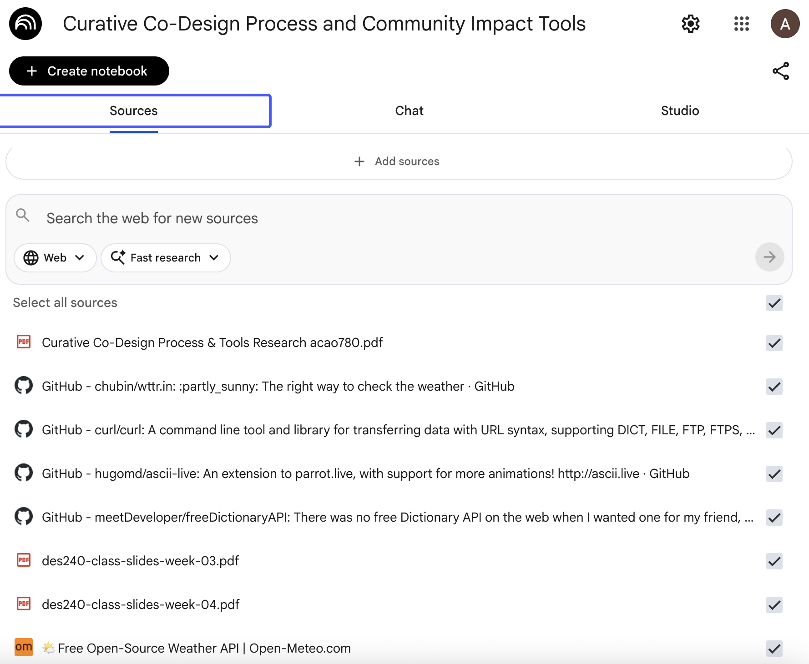
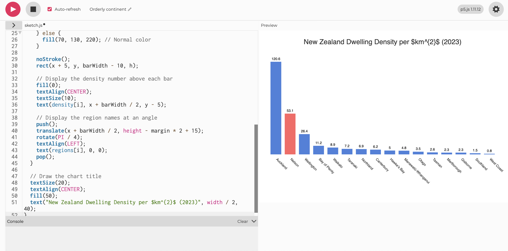
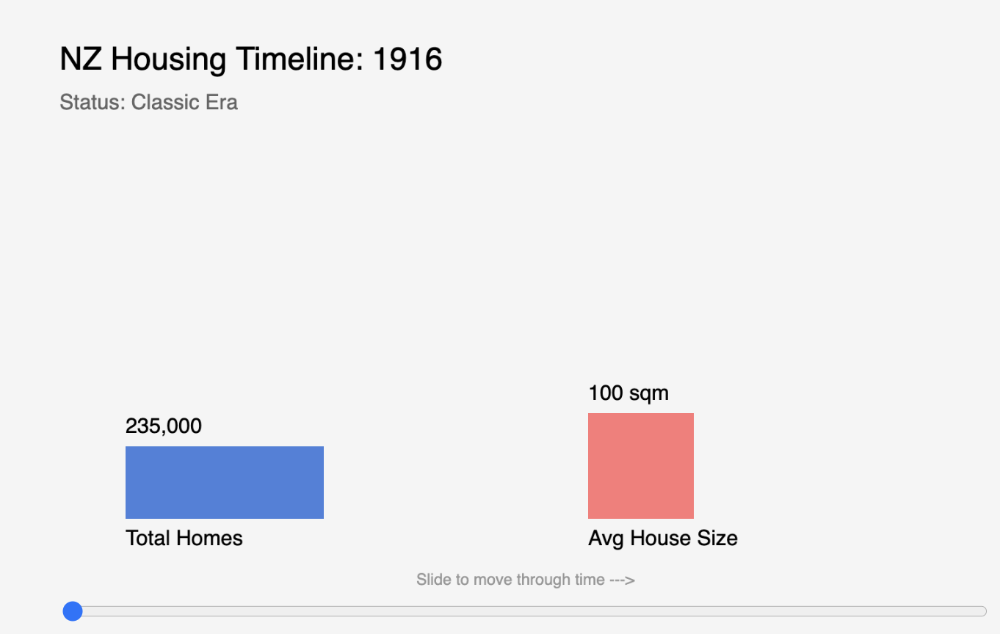

# Week 04

[← Back to Home](../index.md)

## Documentation 

### Activity one

ChatGPT is like a smart online assistant that needs the internet and keeps your data on its servers, while Ollama is a private tool that runs directly on your own computer without needing any internet connection. Because ChatGPT uses powerful remote computers, it is often smarter and faster, but Ollama is completely free and keeps all your information 100% private. Most students use ChatGPT for quick help with research and writing, but developers often prefer Ollama because it works offline and protects their personal code.

Using ChatGPT feels like renting a high-end supercomputer because it is incredibly fast and smart, but you have to trust a big company with your private data. In contrast, using Ollama gives you total sovereignty because the AI lives on your hardware, even though it might be slower or less capable depending on your computer's power. It is a classic tradeoff where you choose between the massive "brain power" of the cloud and the ultimate "privacy and control" of your own machine.

### Activity two

## Independent Study: AI-Assisted Data Exploration

### Auckland Housing Prices — relevant to life in Aotearoa, rich data for visualising

I chose Auckland housing data because housing affordability directly affects my life as a student in NZ. It's not abstract — it's personal.

I started by uploading several online links and official files from the Housing New Zealand website into my NotebookLM account. This was a very helpful first step because it allowed the AI to read the specific rules and guides that are used in my country. By giving the computer these documents, I made sure that any answers it gave me were based on real information from the government instead of just general facts from the internet.

After all my files were uploaded, I asked the AI several questions to help me understand the housing system in a much clearer way. I asked some questions to understand more about the house system. The AI was able to take the very long and complicated sentences from the documents and turn them into simple answers that were much easier for me to read and remember.

- "What's in this dataset?"
- "What stories might it contain?"
- "What biases or gaps are present?"
- "Who collected this data, and for what purpose?"
...

### Visualisations
I started by having a long conversation with NotebookLM to help me understand the housing information and I asked it to give me a clear list of the data ranked by each region. This was a very important step because housing data can be very messy and hard to read when it is just in a big file. By asking the AI to organize the numbers for me, I was able to see which parts of New Zealand have the most housing needs and which parts have the least.

Once I had the clean data from the first AI, I took those numbers to another tool called Ollama and asked it to write the p5.js code for a bar chart. I wanted to turn the boring numbers into a picture that is easy for anyone to understand at a single glance. The code that Ollama gave me created a colorful chart where each bar represents a different region and the height of the bar shows the amount of housing resources available there.

I did not stop at just one chart because I wanted to see the information in many different ways to make sure I understood everything perfectly. I repeated this method several times to create more types of graphs like timelines that show how housing has changed over the years. This process of using one AI for the facts and another AI for the art helped me turn a difficult government document into a beautiful collection of visual data that tells a clear story.

## Reflection
Using an AI helps us find patterns very quickly like the fact that house prices are lower now than they were in the year 2021. However this speed can be shallow because the computer does not always understand the deep history of Māori housing or the cultural background of New Zealand. Without a person giving the computer very specific instructions the AI will miss how important data is for Māori communities as a tool for their own future.

We must use the ideas of Data Feminism to ask who is being left out of these government reports because the missing information tells a big story. There are two big gaps where the records are empty like the missing updates for people who need social housing and reports that show zero children being helped in some areas. When the government keeps perfect records for investors but says the data for the most vulnerable people is unavailable it shows that the system has a specific set of priorities that favors money over people.

The way we design our charts can show how urgent the housing problem is like using a timeline to show that there are too many houses on the market and not enough buyers. This problem is not just about money but also about the physical size of our homes which are getting much smaller every year. I would like to build a project where people can touch blocks to feel how a house in 2011 was much larger than the tiny homes we are building in 2024.

Final Reflections
In the end this data proves that information is never neutral and it always carries the bias of the people who collected it. Most of the files I found were made for investors who want to buy property and make a profit rather than for the people who just need a home. The AI is not a neutral observer and it needs a human to direct it so we can look past the averages and see the truth about the housing crisis in Auckland.

## Reference

Tutorials Page: p5.js. (n.d.). Tutorials. Retrieved October 24, 2023, from https://p5js.org/tutorials/

Reference Page: p5.js. (n.d.). Reference. Retrieved October 24, 2023, from https://p5js.org/reference/

### AI Tools & Software

NotebookLM
Google. (2024). NotebookLM [Large language model]. https://notebooklm.google.com/

Ollama
Ollama. (2024). Ollama [Computer software]. https://ollama.com/

Google Gemini
Google. (2024). Gemini (Version 1.5 Pro) . https://gemini.google.com/

Google. (2026). ChatGPT (GPT-4o) [Large language model]. https://chatgpt.com/

### Auckland Housing & Data Sources
Knowledge Auckland: Housing (Topic Page)

Auckland Council. (n.d.). Housing. Knowledge Auckland. Retrieved April 2, 2026, from https://knowledgeauckland.org.nz/housing/

Auckland Monthly Housing Update: Datasheet

Auckland Council. (2026). Auckland monthly housing update: Datasheet [Data set]. Knowledge Auckland. https://knowledgeauckland.org.nz/publications/auckland-monthly-housing-update-datasheet

Auckland Monthly Housing Update: May 2025

Auckland Council. (2025). Auckland monthly housing update: May 2025 (Revised October 2025). Knowledge Auckland. https://knowledgeauckland.org.nz/publications/auckland-monthly-housing-update-may-2025/

Opes Partners: Auckland Property Market

Opes Partners. (2024). Auckland property market: Prices, rents & yields. https://www.opespartners.co.nz/property-markets/auckland

HUD: Local Housing Statistics (Key Data)

Ministry of Housing and Urban Development. (n.d.). Key data: Local housing statistics. https://www.hud.govt.nz/stats-and-insights/local-housing-statistics/key-data

Housing First: Data and Evidence

Housing First Auckland. (n.d.). Data and evidence. https://www.housingfirst.co.nz/data-and-evidence/?order=DESC%2Bpost_date&posttype=post&cat%5B%5D=data-and-evidence

Infometrics: Auckland House Values

Infometrics. (2026). Auckland: House values - Regional economic profile [Interactive data]. https://regions.infometrics.co.nz/auckland/income-and-housing/house-values

### Stats NZ Report & CSV Files

Stats NZ. (2025). Housing in Aotearoa New Zealand: 2025. https://www.stats.govt.nz/reports/housing-in-aotearoa-new-zealand-2025/

CSV Data Files (Figure 0.1 to 1.8)
When citing the specific data files from the report:

Stats NZ. (2025). Housing in Aotearoa New Zealand: 2025 – CSV [Data set]. https://www.stats.govt.nz/reports/housing-in-aotearoa-new-zealand-2025/

## AI Usage Statement
I used vibe coding (Google Gemini) to help generate both iterations of the p5.js sketch. I described my requirements in plain language, reviewed the generated code, and made adjustments as needed.
