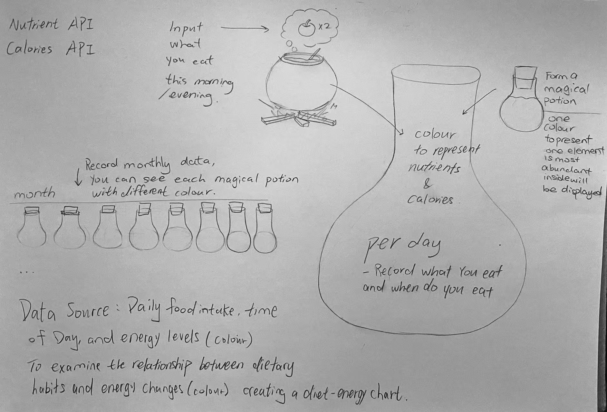
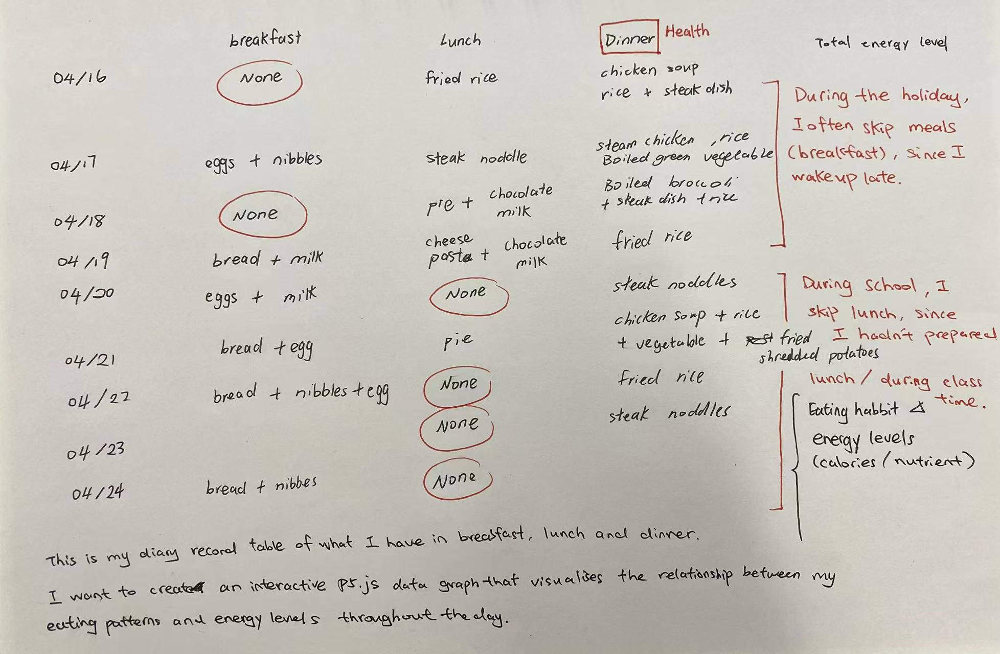

# Week 05

[← Back to Home](../index.md)

## Documentation 

### Review and Reflect

During this unit, I experimented with multiple approaches to data representation:

**Week 1**: Hand-drawn data portrait tracking "what makes me laugh and when" — 19 events recorded over one week, using colored dots where dot size showed laughter intensity.

**Week 2**: Interactive p5.js visualisations — I created two versions: "Gorgeous Drawbridge" (toggle buttons to filter by laughter type) and "Periodic Opossum" (timeline view showing when laughter occurs across the week). I used vibe coding with Google Gemini to learn DOM elements and conditional logic.

**Week 3**: Live API data integration — I worked with Open-Meteo weather API, modifying code to visualise wind, temperature, and humidity. I also created a "Live Moon Phase Visualisation" that shows real-time moon stages with twinkling stars. 

**Week 4**: AI-assisted data exploration — I compared ChatGPT (cloud-based, external data storage) with Ollama (local, privacy-first). Using NotebookLM, I explored Auckland housing data from NZ.

I found the data humanism approach from Week 1 most engaging — treating personal data with empathy, capturing not just what happened but the emotional context. Moving from p5.js "vibe coding" to Live API experiments taught me how protocols transform invisible wind and moon phases into art. I aim to explore Data Humanism and the Datafication of Everyday Life. From these experiments, I learned that data is never neutral — it carries the bias of whoever collected it and for what purpose, like the housing data exploration was especially powerful: complete data for investors, but gaps for vulnerable populations. 

From these experiments, I learned that personal data can reveal patterns we normally miss — like when I laugh most. how certain foods affect my energy. This will inform my project by tracking my eating habits and energy levels to discover my personal food-energy relationship.

### Thematic Focus and Data Sources

My project focuses on the relationship between eating habits and energy levels (calories and nutrients) — specifically, what I eat, when I eat, and how energetic I feel throughout the day.

This is relevant to me as a student: I often skip meals when busy, rely on coffee for energy, or eat at irregular times. I want to see if there are patterns — does eating breakfast improve my morning energy? Does late-night snacking affect next-day focus?

For data, I will self-record what I eat (meal type, time, approximate portion) and my energy level (1-10 scale) at different times of day. This is personal, manually collected data — no APIs needed. I'll track for 2-3 weeks to get enough data points. In addition, the food’s nutrients and calories are also recorded as collected data, and it needs to be real data, so APIs needed.

### Visualisation & Impact

My visualisation will be an interactive website (p5.js) showing my eating patterns and energy levels across the day. 

I will create an interactive p5.js data graph that visualises the relationship between my eating patterns and energy levels throughout the day. Users can explore how different meals affect my energy through interactive graphs and time-based animations. This visualisation demonstrates the tangible impact of dietary choices on daily performance and wellbeing, making abstract data personally meaningful and actionable.

## Images & Media

### Reference

API Ninjas (Nutrition API) API Ninjas. (n.d.). Nutrition API documentation. https://api-ninjas.com/api/nutrition#nutrition-endpoint

Edamam (Recipe Search API) Edamam. (n.d.). Recipe Search API developer portal. https://developer.edamam.com/recipe-demo

U.S. Department of Agriculture (FoodData Central API) U.S. Department of Agriculture. (n.d.). FoodData Central API guide. https://fdc.nal.usda.gov/api-guide

## AI Usage Statement

*Document any use of AI tools under an AI Usage Statement heading. Explain which tools you used and describe how you used them. Reference any AI-generated content (see [QuickCite](https://auckland.libguides.com/referencing-generative-ai-tools) for guidance).*
