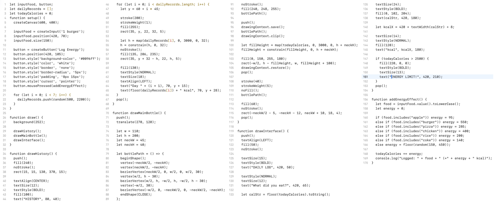
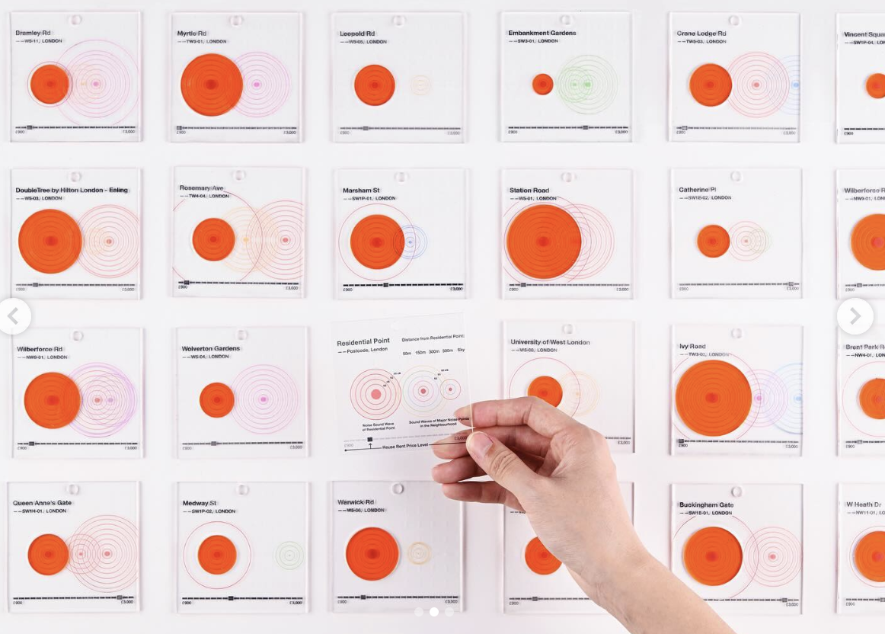
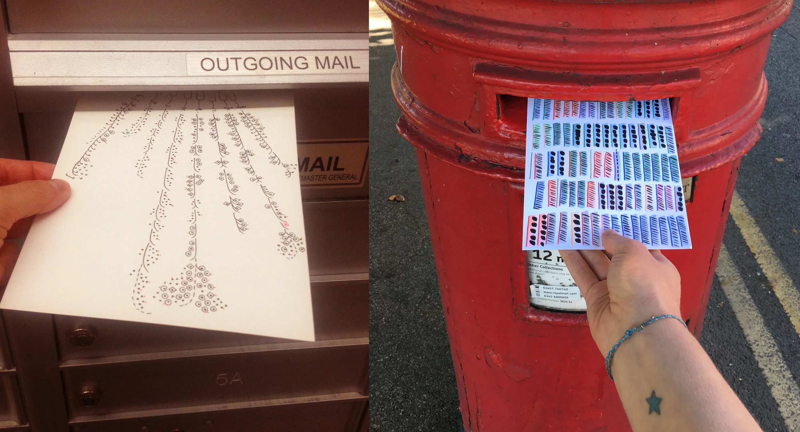
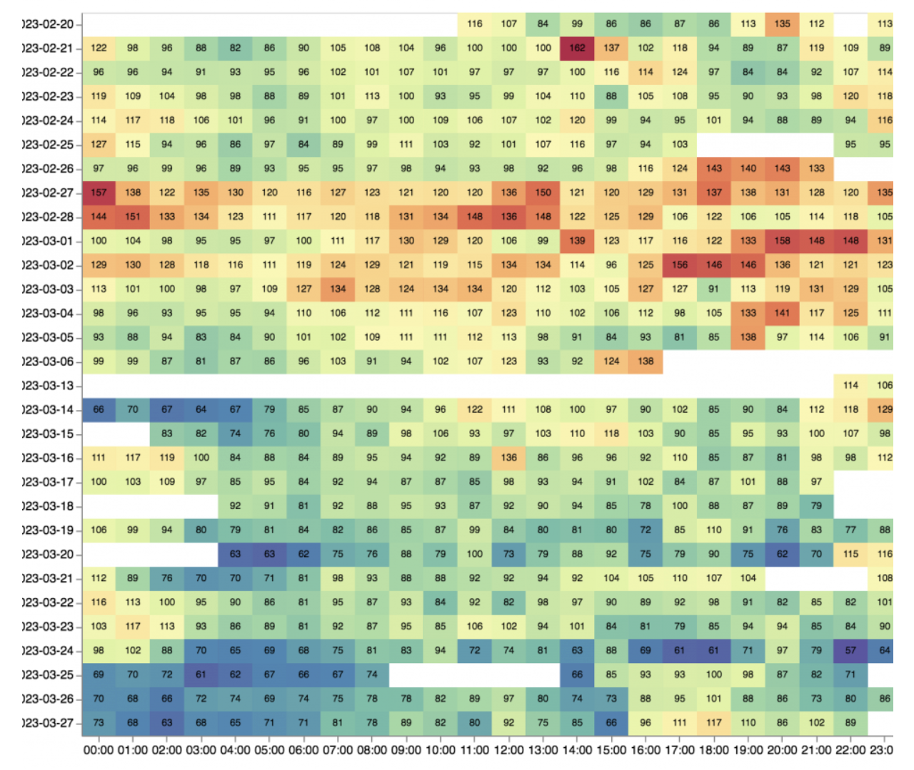
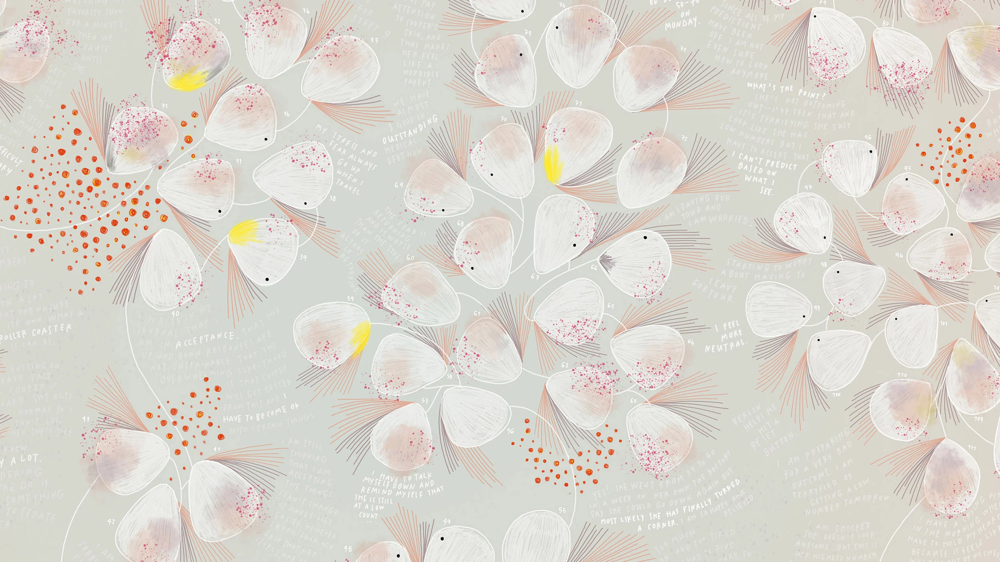
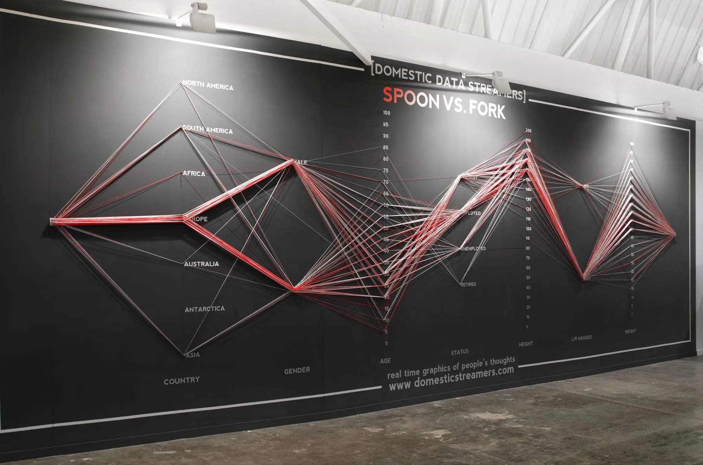

# Week 06

[← Back to Home](../index.md)

## Documentation 
During the Week 6 proposal consultation, I introduced my topic to the instructor. I explained my plan to create a food diary that tracks both my eating behavior and daily caloric intake. My purpose for recording this data is to remind myself to take care of my body. My motivation stems from an experience last year when a medication I was taking caused a loss of appetite and a dislike for meat. My weight dropped from 53kg to below 50kg, which left me feeling exhausted and unhealthy.

I began recording my data on April 16th. Through this process, I discovered that I often skip breakfast during holidays and occasionally skip lunch on school days. This pattern is a significant concern for my future health, especially since my grandfather suffered from a stomach disease caused by food scarcity during his childhood. By tracking my energy intake and monitoring my behaviors, I aim to create a visual data design that reminds me to prioritize my well-being and conveys the importance of taking care of one's body through healthy daily eating.

The purpose of my project is to remind people to take care of their bodies. By showing my own eating habits, I want to raise awareness about the importance of regular meals. I believe that small behaviors, like skipping breakfast, can add up to big health problems over time.

### Current Progress and Development 

I am using p5.js to design the visual interface. Below are the initial images and code from my Week 5 report, representing the rough data visualization from the planning stage. Following the proposal consultation, I am now focused on further developing this idea. The first step in the development phase is to find a usable API that can be integrated into my project. Currently, the nutritional data for my p5.js visualization does not come from a standard nutrition API; instead, I am using Google Gemini to query the energy content of foods. At this stage, I am collecting nutritional data manually, but my next step is to find a functional API to automate this process within the visualization.

### Video & Code

<iframe src="https://www.youtube.com/embed/ZtuKyqvnCUM" width="560" height="315"> </iframe>

Below are the P5.JS code: 

 

## 1. Data Exploration 

In this phase of my research, I have been collecting personal dietary entries since April 16th. I began by establishing a structured dataset that includes dates, meal times, and specific food content. However, while auditing this data, I discovered that the records have significant limitations in terms of accuracy. Because I lack precise measurements for food quantities, my calorie estimations remain somewhat subjective. Additionally, I recognize that my current dataset is limited to my own experience and lacks broader social representativeness.
More importantly, this recording process has clearly revealed my long-standing "meal skipping" behavior. I noticed a consistent pattern of skipping breakfast on holidays and ignoring lunch during busy school days. For me, this data is more than just numbers; it represents a significant health risk, especially given my family history of gastrointestinal diseases.

Because of these findings, I want to shift the focus of my project. It is moving from being a simple "personal diary" to becoming a "social intervention tool." By revealing the behavioral vulnerabilities hidden within my own data, I aim to create a design that raises public awareness about the importance of regular eating habits and prioritizing one's well-being.

For the next stage of my project, I need to calculate my daily calorie intake through further research and problem-solving. I am currently exploring two ways to get this nutritional data: using a nutrition API like USDA FoodData Central or Edamam, or querying Google Gemini for estimated values. My current dataset, which includes the date, meal type, and food items, will serve as the initial foundation, but I plan to add the caloric content after completing this research.

As I review my current spreadsheet, I have realized some significant limitations. First, this is an individual test case focused only on myself. I’ve realized that my data isn't enough for further development yet; I need more participants and more data records to create a strong pattern that truly shows why healthy eating is so significant. Second, my entries lack exact portion sizes, making my calorie estimations imprecise. Finally, the data doesn't capture the "why" behind my behavior—the reasons I skip meals, whether it's due to my mood or my busy school schedule.

Because of these limitations, my project direction has shifted. Instead of a purely digital visualization in p5.js, I want to take a hybrid narrative approach that combines digital work with handmade visual data. I need to do more research, not just on my own records, but also online to find APIs and data that relate to the message I want to convey. To address these gaps and create a stronger foundation for my project, I have decided to redo my data collection process.
The data shows the food and dairy intakes of breakfast, lunch and dinner, began on 16th of April and end on 9th of June. 

### 饮食与能量状态记录表 (04/16 - 06/09)

| 日期 (Date) | 状态 (Status) | 早餐 (Breakfast) | 午餐 (Lunch) | 晚餐 (Dinner) | 卡路里 (kcal) | 能量水平 (Energy 1-10) |
| :--- | :--- | :--- | :--- | :--- | :--- | :--- |
| **04/16** | Holiday | None | Fried rice | chicken soup, rice + steak dish | 1400 | 5 |
| **04/17** | Holiday | eggs + nibbles | steak nodolle | steam chicken, rice, Boiled green vegetable | 2100 | 8 |
| **04/18** | Holiday | None | pie + chocolate milk | Boiled broccoli + steak dish + rice | 1600 | 6 |
| **04/19** | Holiday | bread + milk | cheese pasta + chocolate milk | fried rice | 2200 | 9 |
| **04/20** | School | eggs + milk | None | steak nodolles | 1100 | 3 |
| **04/21** | School | bread + egg | pie | chicken soup + rice + vegetable + rest fried shredded potatoes | 1900 | 7 |
| **04/22** | School | bread + nibbles + egg| None | Fried rice | 1200 | 4 |
| **04/23** | School | None | None | steak nodolles | 800 | 2 |
| **04/24** | School | bread + nibbes | None | None | 500 | 1 |
| **04/25** | Holiday | None | Fried rice | steak dish + rice + vegetable | 1300 | 5 |
| **04/26** | Holiday | None | cheese pasta + milk | steam chicken, rice | 1450 | 6 |
| **04/27** | School | eggs + milk | None | fried rice | 1050 | 4 |
| **04/28** | School | bread + egg | None | chicken soup + rice + broccoli | 1100 | 4 |
| **04/29** | School | bread + nibbles | pie | steak nodolles | 1750 | 7 |
| **04/30** | School | eggs + milk | None | steam chicken, rice, Boiled green vegetable | 1200 | 4 |
| **05/01** | School | bread + milk | None | Fried rice + eggs | 1150 | 4 |
| **05/02** | Holiday | None | pie + chocolate milk | Boiled broccoli + steak dish + rice | 1600 | 6 |
| **05/03** | Holiday | bread + nibbles | Fried rice | chicken soup, rice + vegetable | 1800 | 8 |
| **05/04** | School | eggs + egg | None | steak nodolles | 1000 | 3 |
| **05/05** | School | bread + milk | None | fried rice + steam chicken | 1250 | 4 |
| **05/06** | School | None | cheese pasta | steak dish + rice | 1400 | 5 |
| **05/07** | School | bread + nibbles + egg| None | chicken soup + rice + shredded potatoes| 1350 | 5 |
| **05/08** | School | eggs + milk | None | steak nodolles | 1100 | 4 |
| **05/09** | Holiday | None | Fried rice | steam chicken, rice, Boiled green vegetable | 1350 | 6 |
| **05/10** | Holiday | None | pie + chocolate milk | steak dish + rice | 1500 | 6 |
| **05/11** | School | bread + milk | None | Fried rice | 1000 | 3 |
| **05/12** | School | bread + egg | None | chicken soup, rice + vegetable | 1150 | 4 |
| **05/13** | School | eggs + nibbles | pie | steak nodolles | 1850 | 8 |
| **05/14** | School | bread + milk | None | Boiled broccoli + steak dish + rice | 1250 | 4 |
| **05/15** | School | bread + egg | None | fried rice | 1100 | 4 |
| **05/16** | Holiday | None | cheese pasta + milk | chicken soup, rice + steak dish | 1700 | 7 |
| **05/17** | Holiday | None | Fried rice | steam chicken, rice, Boiled green vegetable | 1350 | 5 |
| **05/18** | School | eggs + milk | None | steak nodolles | 1100 | 4 |
| **05/19** | School | bread + nibbles | None | chicken soup + rice + shredded potatoes| 1200 | 4 |
| **05/20** | School | None | pie | Fried rice | 1300 | 5 |
| **05/21** | School | bread + egg | None | steam chicken, rice, vegetable | 1150 | 4 |
| **05/22** | School | eggs + nibbles | None | steak nodolles | 1050 | 3 |
| **05/23** | Holiday | None | cheese pasta | Boiled broccoli + steak dish + rice | 1450 | 6 |
| **05/24** | Holiday | None | pie + chocolate milk | fried rice | 1300 | 5 |
| **05/25** | School | bread + milk | None | chicken soup, rice + vegetable | 1100 | 4 |
| **05/26** | School | bread + nibbles + egg| None | steak nodolles | 1250 | 4 |
| **05/27** | School | eggs + milk | cheese pasta | steam chicken, rice | 1900 | 8 |
| **05/28** | School | None | None | Fried rice | 850 | 2 |
| **05/29** | School | bread + egg | None | chicken soup + rice + steak dish | 1350 | 5 |
| **05/30** | Holiday | None | Fried rice | Boiled broccoli + steak dish + rice | 1500 | 6 |
| **05/31** | Holiday | bread + milk | pie + chocolate milk | steam chicken, rice | 1950 | 8 |
| **06/01** | School | eggs + milk | None | steak nodolles | 1100 | 4 |
| **06/02** | School | bread + nibbles | None | Fried rice | 1000 | 3 |
| **06/03** | School | bread + egg | pie | chicken soup, rice + vegetable | 1800 | 7 |
| **06/04** | School | eggs + milk | None | steak nodolles | 1100 | 4 |
| **06/05** | School | bread + nibbles | None | steam chicken, rice, Boiled green vegetable | 1200 | 4 |
| **06/06** | Holiday | None | cheese pasta + milk | chicken soup + rice + shredded potatoes| 1650 | 7 |
| **06/07** | Holiday | None | Fried rice | steak dish + rice + vegetable | 1400 | 6 |
| **06/08** | School | bread + egg | None | steak nodolles | 1150 | 4 |
| **06/09** | School | eggs + milk | None | Fried rice | 1050 | 3 |

## 2. Visual Research and Precedent Study （增加一个research, 好像有一个照片是一面墙体，这个跟你week 8要发展的很像）

During Week 6, I spent 45 minutes collecting visual references related to my project. I used Google Gemini to help me search for examples of data visualization, physical data design, and nutrition tracking projects.

The first reference I found was Hangjie Cai's final project called "Noisy Factory." This project uses laser cut to cut each data point into a separate piece. When all the pieces are stacked together, they reveal the relationship between environmental noise and economic disparities in London. What attracts me most is how physical the piece feels. By stacking laser-cut layers, you can actually see the pattern emerge. I want to use a similar method in my project, where each meal or skipped meal becomes a physical layer. 

The second reference is "Dear Data" by Giorgia Lupi and Stefanie Posavec. This is a famous project where they hand-drew small data points on postcards every day for a year. They recorded tiny details like what they ate, how they felt, and their complaints. What I love most is the handmade feel. Each drawing is personal and unique. I will use their idea of different shapes and colors to represent different types of food or meals. 

The third reference is "The Quantified Self" and Nicholas Felton's annual reports. This project shows how people track their own data over months or years. I like how Felton organizes long timelines and clearly shows the difference between weekdays and weekends. Since my data starts from April 16th, I can use a similar timeline structure to compare my school days and holidays. 

The fourth reference is Giorgia Lupi's project "Bruises: The Data We Don't See." This project visualizes a girl with an immune disease. Instead of simple charts, she uses flowing shapes that look like cells or petals. What I learn from this is that feelings like "tiredness" or "not feeling well" are hard to measure with numbers. I can use brush stroke thickness or color depth to show these feelings, not just calorie counts. 

The fifth reference is from "Domestic Data Streamers," a design team from Barcelona. They turn boring data into physical installations that let audiences "feel" the weight and volume of data. What attracts me is how they use weight and liquids to represent energy. I could use a leaking container to show energy loss, or different weights of sand to represent my daily intake.

After seeing these references, I decided to move in a clearer direction. I want to combine digital visualization with handmade physical elements. The laser cut will show the patterns, and the colors will show the feelings. This approach feels more meaningful than just numbers on a screen.

## 3. Project Planning and Skills Roadmap

### 3.1 What do I need to make?

I plan to create a project that combines a laser-cut physical piece .
The physical part will be made with laser cut. Each layer will represent a day. The size of each layer will show how much I ate. If I skipped a meal, that layer will be smaller or missing. When all layers are stacked together, viewers will see the pattern of my eating habits.

I will first draw the design on paper. This helps me see the idea before cutting expensive materials. I will iterate with paper many times until the design looks good. Then I will use the laser cut machine to make the final piece.

### 3.2 What do I need to learn?

| Priority | Skill/Tool | Why I Need It |
|----------|-----------|--------------|
| 1 | Drawing / Sketching | To visualize my idea before making |
| 2 | Laser Cut Machine | To create the physical layers |
| 3 | Data Collection | To record and organize my food data |
| 4 | Photography | To document my final project |

### 3.3 What are my next steps?

My next step is to finish the data collection. I need to add the "reason" column to my table. This means recording why I skipped a meal. Was I busy? Was I not hungry? Did I sleep late? Understanding the "why" behind my behavior is important. I also need to calculate the calories for each meal. There are two ways to do this. First, I can use the USDA FoodData Central API, which is free and accurate. Second, I can search on Google Gemini for estimated values. Either way, I need to finish this before I start designing.

After the data is ready, I will start drawing the first sketch on paper. I want to try 2-3 different designs. Each design will show the data in a different way. I will ask my classmates for feedback on these sketches. This will help me choose the best direction. While waiting for feedback, I will begin to make a simple version first. I will add colors and more details later.

Finally, I will book time at the laser cut workshop. I need to practice on cheap paper before using the final material. This helps me reduce waste and save money. I will iterate 3-4 times until the design looks good.

## Independent Study

### 1. Consultation Reflection  (需要修改）
During the proposal consultation, I met with my instructor to discuss my project. I explained my idea about creating a food diary that tracks both my eating behavior and daily caloric intake. I shared my personal experience of losing weight last year and how this motivated me to take better care of my body.

The instructor asked several helpful questions. First, he asked who my audience was. This made me think about whether my project was for myself or for others. Second, he asked how I would get accurate nutritional data. I admitted that I was not sure yet. Third, he suggested that I look at established data visualization projects for reference.

This discussion changed my direction in a small but important way. Before, I thought only about collecting my own data. After the consultation, I realized that I needed to make the data meaningful to a wider audience. I started to think about how my personal story could connect to larger health issues.

I will take two actions based on this consultation. First, I will add a column for the "reason" behind each meal. This makes the data more than just numbers. Second, I will research nutrition APIs to get accurate calorie information. 同时，我需要做更过关于吃饭为什么重要的research，并找一些数据等

### 2. Technical Skill Building

Based on my skills roadmap, my top priority is to learn p5.js for digital visualization.
利用课堂上制定的技能路线图，解决您的首要技术差距。记录您的学习过程，包括文字和图片证据，并反思您尝试了什么、学到了什么，以及这些如何帮助您推进项目开发（例如，通过提升技能以进行下一步，或者通过发现某些环节存在问题，您需要调整方向）。
Based on my skills roadmap, my top priority is to learn laser cut design. I have used laser cut before, but only for simple projects. I need to learn how to design layered data visualizations.

I drew several circles to represent my data layers. Each circle has a different size to show how much I ate. I cut these out by hand first to test the idea.

What I learned is that paper prototyping works well. I can see the design quickly without wasting materials. I also learned that the stacking idea is visually interesting. When I put the layers together, the pattern becomes clear.

This helps my project because now I know the laser cut direction works. I will continue iterating with paper cutouts. I will bring these to class for feedback.

### 3. Initial Concept Sketch
Based on my paper sketches from class, I created a more detailed concept. The first layer is the physical laser-cut piece. Each day is a circular layer. The size of the circle shows how much I ate. Missing meals create empty spaces. When stacked together, these layers show my eating patterns over time.

## Reference

https://www.instagram.com/p/DDEtR3EiRrU/?img_index=3

https://www.dear-data.com/theproject

https://quantifiedself.com/

https://giorgialupi.com/bruises-the-data-we-dont-see

https://www.domesticstreamers.com/work/data-strings/

## AI Usage Statement

*Document any use of AI tools under an AI Usage Statement heading. Explain which tools you used and describe how you used them. Reference any AI-generated content (see [QuickCite](https://auckland.libguides.com/referencing-generative-ai-tools) for guidance).*
