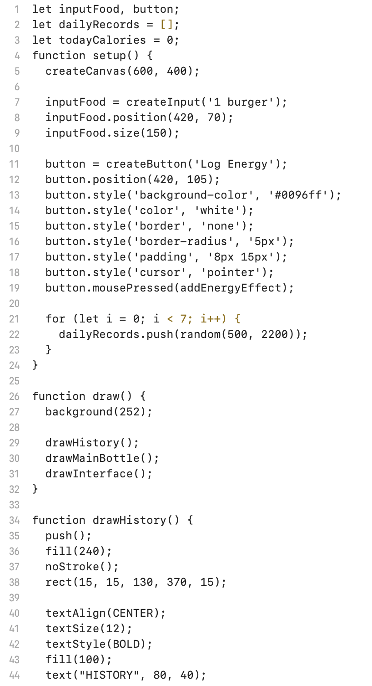
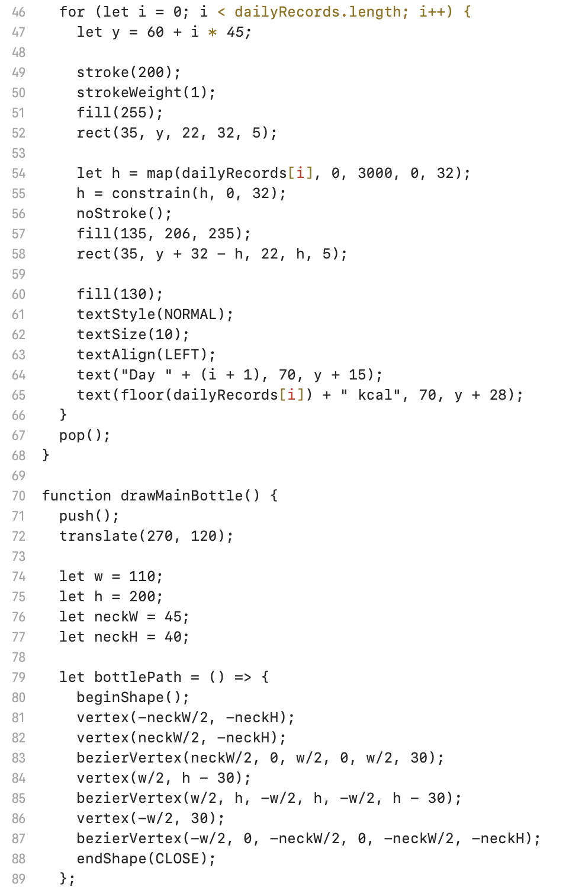
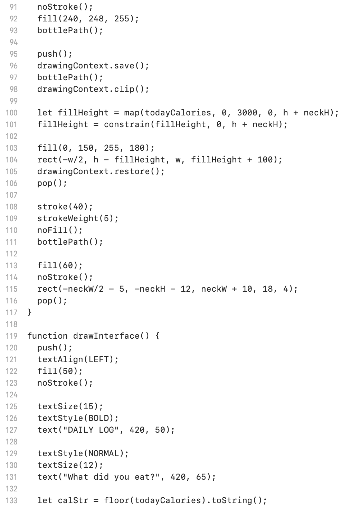
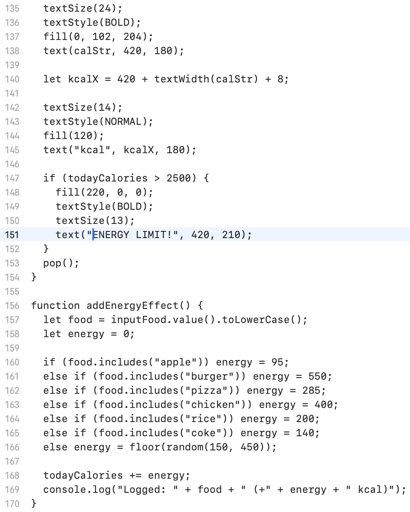
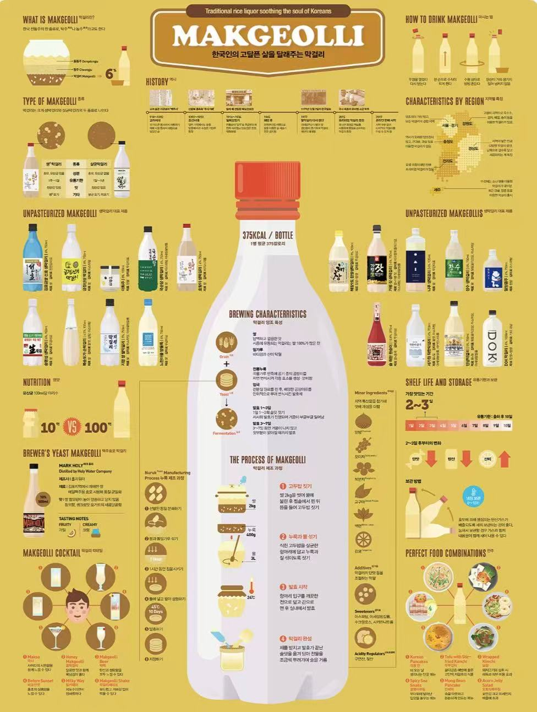
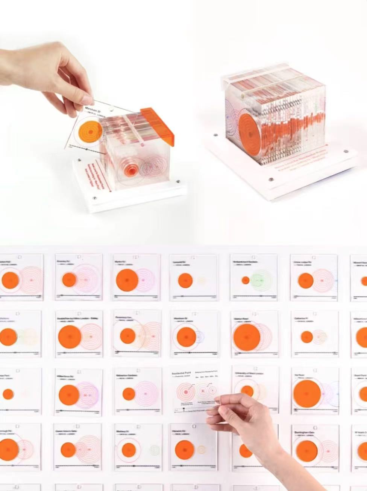
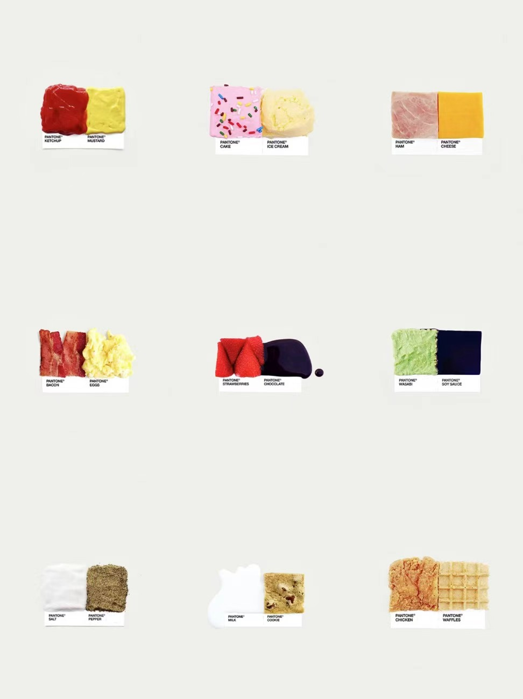
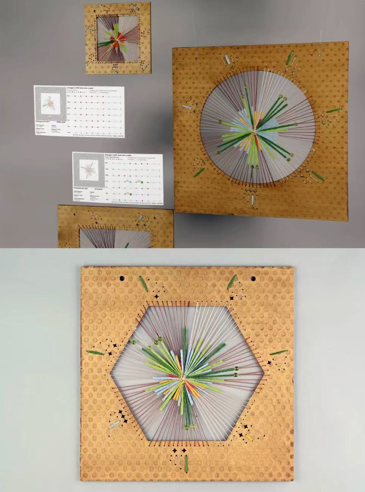
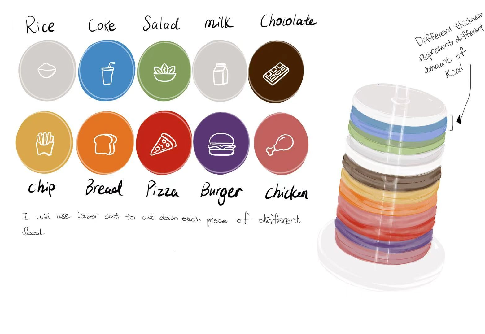

# Week 06

[← Back to Home](../index.md)

## Documentation 
During the Week 6 proposal consultation, I introduced my topic to the instructor. I explained my plan to create a food diary that tracks both my eating behavior and daily caloric intake. My purpose for recording this data is to remind myself to take care of my body. My motivation stems from an experience last year when a medication I was taking caused a loss of appetite and a dislike for meat. My weight dropped from 53kg to below 50kg, which left me feeling exhausted and unhealthy.

I began recording my data on April 16th. Through this process, I discovered that I often skip breakfast during holidays and occasionally skip lunch on school days. This pattern is a significant concern for my future health, especially since my grandfather suffered from a stomach disease caused by food scarcity during his childhood. By tracking my energy intake and monitoring my behaviors, I aim to create a visual data design that reminds me to prioritize my well-being and conveys the importance of taking care of one's body through healthy daily eating.

The purpose of my project is to remind people to take care of their bodies. By showing my own eating habits, I want to raise awareness about the importance of regular meals. I believe that small behaviors, like skipping breakfast, can add up to big health problems over time.

### Current Progress and Development 

I am using p5.js to design the visual interface. Below are the initial images and code from my Week 5 report, representing the rough data visualization from the planning stage. Following the proposal consultation, I am now focused on further developing this idea. The first step in the development phase is to find a usable API that can be integrated into my project. Currently, the nutritional data for my p5.js visualization does not come from a standard nutrition API; instead, I am using Google Gemini to query the energy content of foods. At this stage, I am collecting nutritional data manually, but my next step is to find a functional API to automate this process within the visualization.

### Video & Code

<iframe src="https://www.youtube.com/embed/ZtuKyqvnCUM" width="560" height="315"> </iframe>

Below are the P5.JS code: 

 

 

 

 

## 1. Data Exploration 

In this phase of my research, I have been collecting personal dietary entries since April 16th. I began by establishing a structured dataset that includes dates, meal times, and specific food content. However, while auditing this data, I discovered that the records have significant limitations in terms of accuracy. Because I lack precise measurements for food quantities, my calorie estimations remain somewhat subjective. Additionally, I recognize that my current dataset is limited to my own experience and lacks broader social representativeness.
More importantly, this recording process has clearly revealed my long-standing "meal skipping" behavior. I noticed a consistent pattern of skipping breakfast on holidays and ignoring lunch during busy school days. For me, this data is more than just numbers; it represents a significant health risk, especially given my family history of gastrointestinal diseases.

Because of these findings, I want to shift the focus of my project. It is moving from being a simple "personal diary" to becoming a "social intervention tool." By revealing the behavioral vulnerabilities hidden within my own data, I aim to create a design that raises public awareness about the importance of regular eating habits and prioritizing one's well-being.

The data shows the food and dairy intakes of breakfast, lunch and dinner, began on 16th of April. 

| Data | Breakfast | Lunch | Dinner |
|-----|------|-------------------|------|
| 04/16 | NONE | Fried Rice |------|
| 04/17 | Eggs + Nibbles | Steak Noddle |------|
| 04/18 | NONE | Pie + Chocolate |------|
| 04/19 | Bread + Milk | Cheese Paste + Chocolate |------|
| 04/20 | Bread + Milk | NONE |------|
| 04/21 | Bread + Egg | Pie |------|
| 04/22 | Egg + Nibbles + Bread| NONE |------|
| 04/23 |------| NONE |------|
| 04/24 | Bread + Nibbles | NONE |------|
| 04/25 |------| Morning joke from roommate |------|
| 04/26 |------| Funny post on social media |------|
| 04/27 |------| Classmate's comment funny |------|
| 04/28 |------| Funny picture |------|
| 04/29 |------| Friend's story about their day |------|
| 04/30 |------| Party with friends - lots of laughing |------|
| 05/01 |------| Brunch with friends - funny conversations |------|
| 05/02 |------| Shopping - funny sign I saw |------|
| 05/03 |------| Comedy show on TV |------|
| 05/04 |------| Funny video from friend |------|

(end when week 7 task open)

## 2. Visual Research and Precedent Study 

(delect some of the pattern that do not match your idea)

## 3. Project Planning and Skills Roadmap

### 3.1 What do I need to make?

### 3.2 What do I need to learn?

### 3.3 What are my next steps?

## Independent Study

### 1. Consultation Reflection

### 2. Technical Skill Building

### 3. Initial Concept Sketch

## AI Usage Statement

*Document any use of AI tools under an AI Usage Statement heading. Explain which tools you used and describe how you used them. Reference any AI-generated content (see [QuickCite](https://auckland.libguides.com/referencing-generative-ai-tools) for guidance).*
