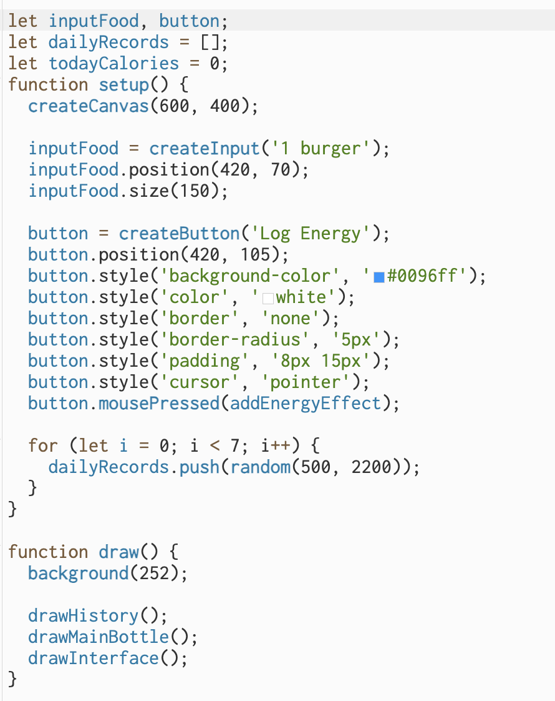
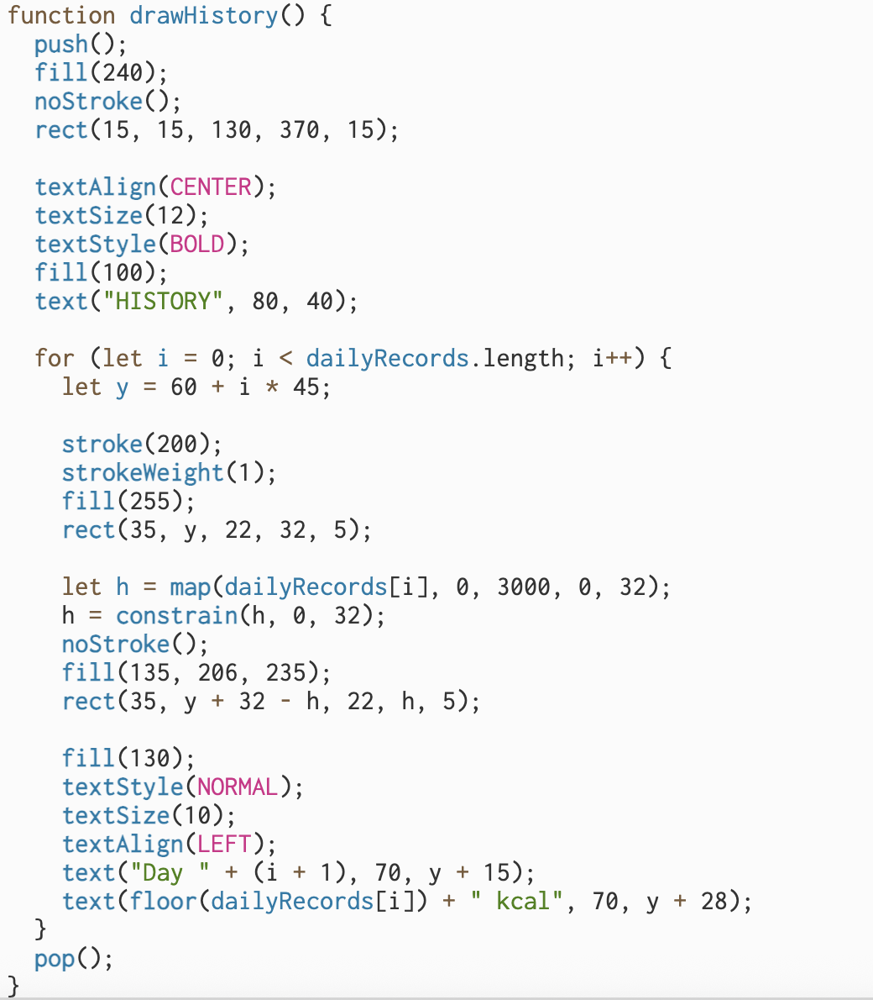
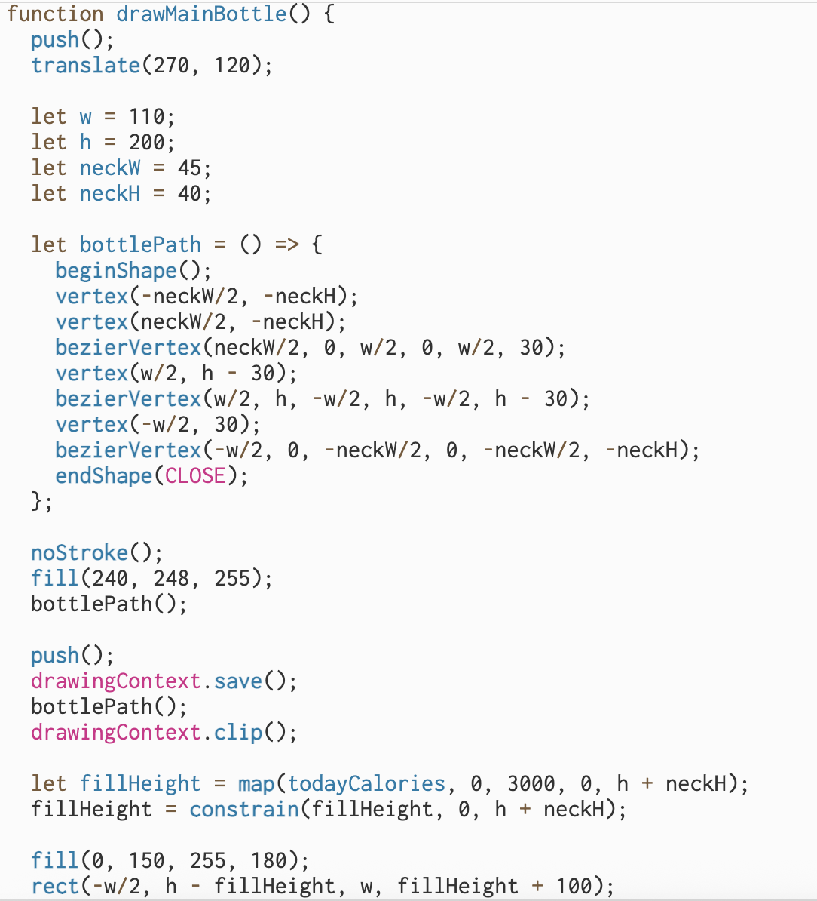
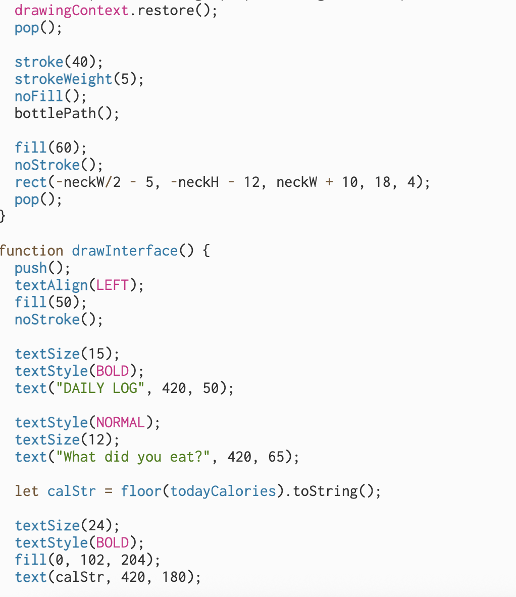
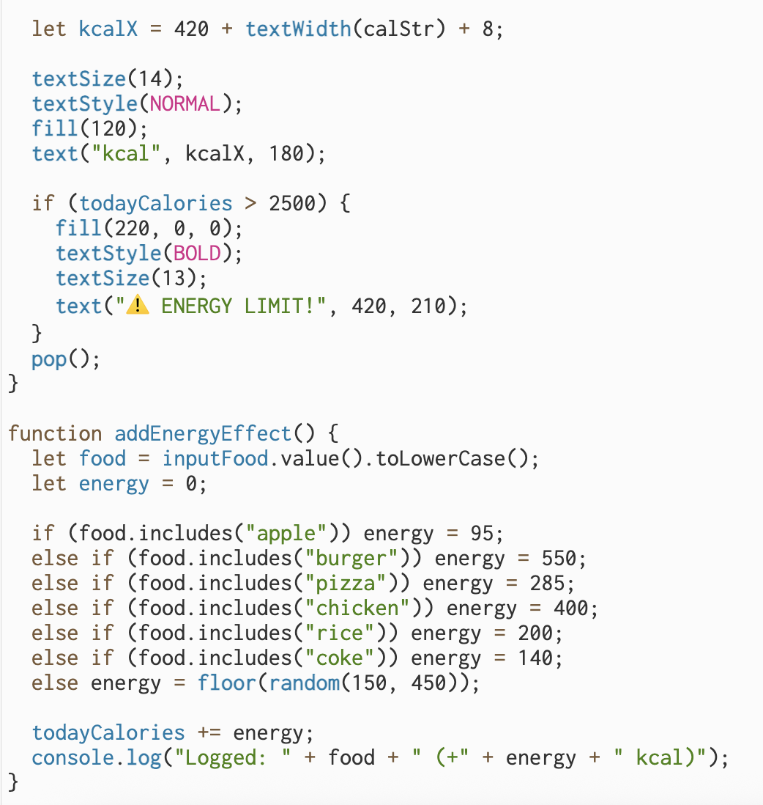

# Week 06

[← Back to Home](../index.md)

## Documentation 
During the week 6 consultation, I introduced my topic to the instructor. I explained that I want to create a food diary that tracks both my eating behavior and daily caloric intake. My motivation stems from an experience last year when a medication I was taking caused a loss of appetite and a dislike for meat. My weight dropped from 53kg to below 50kg, which left me feeling exhausted and unhealthy.

I began recording my data on April 16th. Through this process, I discovered that I often skip breakfast during holidays and occasionally skip lunch on school days. This pattern is a significant concern for my future health, especially since my grandfather suffered from a stomach disease caused by food scarcity during his childhood. By tracking my energy intake and monitoring my behaviors, I aim to create a tool that reminds me to prioritize my well-being.

### Current Progress and Development 

I am using p5.js to design the visual interface. Below are the initial images and code from my week 5 report, representing the rough data visualization at the planning stage. Following the proposal consultation, I am now focused on further developing this idea. The first step in the development phase is to find a usable API that can be integrated into my project. Currently, the nutritional data for my p5.js visualization doesn't come from a standard nutrition API; instead, it uses Google Gemini to query the energy content of foods. At this stage, I'm collecting nutritional data manually, rather than through automated API calls. My next step is to find a usable API that can be integrated into this visualization.

### Code

## 1. Data Exploration 

### Data (since 5th of June)

| Data | Breakfast | Lunch | Dinner |
|-----|------|-------------------|------|
| 04/16 | NONE | Fried Rice | - |
| 04/17 | Eggs + Nibbles | Steak Noddle | - |
| 04/18 | NONE | Pie + Chocolate | - |
| 04/19 | Bread + Milk | Cheese Paste + Chocolate | - |
| 04/20 | Bread + Milk | NONE | - |
| 04/21 | Bread + Egg | Pie | - |
| 04/22 | Egg + Nibbles + Bread| NONE | - |
| 04/23 | - | NONE | - |
| 04/24 | Bread + Nibbles | NONE | - |
| 04/25 | - | Morning joke from roommate | - |
| 04/26 | - | Funny post on social media | - |
| 04/27 | - | Classmate's comment funny | - |
| 04/28 | - | Funny picture | - |
| 04/29 | - | Friend's story about their day | - |
| 04/30 | - | Party with friends - lots of laughing | - |
| 05/01 | - | Brunch with friends - funny conversations | - |
| 05/02 | - | Shopping - funny sign I saw | - |
| 05/03 | - | Comedy show on TV | - |
| 05/04 | - | Funny video from friend | - |

## 2. Visual Research and Precedent Study 

(delect some of the pattern that do not match your idea)

## 3. Project Planning and Skills Roadmap

### 3.1 What do I need to make?

### 3.2 What do I need to learn?

### 3.3 What are my next steps?

## Independent Study

### 1. Consultation Reflection

### 2. Technical Skill Building

## AI Usage Statement

*Document any use of AI tools under an AI Usage Statement heading. Explain which tools you used and describe how you used them. Reference any AI-generated content (see [QuickCite](https://auckland.libguides.com/referencing-generative-ai-tools) for guidance).*
