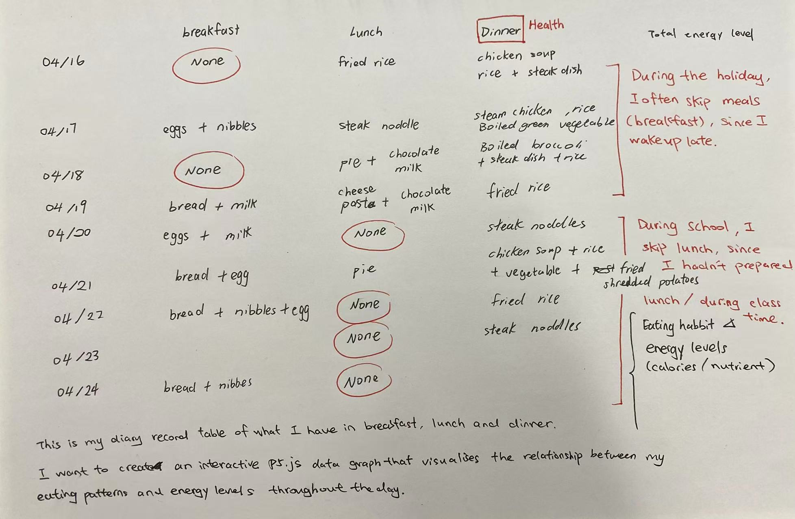
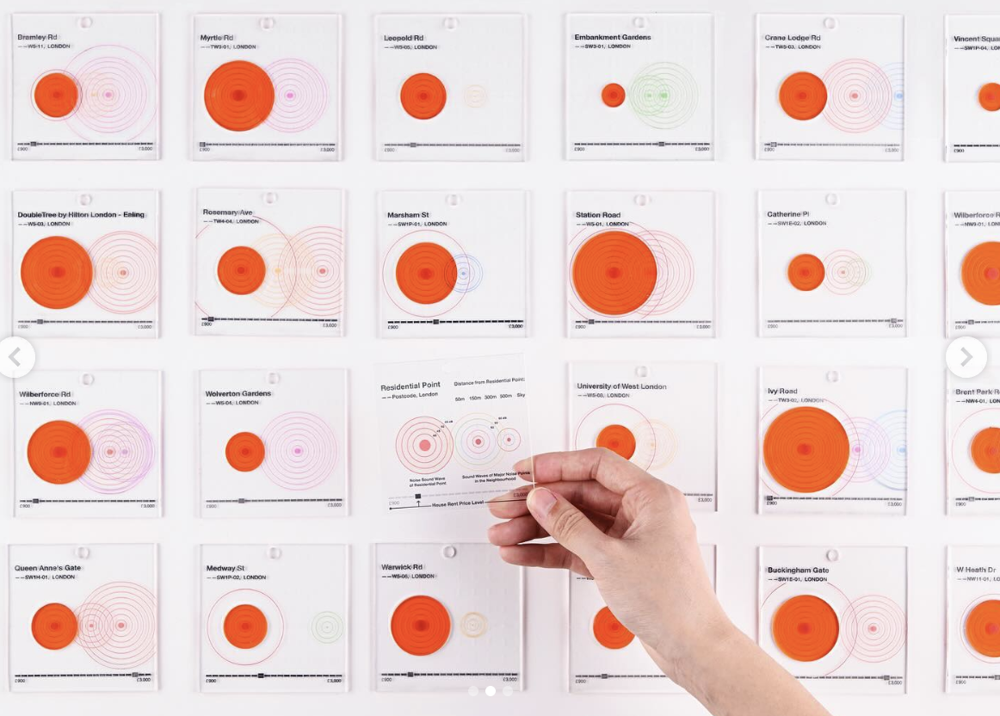
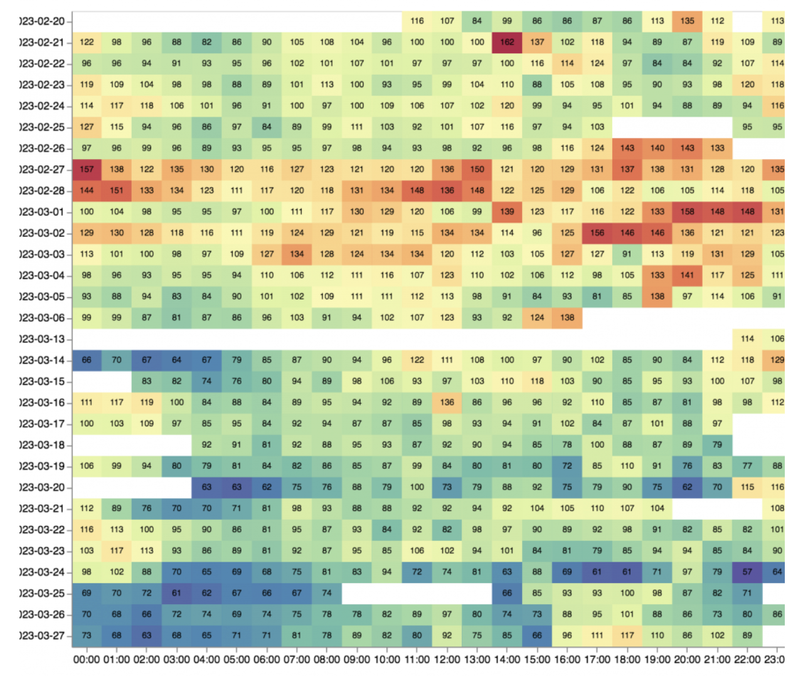
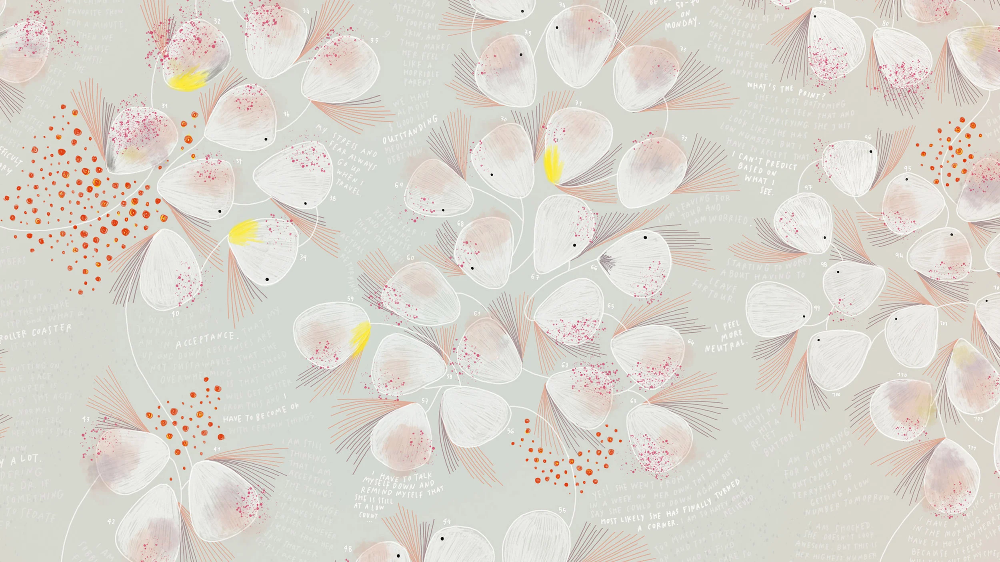
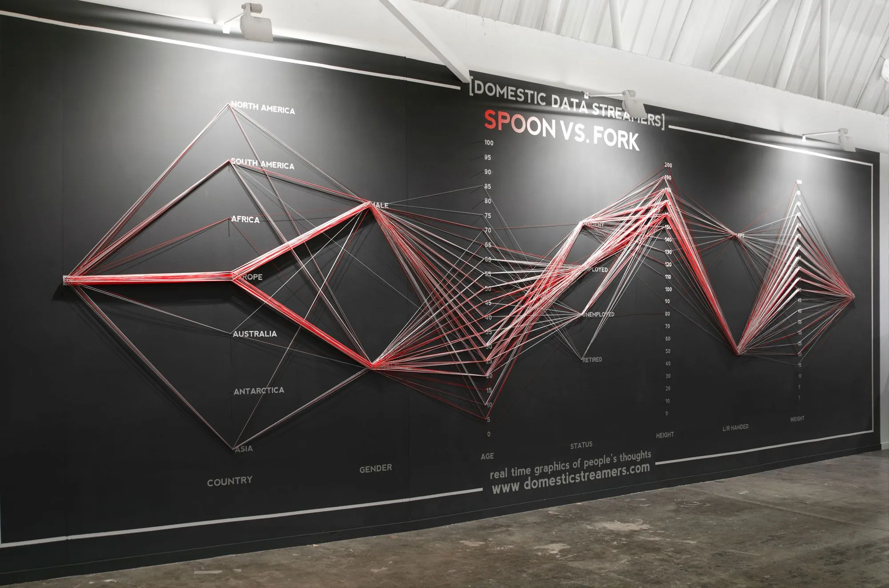
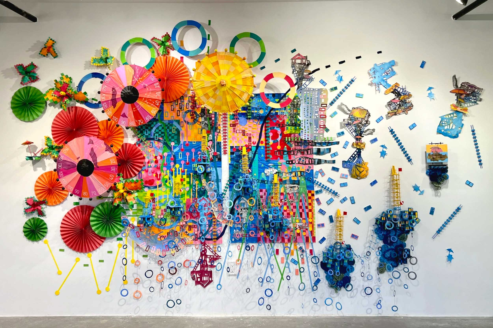
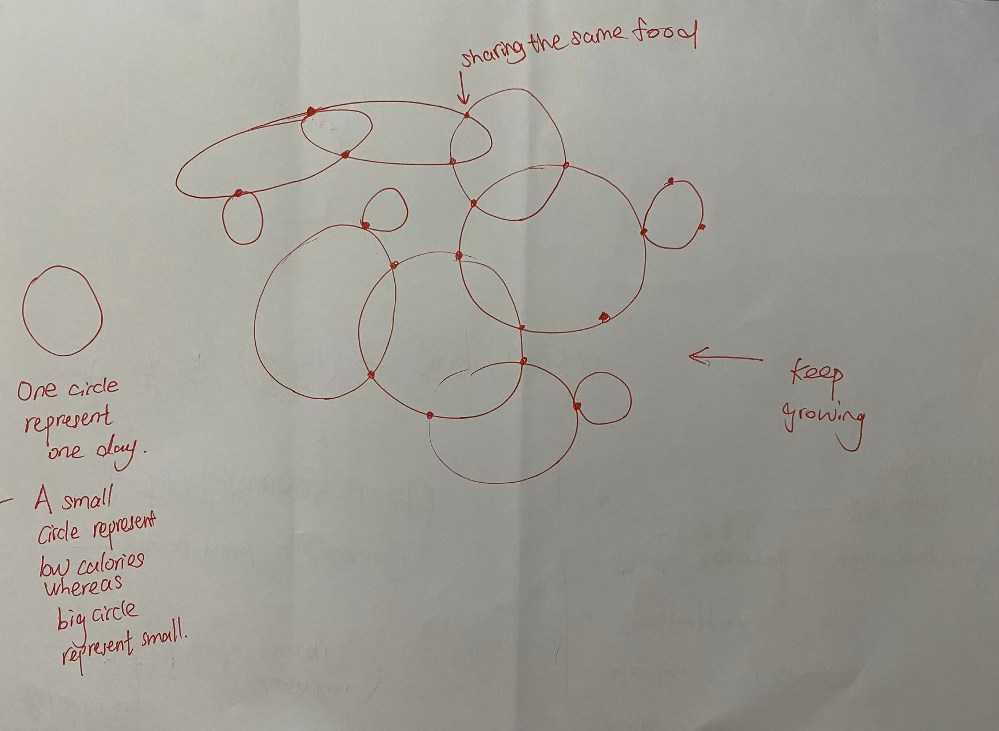
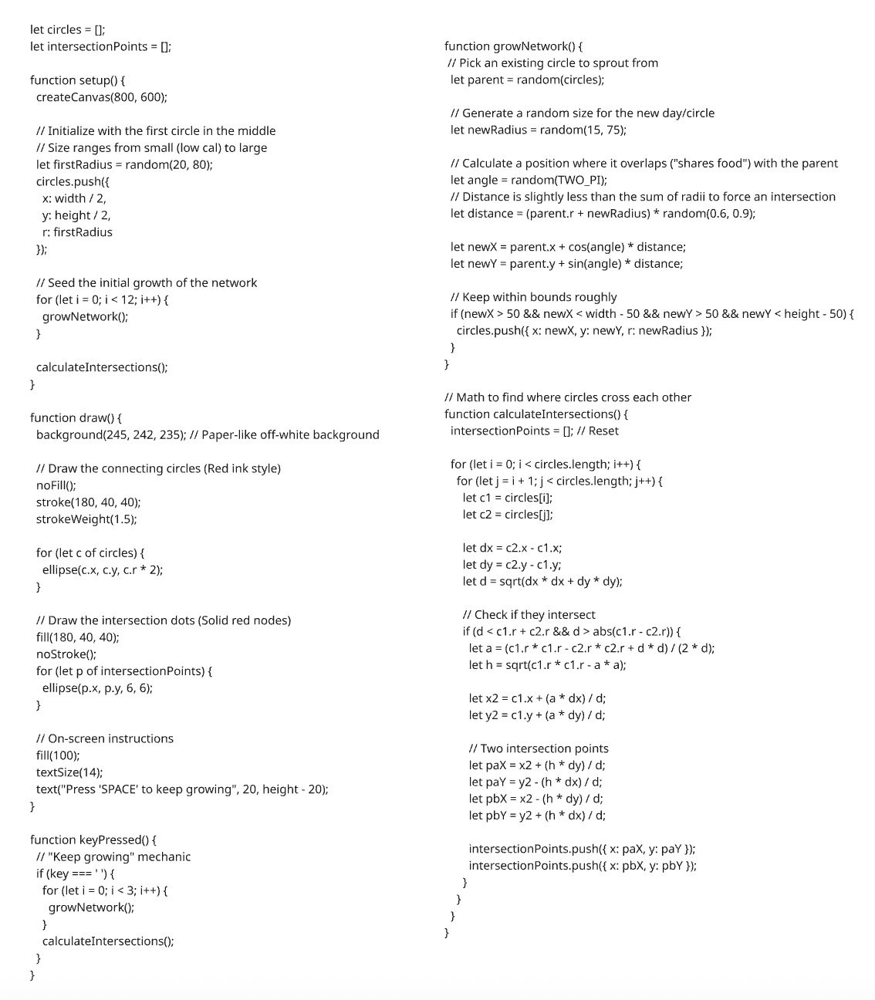
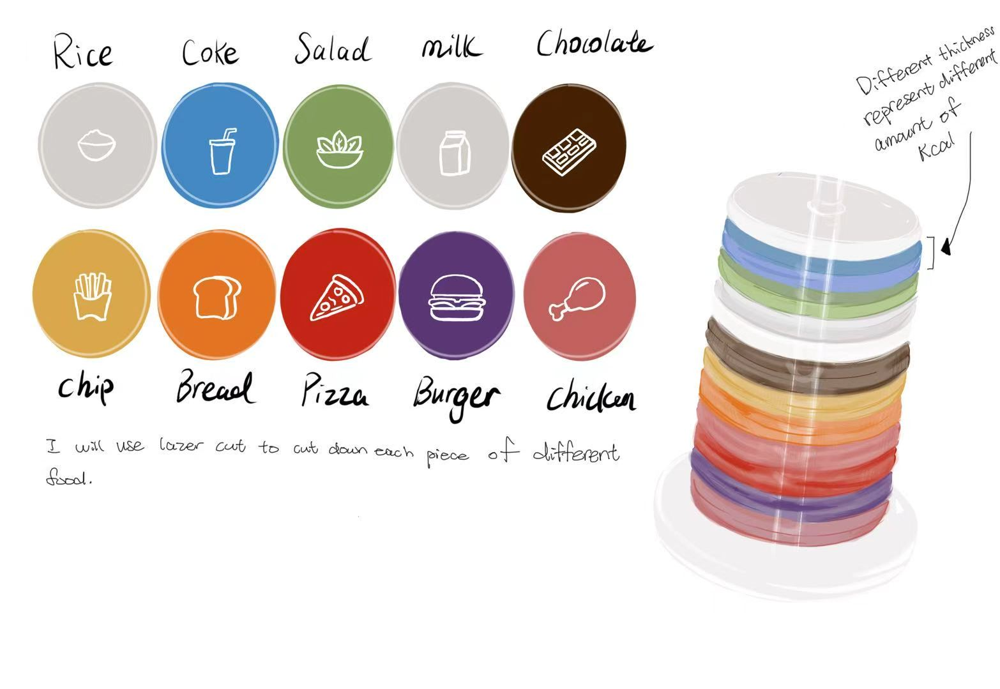

# Week 06

[← Back to Home](../index.md)

## Documentation 
During the Week 6 proposal consultation, I introduced my topic to the teacher. I explained my plan to create a food diary that tracks both my eating behavior and daily caloric intake. My purpose for recording this data is to remind myself to take care of my body. My motivation stems from an experience last year when a medication I was taking caused a loss of appetite and a dislike for meat. My weight dropped from 53kg to below 50kg, which left me feeling exhausted and unhealthy. From the article, "Gastic Health - how Overating or under eating can impact your stomach" it mentions "when you do eat enough food, your body goes into starvation mode. This can cause gastric pain, constipation, and other digestive problems. Skipping meals can also make you feel weak, tired, and irritable, which can affect your overall wellbeing." This made me realize the vital importance of eating well—it's the foundation for growth and vitality. I want to use this micro-perspective to observe my eating habits, analyze and uncover my dietary issues, and ultimately use data as a daily reminder for myself. 

Therefore, I began recording my data on April 16th during the school break. After a few days, I discovered that I often skip breakfast during holidays and occasionally skip lunch on school days. This pattern is a significant concern for my future health, especially since my grandfather suffered from a stomach disease caused by food scarcity during his childhood. Thus, I have a strong motivation to track my energy intake and monitor my behavior. Through this, I aim to create a visual data design that reminds me to prioritize my well-being and conveys the importance of caring for one's body through healthy daily eating.

The purpose of my project is to remind people to take care of their bodies. By showing my own eating habits, I want to raise awareness about the importance of regular meals. I believe that small behaviors, like skipping breakfast, can add up to big health problems over time.

## 1. Data Exploration 
In this phase of my research, I have been collecting personal dietary entries since April 16th. I began by establishing a structured dataset that includes dates, meal times, and specific food content. However, while auditing this data, I discovered that the records have significant limitations in terms of data visualization and depth. Currently, my data is strictly confined to logs of what I eat for each meal, lacking any supporting metrics or deeper quantitative evidence. Furthermore, I realized that my current findings are limited to my personal experience and lack broader social representation. If only collecting my dietary, it would have limited sample size. One limitation of this project is that the data only comes from one person. Since the food diary records my own eating habits, it does not represent the experiences of a wider group of people. This makes it difficult to draw broader conclusions about eating behaviours in society. Therefore, I will simultaneously track the dietary data of my family members and friends, which will allow the project to better reflect the diverse habits of my target personas.

Based on my secondary research and the behavioral patterns observed so far—specifically, my habit of frequently skipping breakfast or lunch—I have decided to add two new measurement metrics to my tracking sheets. Therefore, I need to incorporate the measurement of both total calories and daily energy levels.

### From the article - “How Many Calories Should You Eat in a Day?”

| Gender | Age Group | Sedentary (Low) | Moderately Active (Mid) | Active (High) | Total Intake Range |
|-----|-----|-----|-----|-----|-----|
| Female | 21–25 | 2,000 Calories | 2,200 Calories | 2,400 Calories | 2,000–2,400 Calories |
|-----| 26–50 | 1,800 Calories | 2,000 Calories | 2,400 Calories | 1,800–2,400 Calories |
|-----| 51–60 | 1,600 Calories | 1,800 Calories | 2,200 Calories | 1,600–2,200 Calories |
|-----| 61+ | 1,600 Calories | 1,800 Calories | 2,000 Calories | 1,600–2,000 Calories |
| Male | 21–25 | 2,400 Calories | 2,800 Calories | 3,000 Calories | 2,400–3,000 Calories |
|-----| 26–35 | 2,400 Calories | 2,600 Calories | 3,000 Calories | 2,400–3,000 Calories |
|-----| 36–40 | 2,400 Calories | 2,600 Calories | 2,800 Calories | 2,400–2,800 Calories |
|-----| 41–45 | 2,200 Calories | 2,600 Calories | 2,800 Calories | 2,200–2,800 Calories |
|-----| 46–55 | 2,200 Calories | 2,400 Calories | 2,800 Calories | 2,200–2,800 Calories |
|-----| 56–60 | 2,200 Calories | 2,400 Calories | 2,600 Calories | 2,200–2,600 Calories |
|-----| 61–65 | 2,000 Calories | 2,400 Calories | 2,600 Calories | 2,000–2,600 Calories |
|-----| 66–75 | 2,000 Calories | 2,200 Calories | 2,600 Calories | 2,000–2,600 Calories |
|-----| 76+ | 2,000 Calories | 2,200 Calories | 2,400 Calories | 2,000–2,400 Calories |

Another limitation of this project is the calorie calculations are based on estimated food portions rather than exact measurements. Because I did not weigh every meal, some calorie values may be inaccurate. Unfortunately, I don't have a food scale to weight every meals. And I have no way to weigh myself when eating at restaurants. However, the data is still useful for identifying overall patterns and trends.

I also rate my energy level between 1 and 10. This represents my overall physical and mental state for the day, capturing how my body actually feels in response to what I eat. In this design project, while Calories serve as the objective, quantitative input (measuring the raw energy consumed), the Energy Level acts as the subjective, qualitative output (tracking holistic vitality, cognitive focus, and physical fatigue). By juxtaposing these two metrics, the data visualization highlights the critical correlation between food intake and daily performance. More importantly, it maps the behavioral chain reaction—such as the severe energy drops (levels 1–3) that directly follow skipped meals—thereby transforming personal intuition into a visible, data-driven warning system for self-care.

In conclusion, an audit of my dietary logs revealed a chronic pattern of missing meals—specifically skipping breakfast on holidays and lunch on busy school days. Recognizing that simple food logs lacked data depth, I upgraded my tracking methodology by introducing two critical metrics: total calories and daily energy levels (1–10) to map the physical and psychological impact of these habits. However, I soon realized that focusing solely on my own experience created a severe limitation in social representation, failing to capture the broader 'why' behind meal-skipping. Driven by these insights, my project is undergoing a profound shift from a simple 'personal diary' to a 'social intervention tool' aimed at raising public awareness about irregular eating habits and self-care. To achieve this, my design direction using digital p5.js visualization to approach. To build a robust foundation for this new direction, I will expand my scope to simultaneously track the dietary data of family members and friends, thereby better reflecting the diverse habits of my target personas. Consequently, to address all existing data gaps and gather a more scientifically and emotionally rigorous dataset, I have decided to officially redo and restart my data collection process.

### Data Collection Method
The data was collected through a daily food diary. Each day, I recorded what I ate, the type of day it was (school day, weekend, working day or holiday), my estimated calorie intake, and my daily energy level on a scale from 1 to 10.
### Data Categories
Date and Day Type: This records when the data was collected and provides context about my daily routine. Different types of days, such as school days, weekends, and holidays, may influence eating habits.
Breakfast, Lunch, and Dinner: These categories record what foods were eaten during each meal. They also show whether a meal was skipped.
Total Calories: This is an estimate of the total amount of energy consumed each day through food and drinks.
Energy Level (1–10): This is a self-reported score that reflects how energetic I felt throughout the day. Higher scores indicate feeling more focused, active, and energetic, while lower scores indicate tiredness or lack of energy.

### Data collections (5 people)
I will be documenting all my data collection here, eventually this is week 6 journal page, I want my data collection to be clear and clean just gather them in one place.
#### Anna's Self-tracked personal dietary log (April 16, 2026 – May 31, 2026)， 46 days.

| Date | state | Breakfast| Lunch | Dinner | Total calories | Energy Levels (1-10) |
|-----|-----|-----|-----|-----|-----|-----|
| 04/16 | Holiday | None | fried rice | chicken soup + rice + steak dish | 1650 | 5 |
| 04/17 | Holiday | eggs + nibbles | steak nodolles | steam chicken + rice + Boiled green vegetable| 2150 | 8 |
| 04/18 | Holiday | None | pie + chocolate milk | Boiled broccoli + steak dish + rice | 1300 | 4|
| 04/19 | Holiday | bread + milk | cheese pasta + chocolate milk | fried rice |1850 | 7 |
| 04/20 | School | eggs + milk | None | steak nodolles | 1300 | 4 |
| 04/21 | School | bread + egg | pie | chicken soup + rice + Boiled green vegetable + shredded potatoes| 1750 | 6 |
| 04/22 | School | bread + nibbles + egg| None | fried rice | 1100 | 3 |
| 04/23 | School | None | None | steak nodolles | 800 | 1 |
| 04/24 | School | bread + nibbles | None | steak dish | 830 | 2|
| 04/25 | weekend | eggs + milk | fried rice | steak dish + rice + Boiled broccoli | 1900 | 7|
| 04/26 | weekend | bread + egg + milk | cheese pasta | steam chicken + rice + chicken soup | 2050 | 8|
| 04/27 | School | bread + nibbles + egg| apple | fried rice + cherry + steam chicken | 1650 | 6|
| 04/28 | School | eggs + milk + hot dog | pie + chocolate milk | chicken soup + rice + steak dish | 2250 | 8 |
| 04/29 | School | bread  + Cereal + egg | cheese pasta + apple + chocolate | steak noodles + chicken soup | 2550 |10 |
| 04/30 | School | bread + nibbles | fried rice + pear | pizza + coke| 2400 |8 |
| 05/01 | School | eggs + milk | None | fried rice + steam chicken | 1400 | 4 |
| 05/02 | weekend  | bread + egg + milk | steak nodolles | cheeseburger + coke + chip | 2700| 10 |
| 05/03 | weekend  | bread + nibbles+ orange juice | cheese pasta + chocolate milk| chicken soup + rice + shredded potatoes | 2150 | 8 |
| 05/04 | School | chicken noodle | apple | steak nodolles | 1400 | 4 |
| 05/05 | School | bread + milk + egg | pie | Pepperoni pizza + Chicken soup| 2200 | 8 |
| 05/06 | School | cereal | cheese pasta | steak dish + rice | 1900 | 7|
| 05/07 | School | bread + nibbles + egg| None | chicken soup + rice + shredded potatoes | 1200 | 3 |
| 05/08 | School | None | fried rice + apple | pizza + chicken soup + mango | 1900 | 6 |
| 05/09 | weekend  | eggs + nibbles | pie + chocolate milk | steak dish + rice + Boiled broccoli | 1950 | 7 |
| 05/10 | weekend  | bread + egg + milk | cheese pasta | fried rice + apple pie| 2150 | 8 |
| 05/11 | School | bread + nibbles | None | chicken soup + steak dish + rice + Boiled green vegetable| 1150 | 3 |
| 05/12 | School | eggs + milk | fried rice + strawberry + grape | steak dish + rice + black tea | 2150 | 8 |
| 05/13 | School | bread + egg + yogurt | pie | steak noodles + soup | 1850 | 7 |
| 05/14 | School | None | cheese pasta + chocolate milk| steam chicken + rice + shredded potatoes | 1500 | 5 |
| 05/15 | School | bread + nibbles | fried rice +  orange juice | chicken soup + rice + steak dish | 1900 | 7 |
| 05/16 | weekend  | bread + cereal | steak noodles | Boiled broccoli + steak noddles| 1750 | 6 |
| 05/17 | weekend  | bread + egg + cereal| pie + chocolate milk | steam chicken + rice + Boiled green vegetable| 2050 | 8 |
| 05/18 | School | None | cheese pasta | steak noodles | 1500 | 5 |
| 05/19 | School | bread + nibbles | fried rice | chicken soup + rice + shredded potatoes | 1750 | 6|
| 05/20 | School | hot dog+ milk | pie | fried rice + steam chicken | 1850 | 7 |
| 05/21 | School | eggs + nibbles | steak noodles | chicken soup + steak noddles| 2000 | 7 |
| 05/22 | School | yogurt + chicken soup + rice | None | steak dish + rice | 1100 | 3 |
| 05/23 | weekend  | bread + egg+apple | fried rice | Boiled broccoli + steak dish + rice | 1950 | 7 |
| 05/24 | weekend  | eggs + milk | pie + chocolate milk | chicken soup + rice + steam chicken | 2100 | 8 |
| 05/25 | School | bread + nibbles | cheese pasta | steak noodles | 1750 | 6 |
| 05/26 | School | bread + egg + milk | fried rice | steam chicken + rice + shredded potatoes | 1900 | 7 |
| 05/27 | School | fried egg + orange juice + nibbles | pie | chicken soup + rice + steak dish | 1950 | 7 |
| 05/28 | School | None | steak noodles +  orange juice | fried rice + Boiled green vegetable + strawberry | 1500 | 5 |
| 05/29 | School | None| cheese pasta + chocolate milk| steam chicken + rice + Boiled broccoli | 1400 | 4 |
| 05/30 | weekend  | eggs + nibbles + grapes | fried rice + apple | Boiled broccoli + steak dish + rice | 1900 | 7 |
| 05/31 | weekend  | chicken noodles + black tea | steak noodles + apple | steam chicken + rice + chicken soup | 2100 | 8 |

#### My mum's dietary log (May 22, 2026 – May 31, 2026)， 10 days:
| Date | State | Breakfast | Lunch | Dinner | Total Calories | Energy Levels (1-10) |
|------|------|------|------|------|------|------|
| 05/22 | Working Day | Chicken Noodles + Black Tea | Dumpling | Steak Dish + Rice | 1850 | 7 |
| 05/23 | Weekend | Cereal + Sandwich | Fried Rice + Apple | Boiled Broccoli + Steak Dish + Rice | 2100 | 8 |
| 05/24 | Weekend | Steak Noodles + Tea | Pizza | Chicken Soup + Rice + Steam Chicken | 2300 | 8 |
| 05/25 | Working Day | Black Tea + Bread | Fried Rice | Steak Noodles | 1800 | 7 |
| 05/26 | Working Day | Black Tea + Egg + Dumpling | Steak Noodles | Steam Chicken + Rice + Shredded Potatoes | 2050 | 8 |
| 05/27 | Working Day | Tea + Sandwich | Steak Dish + Rice | Chicken Soup + Rice + Steak Dish | 2200 | 8 |
| 05/28 | Working Day | Tea + Egg + Cereal | Hamburger | Fried Rice + Boiled Green Vegetable + Strawberry | 2000 | 7 |
| 05/29 | Working Day | Tea + Cereal + Bread | Noodles | Steam Chicken + Rice + Boiled Broccoli | 1850 | 7 |
| 05/30 | Weekend | Tea + Fried Rice | Pizza | Boiled Broccoli + Steak Dish + Rice | 2200 | 8 |
| 05/31 | Weekend | Tea + Nibbles + Cereal | Steak Noodles | Steam Chicken + Rice + Chicken Soup | 2100 | 8 |

My mother's dietary record presented a very different pattern from both my own data and my friend's data. Across the recording period, she consistently ate three meals a day and rarely skipped breakfast. Her meals generally included a balance of carbohydrates, protein, and vegetables, resulting in a relatively stable calorie intake and consistently high energy levels.

Unlike my own habit of occasionally missing meals due to busy schedules, or my friend's intentional meal restriction for weight loss, my mother's eating habits reflected a routine centred around regular nourishment and self-care. Although her diet was not strictly a "healthy diet" in the conventional sense, the consistency of her meal timing appeared to contribute to more stable energy levels throughout the week.

This dataset became an important comparison point within my project. It demonstrated that regular eating habits are achievable within everyday life and highlighted the potential benefits of meal consistency. Comparing these three datasets revealed that eating behaviour is shaped by different motivations, lifestyles, and responsibilities. Together, they provided a broader understanding of how people relate to food and reinforced the importance of promoting awareness around regular meals and personal wellbeing.

#### My older sister's dietary log (May 22, 2026 – May 31, 2026)， 10 days:
| Date | State | Breakfast | Lunch | Dinner | Total Calories | Energy Levels (1-10) |
|------|------|------|------|------|------|------|
| 05/22 | Working Day | Chicken Noodles + Juice | Dumpling | Steak Dish + Rice | 1950 | 7 |
| 05/23 | Weekend | None | Hamburger | Boiled Broccoli + Steak Dish + Rice | 1700 | 6 |
| 05/24 | Weekend | Steak Noodles + Coffee | Pizza | Chicken Soup + Rice + Steam Chicken | 2350 | 8 |
| 05/25 | Working Day | Coffee + Bread | Fried Rice | Steak Noodles | 1800 | 6 |
| 05/26 | Working Day | Coffee + Egg + Dumpling | Sandwich + Salad | Steam Chicken + Rice + Shredded Potatoes | 1900 | 7 |
| 05/27 | Working Day | Coffee + Sandwich | Steak Dish + Rice | Chicken Soup + Rice + Steak Dish | 2150 | 8 |
| 05/28 | Working Day | None | Hamburger | Fried Rice + Boiled Green Vegetable + Strawberry | 1800 | 6 |
| 05/29 | Working Day | Coffee + Cereal + Bread | None | Steam Chicken + Rice + Boiled Broccoli | 1450 | 5 |
| 05/30 | Weekend | Coffee + Fried Rice | Pizza | Boiled Broccoli + Steak Dish + Rice | 2250 | 8 |
| 05/31 | Weekend | None | Steak Noodles | Steam Chicken + Rice + Chicken Soup | 1700 | 6 |

#### My youger sister's dietary log (May 22, 2026 – May 31, 2026)， 10 days:
| Date | State | Breakfast | Lunch | Dinner | Total Calories | Energy Levels (1-10) |
|------|------|------|------|------|------|------|
| 05/22 | School | Chicken Noodles + Milk | None | Steak Dish + Rice | 1500 | 5 |
| 05/23 | Weekend | Cereal + Sandwich | Fried Rice + Milk | Boiled Broccoli + Steak Dish + Rice | 2050 | 8 |
| 05/24 | Weekend | Steak Noodles + Juice | Pizza | Chicken Soup + Rice + Steam Chicken | 2400 | 9 |
| 05/25 | School | Black Tea + Bread | Fried Rice | Steak Noodles | 1850 | 7 |
| 05/26 | School | Black Tea + Egg + Dumpling | Pie | Steam Chicken + Rice + Shredded Potatoes | 2100 | 8 |
| 05/27 | School | Sandwich + Milk | Steak Dish + Rice | Chicken Soup + Rice + Steak Dish | 2200 | 8 |
| 05/28 | School | Egg + Cereal | Pie + Juice | Fried Rice + Boiled Green Vegetable + Strawberry | 2050 | 8 |
| 05/29 | School | Cereal + Bread | Noodles | Steam Chicken + Rice + Boiled Broccoli | 1900 | 7 |
| 05/30 | Weekend | Fried Rice + Milk | Bread + Juice | Boiled Broccoli + Steak Dish + Rice | 2150 | 8 |
| 05/31 | Weekend | Nibbles + Cereal + Chocolate Milk | Fried Rice | Steam Chicken + Rice + Chicken Soup | 2350 | 9 |

#### My friend's Diet and Calorie Record (April 16 - June) 10 days：
| Date | State | Breakfast | Lunch | Dinner | Total Calories | Energy Levels (1-10) |
|------|------|------|------|------|------|------|
| 05/20 | Working Day | None | Fried Rice + Bubble Tea | Fried Chicken + Coke + Nibbles | 2450 | 7 |
| 05/22 | Working Day | Milk Tea | Steak Dish + Rice | Boiled Vegetable + Rice + Steam Chicken | 2150 | 7 |
| 05/23 | Weekend | None | Pizza | Steam Chicken + Rice + Fish | 2200 | 7 |
| 05/24 | Weekend | None | Hamburger + Coke | Cheese Pasta | 2350 | 8 |
| 05/25 | Working Day | Coffee | Fried Rice | Chicken Soup | 1600 | 5 |
| 05/26 | Working Day | None | Steak Noodles | Hamburger + Coke | 2250 | 7 |
| 05/27 | Working Day | Milk Tea | Steak Dish + Rice | Seafood Soup + Rice + Steak Dish | 2400 | 8 |
| 05/28 | Working Day | None | Hamburger | Dumplings | 1850 | 6 |
| 05/29 | Working Day | Coffee | Fried Chicken + Steak Noodles | Hot Pot | 2800 | 9 |
| 05/30 | Weekend | None | Pizza | Sushi + Milk Tea | 2400 | 8 |
| 05/31 | Weekend | None | Sandwich + Egg | Steak Noodles | 1750 | 6 |

Friend's dietary record revealed another reason behind irregular eating habits. Similar to older sister, breakfast was frequently skipped. However, unlike intentional dieting, this participant regularly consumed calorie-dense foods such as fried chicken, hamburgers, pizza, milk tea, and soft drinks throughout the day. Despite believing that skipping breakfast would help control weight, the total daily calorie intake remained relatively high, averaging over 2200 kcal per day.

This dataset highlighted a common misconception that eating fewer meals automatically leads to healthier eating habits. In reality, hidden calories from sugary drinks, fast food, and snacks can easily offset the calories saved from skipping meals. Compared with my own data, which was influenced by busy schedules, and Friend A's data, which was driven by dieting goals, Friend B's data demonstrated how a lack of nutritional awareness can also contribute to unhealthy eating patterns.

Together, these datasets revealed that meal-skipping is not caused by a single factor. Instead, it can result from different motivations, lifestyles, and understandings of food, reinforcing the need for broader public awareness around self-care and healthy eating habits.

## 2. Visual Research and Precedent Study 
During Week 6, I spent 45 minutes collecting visual references related to my project. I used Google Gemini to help me search for examples of data visualization, physical data design, and nutrition tracking projects.

The first reference I found was Hangjie Cai's final project called "Noisy Factory." This project uses laser cut to cut each data point into a separate piece. When all the pieces are stacked together, they reveal the relationship between environmental noise and economic disparities in London. What attracts me most is how physical the piece feels. By stacking laser-cut layers, you can actually see the pattern emerge. I want to use a similar method in my project, where each meal or skipped meal becomes a physical layer. 

The second reference is "Dear Data" by Giorgia Lupi and Stefanie Posavec. This is a famous project where they hand-drew small data points on postcards every day for a year. They recorded tiny details like what they ate, how they felt, and their complaints. What I love most is the handmade feel. Each drawing is personal and unique. I will use their idea of different shapes and colors to represent different types of food or meals. 

The third reference is "The Quantified Self" and Nicholas Felton's annual reports. This project shows how people track their own data over months or years. I like how Felton organizes long timelines and clearly shows the difference between weekdays and weekends. Since my data starts from April 16th, I can use a similar timeline structure to compare my school days and holidays. 

The fourth reference is Giorgia Lupi's project "Bruises: The Data We Don't See." This project visualizes a girl with an immune disease. Instead of simple charts, she uses flowing shapes that look like cells or petals. What I learn from this is that feelings like "tiredness" or "not feeling well" are hard to measure with numbers. I can use brush stroke thickness or color depth to show these feelings, not just calorie counts. 

The fifth reference is from "Domestic Data Streamers," a design team from Barcelona. They turn boring data into physical installations that let audiences "feel" the weight and volume of data. What attracts me is how they use weight and liquids to represent energy. I could use a leaking container to show energy loss, or different weights of sand to represent my daily intake.

The sixth reference is from Nathalie Miebach, an artist who translates complex data into hand-woven 3D sculptures. She turns abstract numbers into intricate physical structures that let audiences observe the fragility and interconnectedness of data. What attracts me is how she uses the structural integrity of a weave as a metaphor for stability. I could use this weaving concept to represent my daily eating routines; consistent meals would form a strong, tightly woven pattern.

After researching how different artists express data in unique ways, I am really excited to move on to the next phase: transforming my own data collection into amazing artwork. I am incredibly inspired by their use of drawing, laser-cutting, handcrafting, and coding to visualize data. This has deeply impacted me and made me reflect on how I can express and convey my own data to make a meaningful impact on others.
## 3. Project Planning and Skills Roadmap 
### 3.1 What do I need to make?
At this stage, I need to create a series of experiments that explore different ways of representing my food diary data. Rather than focusing on a final outcome, I will produce sketches, concept drawings, and small prototypes to test how information can be translated into visual and physical forms.

My experiments will investigate how calorie intake, meal patterns, and energy levels can be represented through colour, shape, size, layering, or movement. I will test both digital outputs using p5.js and physical outputs using paper, cardboard, and laser-cut materials. These explorations will help me evaluate which approach communicates the data most effectively and identify a suitable direction for the final project.

### 3.2 What do I need to learn?
1. Data Visualisation Principles

Learn how designers transform raw information into meaningful visual forms and how visual elements can communicate patterns and relationships.

2. p5.js Programming

Develop basic coding skills to create digital and interactive data visualisations.

3. Adobe Illustrator

Learn how to create vector graphics and prepare files for fabrication and prototyping.

4. Laser Cutting Techniques

Understand how to prepare laser-cut files, choose suitable materials, and operate fabrication equipment safely.

5. Material Experimentation

Explore how different materials and construction methods can influence the communication of data.

### 3.3 What are my next steps?

My next step is to continue collecting and organising my food diary data while analysing it for patterns and relationships. Once the dataset is complete, I will identify which variables are most meaningful to visualise, such as calorie intake, meal frequency, and energy levels.

At the same time, I will begin researching examples of data visualisation, data sculptures, and physical data representations created by other designers. Using these references, I will generate a range of sketches and concepts before developing simple digital and physical prototypes.

To support this process, I will improve my skills in p5.js, Adobe Illustrator, and laser cutting. Through testing, reflection, and iteration, I aim to discover an appropriate visual language for my dataset and establish a clear direction for the final project.

## Independent Study

### 1. Consultation Reflection
During the proposal consultation, I met with my instructor to discuss my project idea of creating a food diary that tracks both eating behaviour and daily calorie intake. I shared my personal experience of losing weight due to medication, developing irregular eating habits, and how this motivated me to pay more attention to my health through mindful eating.

The instructor asked several helpful questions that challenged my thinking. First, he asked who my target audience was—myself or others. This made me reconsider whether my project should remain a personal reflection or communicate a broader message. Second, he asked how I would obtain accurate nutritional data. At the time, I was unsure about reliable sources and methods for calorie calculation. Finally, he encouraged me to research existing data visualisation projects for inspiration and to understand how other designers communicate complex information.

The discussion helped sharpen my project direction. Initially, I focused mainly on documenting my own eating habits. However, I realised that I need to connect my personal experience to wider issues surrounding nutrition, health, and wellbeing. As a result, I plan to expand my research beyond my own dataset and investigate why regular eating is important, including the physical and mental impacts of skipping meals. I will also explore nutrition databases and APIs to improve the accuracy of my calorie data and study existing data visualisation and data sculpture projects to inform future design decisions.

### 2. Technical Skill Building
My main technical gap was understanding how to translate raw food diary data into a meaningful visual form. Although I had previously used p5.js for simple coding exercises, I had never used it as a data visualisation tool. I was unsure how numerical data, such as calorie intake and energy levels, could be represented through visual elements and interaction. Therefore, I chose p5.js as a way to experiment with different methods of presenting data and to better understand the possibilities and limitations of digital visualisation.

Following the skills roadmap developed in class, I decided to focus on p5.js as my first technical skill. Although I had been using p5.js since Week 1, I had only used it for simple coding exercises and small visual experiments. My main technical gap was understanding how to transform a real dataset into a meaningful and interactive visualisation. I was particularly interested in exploring the possibilities and limitations of p5.js for communicating information beyond basic graphics.

To further develop this skill, I used Google Gemini to help generate p5.js code based on natural language descriptions of my ideas. Instead of writing code from scratch, I described the visual effects I wanted to create and then modified the generated code through testing and experimentation.

#### Intial concept sketch:

This was my first design concept, which I initially sketched during class and later transformed into a digital version using p5.js. In this version, each circle represents one day of recorded data, and the size of the circle reflects the total calorie intake for that day. However, after testing the visualisation, I realised that the red dots did not communicate enough information on their own. As a result, I began an iterative process with Google Gemini to improve the design. Through several rounds of discussion and experimentation, I added an interactive feature that reveals additional information when the user hovers over a red dot. The visualisation now displays the food items associated with that day, highlighting repeated foods that appeared across multiple days. This iteration helped make the data more informative and engaging. Instead of only showing calorie intake through circle size, the visualisation now allows users to explore eating patterns and recurring food choices. Through this process, I learned how interaction design can help communicate complex data more effectively and encourage deeper exploration of the dataset.

<iframe src="https://www.youtube.com/embed/dpoyehsbqws" width="560" height="315"> </iframe>

Through this process, I learned how p5.js can transform data into visual elements such as shapes, colours, and patterns. I recreated several sketches from class and experimented with different layouts to represent calorie intake, meal frequency, and energy levels. Some designs were too complicated and difficult to read, while others communicated the data more clearly. These experiments helped me understand the strengths and limitations of digital visualisation.

One important insight from this process was that digital visualisation alone did not fully communicate the emotional and personal aspects of my dataset. While p5.js was effective for showing patterns and numerical information, it felt less successful at expressing the lived experience behind irregular eating habits. This led me to explore physical data visualisation and laser-cut fabrication as an alternative direction.

As a result, I began investigating how laser-cut layers could represent daily eating behaviour in a tangible form. Learning p5.js not only improved my technical skills but also helped me refine the overall direction of the project by showing me what worked and what was missing. 

## 3. Concept Sketch & Current Progress and Development 
After spending several days experimenting with p5.js, I realised that it was difficult to communicate the message I wanted to convey. While p5.js was useful for displaying data patterns, my initial visualisations felt too simple and did not effectively raise awareness about the importance of maintaining healthy eating habits. At the same time, I reflected on my previous experience with laser cutting from last year. Since I was already familiar with the fabrication process, I felt more confident exploring a physical approach. This led me to shift my focus towards laser-cut data visualisation. I believe a physical object can better communicate the presence, absence, and impact of eating habits, while also creating a more engaging and memorable experience for viewers.

My project is a physical data visualization that combines digital design and laser-cut craftsmanship. This idea is inspired by Hangjie Cai’s project, "Noisy Factory." My goal is to transform my abstract dietary data into a tangible, 3D piece that people can see and touch. The physical part will be made with laser cut. Each piece will represent a food. The thickness of each piece will show how much I ate. If I skipped a meal, that piece will be missing. When all pieces are stacked together, viewers will see the pattern of my eating habits.

| Priority | Skill/Tool | Why I Need It |
|----------|-----------|--------------|
| 1 | Drawing / Sketching | To visualize my idea before making |
| 2 | Laser Cut Machine | To create the physical layers |
| 3 | Data Collection | To record and organize my food data |
| 4 | Photography | To document my final project |

## Reference

(Gastric Health – How Overeating or Under-eating Can Impact Your Stomach)
https://gastro.com.sg/gastric-health-how-overeating-or-under-eating-can-impact-your-stomach/#:~:text=When%20you%20do%20not%20eat,can%20affect%20your%20overall%20wellbeing.

(How Many Calories Should You Eat in a Day?)
https://health.clevelandclinic.org/how-many-calories-a-day-should-i-eat

https://www.instagram.com/p/DDEtR3EiRrU/?img_index=3

https://www.dear-data.com/theproject

https://quantifiedself.com/

https://giorgialupi.com/bruises-the-data-we-dont-see

https://www.domesticstreamers.com/work/data-strings/

https://news.virginia.edu/content/qa-how-do-you-weave-data-art

## AI Usage Statement

*Document any use of AI tools under an AI Usage Statement heading. Explain which tools you used and describe how you used them. Reference any AI-generated content (see [QuickCite](https://auckland.libguides.com/referencing-generative-ai-tools) for guidance).*
