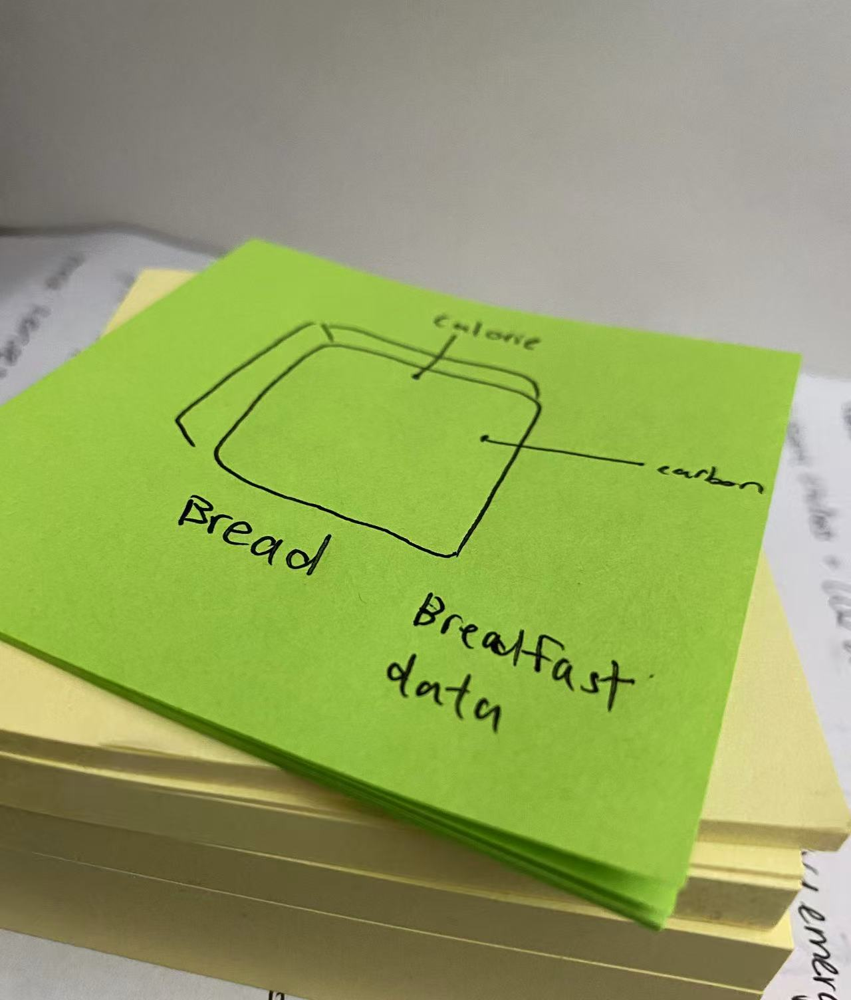
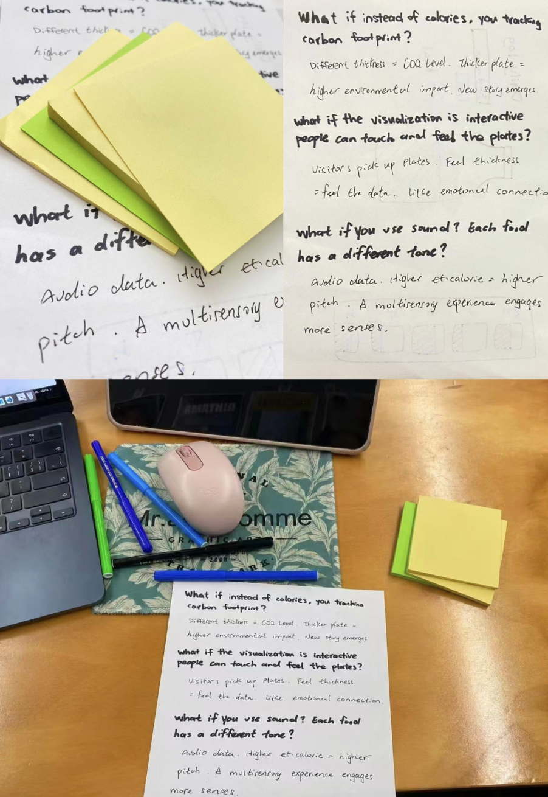

# Week 07

[← Back to Home](../index.md)
 
## Introduction
This learning log documents my progress for Week 7 of the Data-Driven Visualization project course. The second phase of this course focuses on data-driven visualization projects, where I am required to continue documenting my work on my GitHub Pages website. This includes recording experimental processes, technical learning, concept development, and participating in peer review and exchange activities.

## Concept Sketch 
### Activity Description
In this concept sketching session, I was tasked with further developing my concept sketches using drawings and annotations to think through my project. I displayed my sketches on my laptop screen and walked around the room, leaving sticky note comments on other students' work. For each sketch I viewed, I was required to leave at least one observation (what I noticed about the work) and one question (something I was curious about or uncertain about).

### My Sketches and Process
For my concept sketching work, I developed two different approaches to represent food calorie data through physical visualizations:
Approach One (Presented): My first approach was a traditional data visualization sketch showing calorie information through conventional charts and graphs displayed on screen.
Approach Two (Not Presented): My second and more interesting approach was a laser-cut device concept — using acrylic sheets of different thicknesses to represent different calorie values. Each laser-cut plate would be engraved with different food names and related information, creating a three-dimensional calorie book that users could flip through and examine.

### Technical Issue During Presentation
Unfortunately, my iPad tablet suddenly stopped working (black screen) during the class presentation. This technical failure meant that my classmates only saw one of my two ideas. I had originally planned to demonstrate both approaches, including showing the physical thickness of the laser-cut acrylic sheets as a demonstration of my concept. However, due to the iPad malfunction, I had to explain my second concept verbally instead of showing it visually. This was disappointing because the visual impact of seeing different thickness levels was a key part of my concept.

### Feedback Received from Classmates
After presenting my sketch to classmates, I received the following feedback and questions:
- "What makes this different? There are many similar visualizations already out there — what would make this unique?"
- "I like the idea, but is it about water intake or something else?" (They were uncertain about whether I was tracking calories, water, or another metric)
- "I like the calorie tracking and visualization idea. How are you going to accurately track the data?"

### Observations and Reflections
#### What Surprised Me:
After realizing I hadn't shown a second conceptual sketch, I discussed my thoughts with the student next to me. I was surprised to find that this student was very interested in the laser cutting concept I was presenting—especially the idea of ​​"representing data with thickness." This made me realize that 3D physical visualization resonates more with and engages more than 2D charts on a screen. The tactile and touchable nature of physical objects seems to stimulate audience participation more effectively.

#### What Agreed With My Thinking:
Everyone agreed that data accuracy is a critical element of this project. This aligns perfectly with my original concerns. I will need to find reliable data sources to ensure my visualization presents accurate information.

#### Areas I Want to Follow Up On:
- Conduct deeper research into food calorie databases to ensure data accuracy
- Explore how to use laser-cut techniques to represent additional dimensions (thickness for calories, color coding for food types)

#### Reflection and Next Steps
Based on the feedback received, I have refined my concept to focus more on what makes my visualization unique. The tactile experience of touching different thicknesses to "feel" the data is my key differentiating factor. 

## Creation Sprint 
### Activity Description
This activity required me to use rapid prototyping — short cycle iterations, focused making, and an experimental mindset — to spend 45 minutes producing my first practical experiment with my dataset and visualization method. The goal was to extract something visible from the data, even if rough. The objective was to create something testable rather than a final finished product.
### In-Class Prototyping Work
During the creation sprint in class, I used sticky notes to directly sketch and test my laser-cut design concepts. The unique characteristic of sticky notes is that they have physical thickness, which perfectly simulates the laser-cut acrylic plates I am planning to create. I peeled off layers of sticky notes and stacked them together to simulate plates of different thicknesses. This method helped me convey my ideas to classmates much more intuitively than just drawing on paper.
By physically stacking sticky notes, I could show different calorie levels — thin stack for low calories, thick stack for high calories. This gave immediate, tangible feedback on whether my concept would work.

After class, I continued working on my project during my free time. I used Adobe Illustrator to draw proper laser-cut design files, continuing to optimize my design. I transformed the results from my sticky note testing into digital design files, preparing for the next phase of actual production.
These prototypes represent my journey from conceptual ideas to working models, documenting each step of experimentation along the way.

## "What If..." Variant 
For this activity, I paired up with a partner to share my creation sprint results and receive feedback on my food visualization project. My partner introduced me to three hypothetical alternative directions that could expand my project's potential, encouraging me to think more critically and experimentally about my work.

The first suggested direction was to shift my focus from tracking calories to tracking carbon footprint. This would fundamentally change my project's purpose from personal health data to environmental impact data. Instead of showing how different foods affect the body, I would visualize how food choices affect the planet. The appeal of this direction lies in its broader social relevance — environmental issues resonate with a wider audience and connect eating habits to larger global conversations. However, this option would require a complete reconceptualization of my visual language. The board, which currently represent caloric density, would need to represent carbon emissions instead. This pivot would preserve the physical medium but completely change what the thickness communicates.

The second direction proposed was to make the visualization interactive, allowing viewers to pick up and physically handle the plates. This would transform my project from a passively viewed display into an actively experienced installation. Viewers could touch plates of different thicknesses to understand the data through sensation — thick plates representing high-calorie foods and thin plates representing low-calorie foods. This direction excites me because it builds directly on what makes my project unique: the physical, tactile nature of the plates. The strength of my current work is that it exists in the real world, not on a screen. Adding interactivity would enhance this strength by giving viewers a personal connection to the data.

The third suggestion was to add sound as a data dimension, where each food type produces a different tone or musical note. This would create an auditory layer to complement the visual and tactile elements. Low-calorie foods might produce higher pitches, while high-calorie foods produce lower tones. This direction offers an interesting way to make data more memorable and emotionally engaging, but it risks introducing complexity that distracts from the core tactile experience.
Of these three directions, the second option — the interactive tactile experience — offers the most natural evolution for my project. It builds on my existing strength rather than abandoning it, and it deepens the viewer's connection to the data without requiring a complete overhaul of my concept.

｜Food Item｜Typical Meal｜Category｜Calorie(kcal)|Energy 0-5|
|None|Any|Empty|0|0|
|bread|Breakfast|主食 (Carbs)|150|1.5|
|eggs / egg,Breakfast,蛋白质 (Protein),150,1.5
|milk,Breakfast,饮品 (Drink),150,1.0
|nibbles (零食/小吃),Breakfast,零食 (Snack),250,1.0
|fried rice,Lunch / Dinner,主食 (Carbs),450,3.0
|steak nodolle(s),Lunch / Dinner,主食+肉 (Carbs+Meat),650,4.0
|pie,Lunch,烘焙主食 (Carbs),400,2.5
|cheese pasta,Lunch,主食 (Carbs),500,3.0
|chocolate milk,Lunch,饮品 (Drink),250,1.5
|rice,Dinner,主食 (Carbs),200,1.5
|steak dish,Dinner,蛋白质 (Protein),450,3.0
|steam chicken,Dinner,蛋白质 (Protein),250,2.5
|chicken soup,Dinner,汤类 (Soup),150,1.5
|rest fried shredded potatoes,Dinner,蔬菜/主食 (Veg/Carbs),200,1.5
|Boiled green vegetable,Dinner,蔬菜 (Vegetable),50,0.5
|Boiled broccoli,Dinner,蔬菜 (Vegetable),50,0.5

## Images & Media

*Use the format below to embed images from your assets folder:*

``
`*Your caption here*`

*The text inside the square brackets is alt text (a description for accessibility), not a visible caption. To add a caption, place a line of italic text below the image.*

## AI Usage Statement

*Document any use of AI tools under an AI Usage Statement heading. Explain which tools you used and describe how you used them. Reference any AI-generated content (see [QuickCite](https://auckland.libguides.com/referencing-generative-ai-tools) for guidance).*
