# Week 07

[← Back to Home](../index.md)
 
## Introduction
This learning log documents my progress for Week 7 of the Data-Driven Visualization project course. The second phase of this course focuses on data-driven visualization projects, where I am required to continue documenting my work on my GitHub Pages website. This includes recording experimental processes, technical learning, concept development, and participating in peer review and exchange activities.

## 1. Concept Sketch 
### Activity Description
In this concept sketching session, I was tasked with further developing my concept sketches using drawings and annotations to think through my project. I displayed my sketches on my laptop screen and walked around the room, leaving sticky note comments on other students' work. For each sketch I viewed, I was required to leave at least one observation (what I noticed about the work) and one question (something I was curious about or uncertain about).

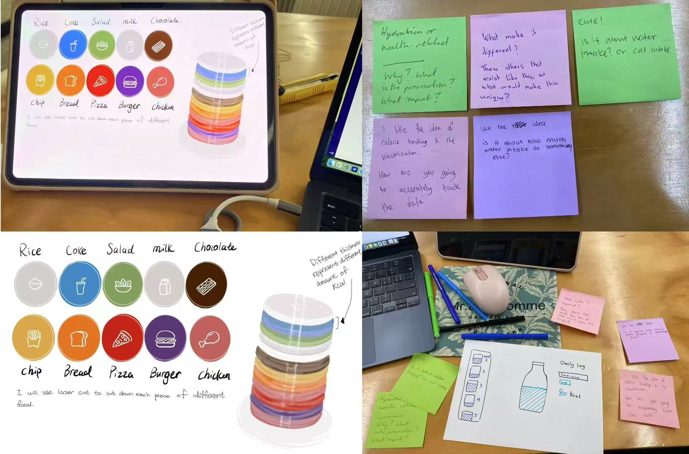
### My Sketches and Process
For my concept sketching work, I developed two different approaches to represent food calorie data through physical visualizations:
Approach One (Presented): My first approach was a traditional data visualization sketch showing calorie information through conventional charts and graphs displayed on screen.
Approach Two (Not Presented): My second and more interesting approach was a laser-cut device concept — using acrylic sheets of different thicknesses to represent different calorie values. Each laser-cut plate would be engraved with different food names and related information, creating a three-dimensional calorie book that users could flip through and examine.

### Technical Issue During Presentation
Unfortunately, my iPad tablet suddenly stopped working (black screen) during the class presentation. This technical failure meant that my classmates only saw one of my two ideas. I had originally planned to demonstrate both approaches, including showing the physical thickness of the laser-cut acrylic sheets as a demonstration of my concept. However, due to the iPad malfunction, I had to explain my second concept verbally instead of showing it visually. This was disappointing because the visual impact of seeing different thickness levels was a key part of my concept.

### Feedback Received from Classmates
After presenting my sketch to classmates, I received the following feedback and questions:
- "What makes this different? There are many similar visualizations already out there — what would make this unique?"
- "I like the idea, but is it about water intake or something else?" (They were uncertain about whether I was tracking calories, water, or another metric)
- "I like the calorie tracking and visualization idea. How are you going to accurately track the data?"

### Observations and Reflections
#### What Surprised Me:
After realizing I hadn't shown a second conceptual sketch, I discussed my thoughts with the student next to me. I was surprised to find that this student was very interested in the laser cutting concept I was presenting—especially the idea of ​​"representing data with thickness." This made me realize that 3D physical visualization resonates more with and engages more than 2D charts on a screen. The tactile and touchable nature of physical objects seems to stimulate audience participation more effectively.

#### What Agreed With My Thinking:
Everyone agreed that data accuracy is a critical element of this project. This aligns perfectly with my original concerns. I will need to find reliable data sources to ensure my visualization presents accurate information.

#### Areas I Want to Follow Up On:
- Conduct deeper research into food calorie databases to ensure data accuracy
- Explore how to use laser-cut techniques to represent additional dimensions (thickness for calories, color coding for food types)

#### Reflection and Next Steps
Based on the feedback received, I have refined my concept to focus more on what makes my visualization unique. The tactile experience of touching different thicknesses to "feel" the data is my key differentiating factor. 

## 2. Creation Sprint 
### Activity Description
This activity required me to use rapid prototyping — short cycle iterations, focused making, and an experimental mindset — to spend 45 minutes producing my first practical experiment with my dataset and visualization method. The goal was to extract something visible from the data, even if rough. The objective was to create something testable rather than a final finished product.
### In-Class Prototyping Work
During the creation sprint in class, I used sticky notes to directly sketch and test my laser-cut design concepts. The unique characteristic of sticky notes is that they have physical thickness, which perfectly simulates the laser-cut acrylic plates I am planning to create. I peeled off layers of sticky notes and stacked them together to simulate plates of different thicknesses. This method helped me convey my ideas to classmates much more intuitively than just drawing on paper.
By physically stacking sticky notes, I could show different calorie levels — thin stack for low calories, thick stack for high calories. This gave immediate, tangible feedback on whether my concept would work.
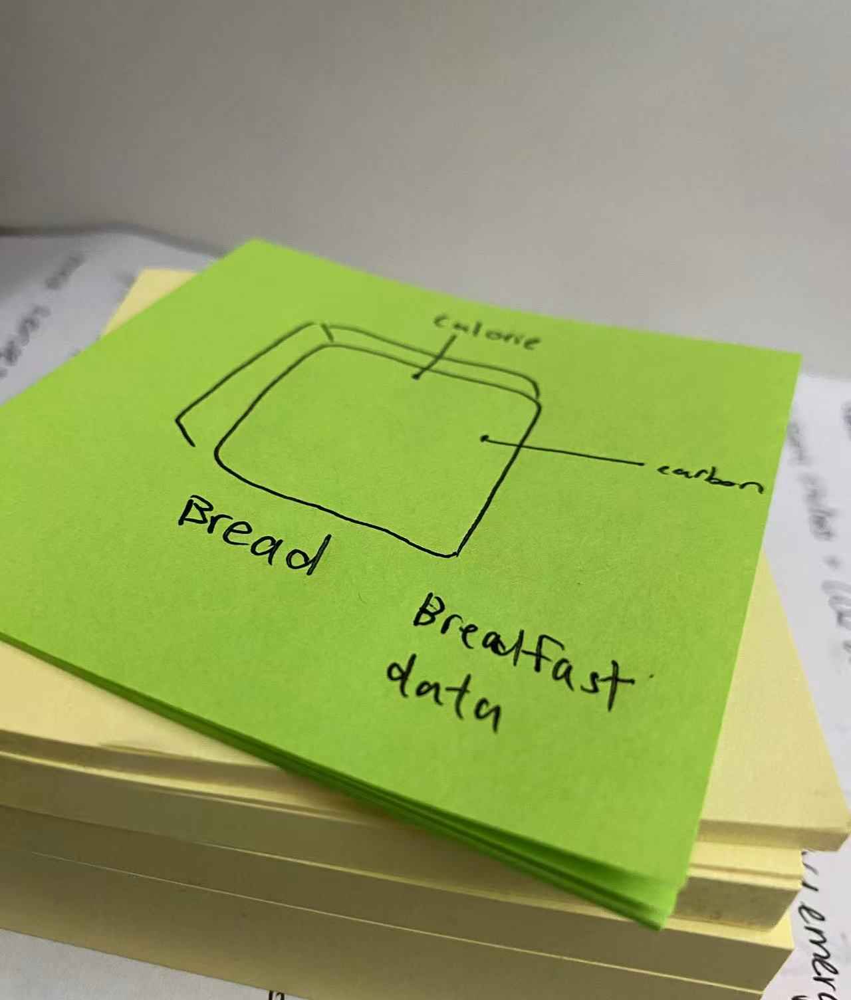

After class, I continued working on my project during my free time. I used Adobe Illustrator to draw proper laser-cut design files, continuing to optimize my design. I transformed the results from my sticky note testing into digital design files, preparing for the next phase of actual production.
These prototypes represent my journey from conceptual ideas to working models, documenting each step of experimentation along the way.

This experiment helped me understand that physical thickness is much easier to communicate than numerical calorie values alone. When classmates could see and compare different stack heights, they immediately understood the relationship between thickness and calorie intake. This confirmed that a tactile approach may be more effective than a purely digital visualization for communicating food-related data.

## 3. "What If..." Variant 
For this activity, I paired up with a partner to share my creation sprint results and receive feedback on my food visualization project. My partner introduced me to three hypothetical alternative directions that could expand my project's potential, encouraging me to think more critically and experimentally about my work.
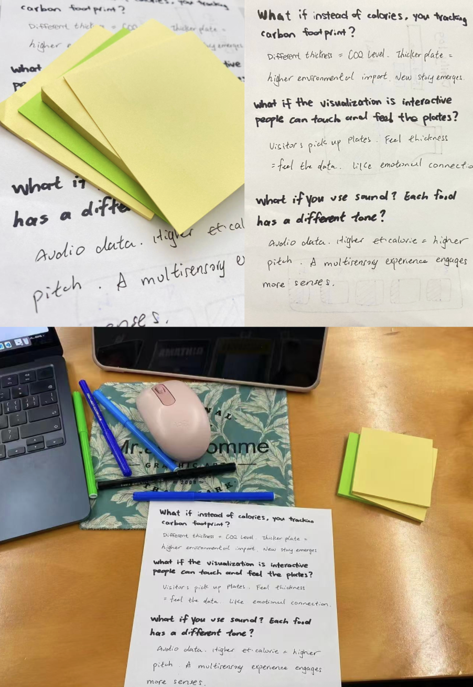

The first suggested direction was to shift my focus from tracking calories to tracking carbon footprint. This would fundamentally change my project's purpose from personal health data to environmental impact data. Instead of showing how different foods affect the body, I would visualize how food choices affect the planet. The appeal of this direction lies in its broader social relevance — environmental issues resonate with a wider audience and connect eating habits to larger global conversations. However, this option would require a complete reconceptualization of my visual language. The board, which currently represent caloric density, would need to represent carbon emissions instead. This pivot would preserve the physical medium but completely change what the thickness communicates.

The second direction proposed was to make the visualization interactive, allowing viewers to pick up and physically handle the plates. This would transform my project from a passively viewed display into an actively experienced installation. Viewers could touch plates of different thicknesses to understand the data through sensation — thick plates representing high-calorie foods and thin plates representing low-calorie foods. This direction excites me because it builds directly on what makes my project unique: the physical, tactile nature of the plates. The strength of my current work is that it exists in the real world, not on a screen. Adding interactivity would enhance this strength by giving viewers a personal connection to the data.

The third suggestion was to add sound as a data dimension, where each food type produces a different tone or musical note. This would create an auditory layer to complement the visual and tactile elements. Low-calorie foods might produce higher pitches, while high-calorie foods produce lower tones. This direction offers an interesting way to make data more memorable and emotionally engaging, but it risks introducing complexity that distracts from the core tactile experience.
Of these three directions, the second option — the interactive tactile experience — offers the most natural evolution for my project. It builds on my existing strength rather than abandoning it, and it deepens the viewer's connection to the data without requiring a complete overhaul of my concept.

## 1. Project Development & Skill Building
Based on the feedback from the Concept Sketch and Creation Sprint activities, I decided to further develop the laser-cut direction of my project. One of the most useful insights from the classroom discussion was that people were much more interested in the physical representation of data than the screen-based visualisation.  She was also planing to do a 3d handmade data model. 

To move the project forward, I began developing a mapping system that converts calorie values into physical dimensions. I created a food reference table that assigns the thickness to each food item. This system allows calorie intake to be translated into a tangible form that can later be fabricated using laser cutting.

During this process, I also revisited my technical skills. I had previous experience with laser cutting, I needed to prepare fabrication files in Adobe Illustrator and consider how numerical data could be transformed into physical objects. 

One important lesson from this stage was that physical data visualisation communicates information differently from digital visualisation. While p5.js was useful for exploring patterns and interactions, the laser-cut approach provides a stronger sense of scale, presence, and materiality. This reinforces the project's goal of encouraging people to think about their eating habits and the importance of maintaining a healthy relationship with food. The next step is to fabricate a small prototype and test whether viewers can understand the calorie information through the physical thickness of the pieces. 

### Solid Food Plate Manufacturing Checklist (Mapping Rule: 50 kcal = 1 mm thickness)

| Food Item | Food types | Calories (kcal) | Thickness of physical board | Energy contribution value (0-5) |
| :--- | :--- | :--- | :--- | :--- |
| **None** | Empty | 0 | **0 mm** | 0 |
| **apple** | Fruit | 80 | **2 mm** | 1.0 |
| **pear** | Fruit | 90 | **2 mm** | 1.0 |
| **strawberry** | Fruit | 30 | **1 mm** | 0.5 |
| **grape** | Fruit | 60 | **1 mm** | 0.5 |
| **mango** | Fruit| 120 | **2 mm** | 1.5 |
| **orange juice** | Fruit | 120 | **2 mm** | 1.0 |
| **yogurt** | Dairy | 150 | **3 mm** | 1.5 |
| **rice** | Carbs | 200 | **4 mm** | 1.5 |
| **cereal** | Carbs | 200 | **4 mm** | 1.0 |
| **bread** | Carbs | 150 | **3 mm** | 1.5 |
| **fried rice** | Carbs | 450 | **9 mm** | 3.0 |
| **pie** | Carbs | 400 | **8 mm** | 2.5 |
| **cheese pasta** | Carbs | 500 | **10 mm** | 3.0 |
| **steak nodolles** | Carbs+Meat | 650 | **13 mm** | 4.0 |
| **shredded potatoes**| Veg/Carbs | 200 | **4 mm** | 1.5 |
| **Boiled green vegetable**| Vegetable | 50 | **1 mm** | 0.5 |
| **Boiled broccoli** | Vegetable | 50 | **1 mm** | 0.5 |
| **hot dog** | Processed Meat | 300 | **6 mm** | 2.0 |
| **pizza**| Fast Food | 600 | **12 mm** | 3.5 |
| **pepperoni pizza**| Fast Food | 700 | **14 mm** | 4.0 |
| **cheeseburger** | Fast Food | 550 | **11 mm** | 3.5 |
| **chip** | Snack | 300 | **6 mm** | 1.5 |
| **coke** | Soft Drink| 140 | **3 mm** | 0.5 |
| **blacktea** | Drink | 10 | **1 mm** | 0.5 |
| **milk** | Drink | 150 | **3 mm** | 1.0 |
| **chocolate milk** | Drink | 250 | **5 mm** | 1.5 |
| **chicken noddles** | Carbs+Protein | 500 | **10 mm** | 3.0 |
| **fried egg** | Protein | 180 | **4 mm** | 1.5 |
| **steak dish** | Protein | 450 | **9 mm** | 3.0 |
| **steam chicken** | Protein | 250 | **5 mm** | 2.5 |
| **apple pie** | Dessert | 450 | **9 mm** | 2.5 |
| **nibbles** | Snack | 250 | **5 mm** | 1.0 |
| **chocolate** | Snack | 200 | **4 mm** | 1.0 |
| **chicken soup** | Soup | 150 | **3 mm** | 1.5 |

With the chatgpt tool, I organised the main food items that appeared throughout my dataset and grouped them into categories. AI was also used to estimate the calorie content of each food item and help determine an appropriate physical thickness value for my early laser-cut prototypes. This foods with higher calorie values were represented by thicker layers, while lower-calorie foods were represented by thinner layers.

## Lazar picture and your process of lazer cuting
After organising the food categories and calorie information, I translated the data into physical forms. I independently created the vector drawings in Adobe Illustrator and prepared the files for laser cutting.

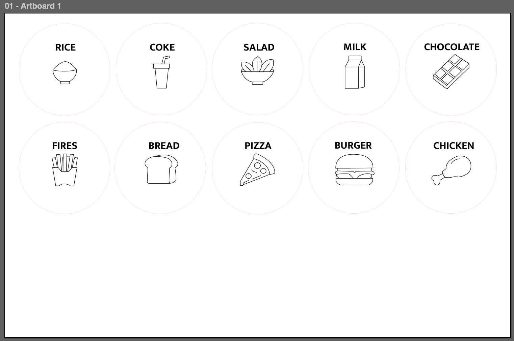
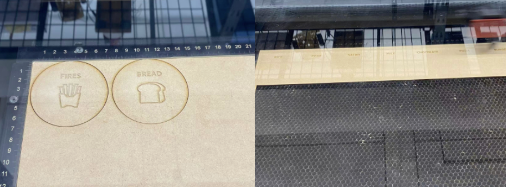
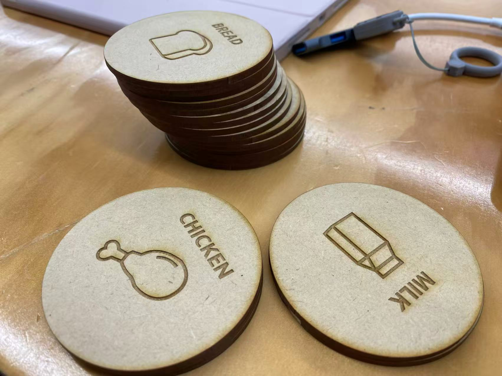
 At this stage, the laser-cut prototype was still an experiment rather than a final outcome. I used a single type of wood throughout the prototype to test the visual system and fabrication process. My main focus was not on material exploration, but on understanding how food data could be translated into physical forms through thickness, shape, and layering. Creating the prototype helped me evaluate the feasibility of the concept。 

## Presentation (5 slides)
I prepared a short, 5-minute progress slides to share with a small group in next week's class:
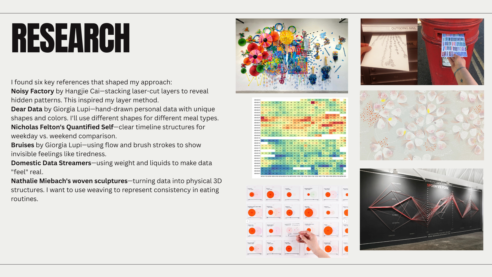
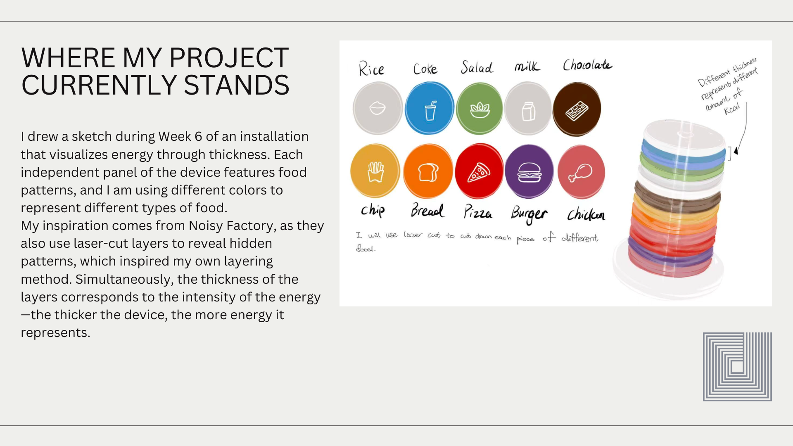
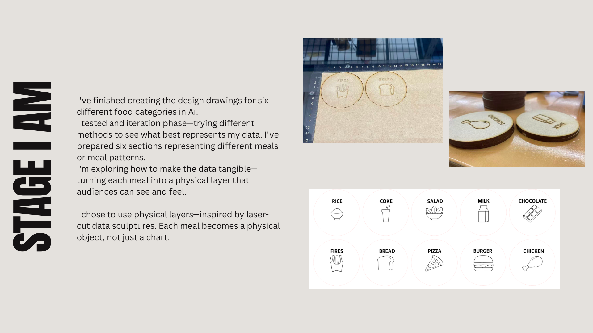
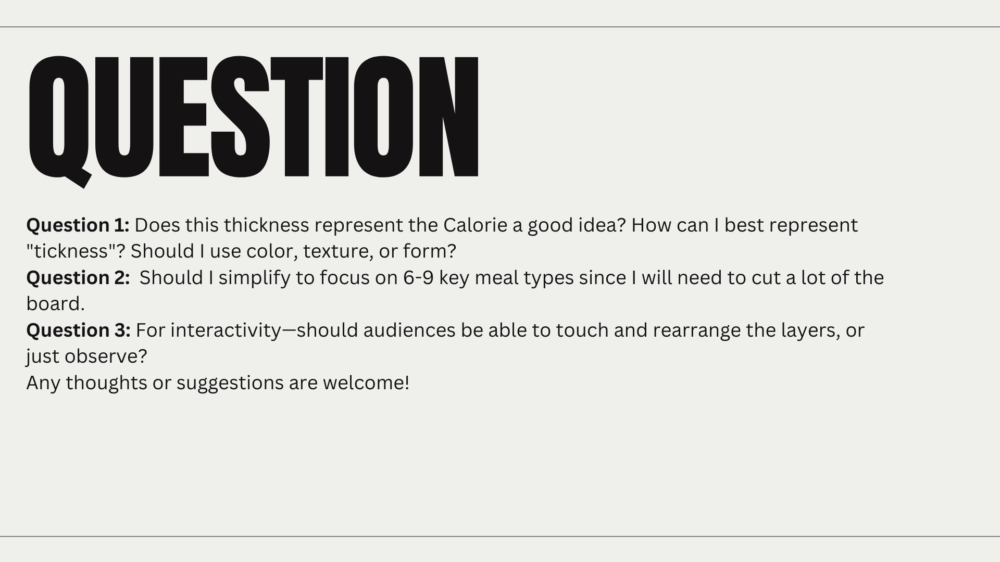
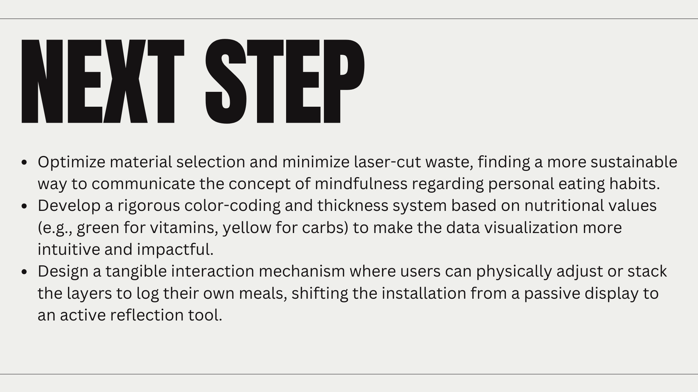

## AI Usage Statement
During Week 7, I used ChatGPT to assist with translating food diary data into a manufacturable format for the physical prototype. Specifically, ChatGPT helped organise the Solid Food Plate Manufacturing Checklist and establish a mapping rule where every 50 kcal corresponded to 1 mm of material thickness. All final decisions and design outcomes were reviewed and determined by me.

OpenAI. (2026). ChatGPT (GPT-5.5 version) [Large language model]. https://chatgpt.com/
