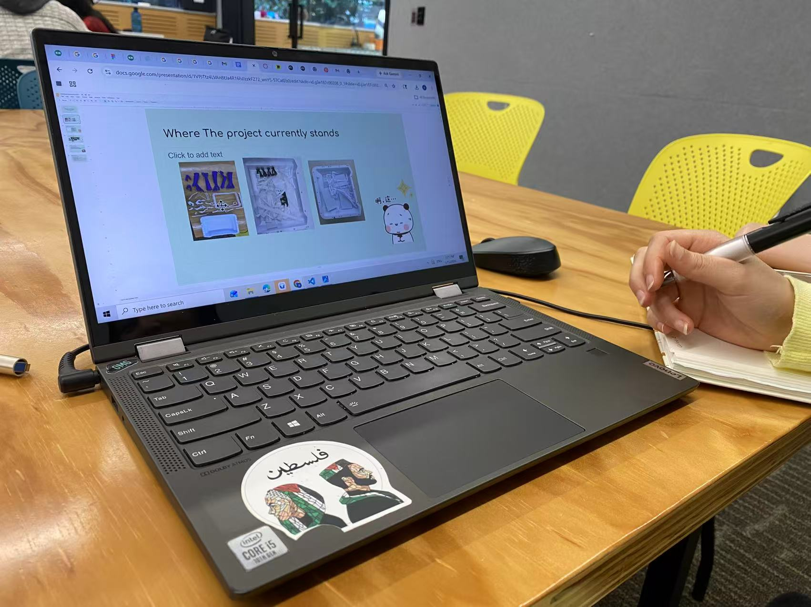
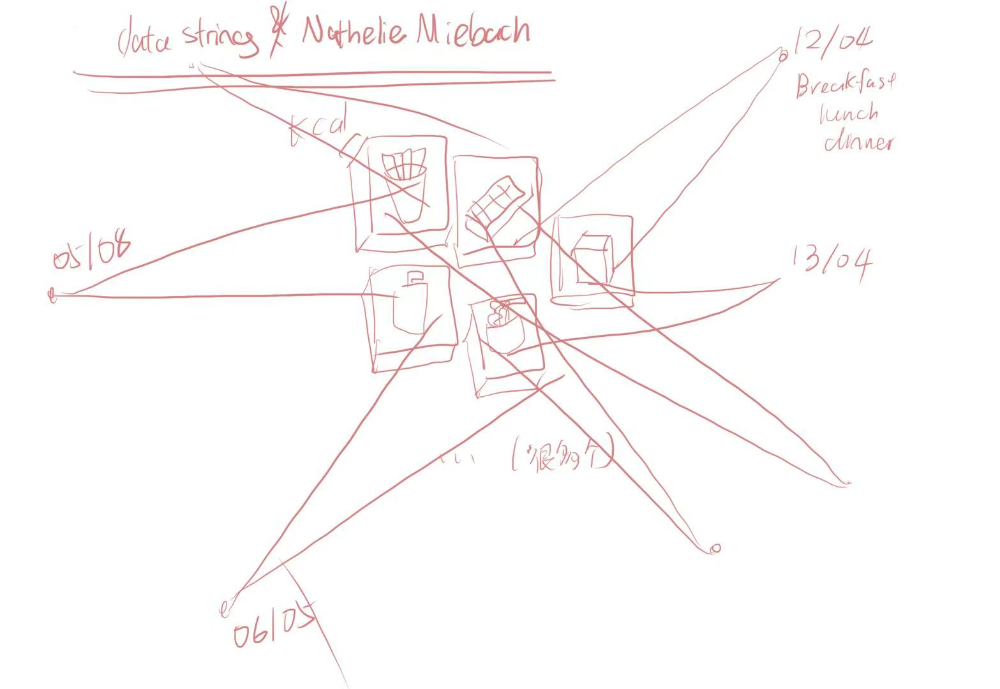
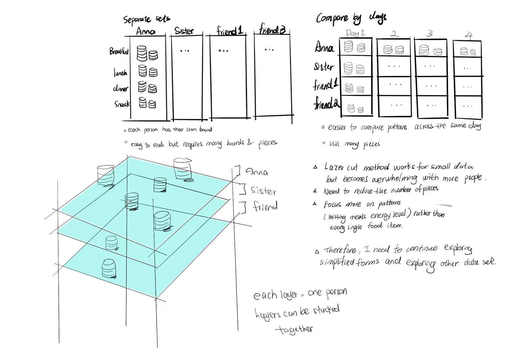

# Week 08

[← Back to Home](../index.md)

## Documentation 

## 1. Progress Reports
Due to personal work commitments, I fell behind t this classroom progress. To catch up, I conducted a 1-on-1 peer review session with a classmate in Week 9, where we presented our work and exchanged critical feedback.

During this presentation, I shared my secondary research, which includes six different data-driven artists. Among them, the installation Noisy Factory by Hangjie Cai serves as my primary design direction. I selected his work because his use of laser-cutting to deconstruct and refine layers is incredibly sophisticated. Inspired by this, I realized I could visualize food data in a tangible, physical form. Since the laser-cut panels do not stick together, they can be repeatedly rearranged, which creates great potential for interactivity.

Furthermore, I have already advanced this concept into a physical prototype. I used Adobe Illustrator to draft the initial blueprints and successfully fabricated the prototype using a laser cutter. Although I was originally supposed to present this in Week 8, I brought the physical model to our Week 9 sharing session.

### Critical Questions Raised
Question 1: Does this thickness represent the Calorie a good idea? How can I best represent "tickness"? Should I use color, texture, or form?
Feedback & Insights: She strongly approved of the thickness concept but recommended shifting the materiality to achieve it more sustainably. Instead of heavy, wasteful wooden boards, she suggested using paper as the primary medium. Furthermore, she proposed a spatial installation approach: hanging these paper layers from the ceiling. Each hanging cluster could represent a single day's food intake data. To elevate the aesthetic value, I could either hand-draw or digitally print stylized food illustrations on the paper, turning the data visualization into an elegant, decorative hanging installation. This not only drastically reduces material waste but also shifts the project from a rigid object into a dynamic, lightweight spatial experience.

Question 2:  Should I simplify to focus on 6-9 key meal types since I will need to cut a lot of the board. 
Feedback & Insights: Her perspective on this was a great reality check regarding data integrity. While simplifying the project to 6–9 generic meal types would undeniably save a lot of drafting time in Adobe Illustrator and reduce fabrication labor, she warned that it might compromise the authenticity of the data. In reality, people's daily diets are incredibly diverse; restricting the choices to just a few categories would make it nearly impossible for participants to accurately map or collect their actual food intake. Therefore, she suggested finding a balance: keeping a broader, more realistic dataset, but perhaps simplifying the complexity of the shapes themselves rather than cutting down the number of food types, ensuring the data remains honest and relatable.

Question 3: For interactivity—should audiences be able to touch and rearrange the layers, or just observe?
Feedback & Insights: "She strongly advocated for a fully interactive experience rather than passive observation. Her reasoning was brilliant from a user-experience standpoint: if the installation is purely visual (observation-only), the design narrative, graphics, and data logic must be flawless and hyper-clear to avoid confusing the audience. However, by making it interactive, the project becomes a participatory artwork. Allowing the audience to touch, rearrange, and physically manipulate the layers invites them to 'join the conversation.' The act of participation itself bridges any potential gaps in visual clarity, shifting the project from a one-way lecture about nutrition into a shared, reflective community experience."

### Peer Feedback & Collaborative Insights
My classmate gave highly positive feedback on my concept. While discussing how to represent energy values through thickness to promote healthy eating, she proposed a fascinating perspective: creating a strict visual distinction between "healthy" and "unhealthy" food. This insight was incredibly inspiring and sparked a lot of deeper thinking for my next design iteration.  At the same time, I started worry to about my workload and how this unhealth and health food can presented, the representation of health and unhealth food will expand the project scope and even alter my focus area, since i just want to convey an idea to raise awareness that having food is really important, do not miss them. 

During the presentation, I received feedback regarding my fabrication process. I realized that my original design would require an overwhelming amount of laser cutting, which is not practical for the given timeline and resources. To address this, I am going to modify the design to significantly reduce the volume of cutting required. However, I will still continue to use laser cutting as my primary fabrication method, focusing instead on a more efficient and streamlined way to apply the technique.
### Presenting: 

## 2. Critical Design Proposition
For this activity, I discussed my project with a student. Her project focuses on collecting waste material from 3D printers, melting the plastic, and transforming it into puzzle pieces that form an environmental installation. The installation is designed to communicate environmental pollution data through physical forms made from recycled material.

What I Found Most Interesting: The most interesting aspect of the project is the relationship between material and message. Rather than simply visualising environmental data, the project uses the waste material itself as the medium. This creates a strong connection between the source of the waste and the environmental issue being represented.

What Is Least Developed: One challenge I identified is the limited amount of waste generated by 3D printers within a single studio. Collecting enough material may require a long period of time, which could restrict the scale and impact of the final installation. The project currently focuses on a very specific waste stream, which may not fully communicate the broader issue of material waste.

Alternative Direction: I suggested expanding the project beyond 3D printer waste to include other forms of studio waste, such as paper scraps, plastic bottles, packaging, and failed prototypes. This would provide a larger dataset and create a more comprehensive picture of waste production within the design studio environment.

Increasing the Impact: To strengthen audience engagement, I proposed adding an interactive element. Visitors could collect pieces of waste found around the studio and place them onto the installation. This would encourage participation and make people more aware of their own contribution to waste generation.

My Design Proposition: If I were developing this project, I would create an environmental landscape divided into different zones, with each area representing a different category of waste. The amount of material in each zone would correspond to the quantity of waste generated. This would allow viewers to compare different forms of waste and understand how small amounts of waste produced within a single design studio can scale into much larger environmental problems when multiplied across thousands of studios worldwide. This proposition builds on the original concept while expanding its scope, increasing audience participation, and strengthening the connection between local actions and global environmental impacts.

## 一个草稿画

# Individual work:

本课程的学习任务包括每周9.5小时的课外自主学习时间。一般来说，您应该花费2小时阅读和思考课程内容，7.5小时完成作业。

请务必先完成所有课堂活动，然后再进行自主学习任务。

1. 反思性总结

根据进度报告和收到的关键设计建议中的反馈，撰写一份简短的反思总结（约300字），并将其写入你的日志。总结中应包含你遇到的最重要的反馈和想法、你据此做出的决策，以及这些决策将如何影响你未来的项目。重点在于将批评意见转化为清晰的方向，而不是简单地复述所有内容。

2. 项目开发

直接根据你的反思总结，应用你所确定的决定，无论这些决定是关于你的数据来源、你的可视化方法、你的作品将采取的形式，还是其他方面。
针对与此方向相关的任何技术技能差距进行改进，并在制作过程中记录你的学习过程，包括文字和图片证据。解释你尝试了什么，学到了什么，以及这些如何推动了你的项目进展。

## after the presentation, i rethink about how to develop my project, due to the presentaion, i get some of the feedback. 
]
]

*Use the format below to embed images from your assets folder:*

``
`*Your caption here*`

*The text inside the square brackets is alt text (a description for accessibility), not a visible caption. To add a caption, place a line of italic text below the image.*

## AI Usage Statement

*Document any use of AI tools under an AI Usage Statement heading. Explain which tools you used and describe how you used them. Reference any AI-generated content (see [QuickCite](https://auckland.libguides.com/referencing-generative-ai-tools) for guidance).*
