# Week 09

[← Back to Home](../index.md)

## 1. Project Statement: First Draft

### Case study
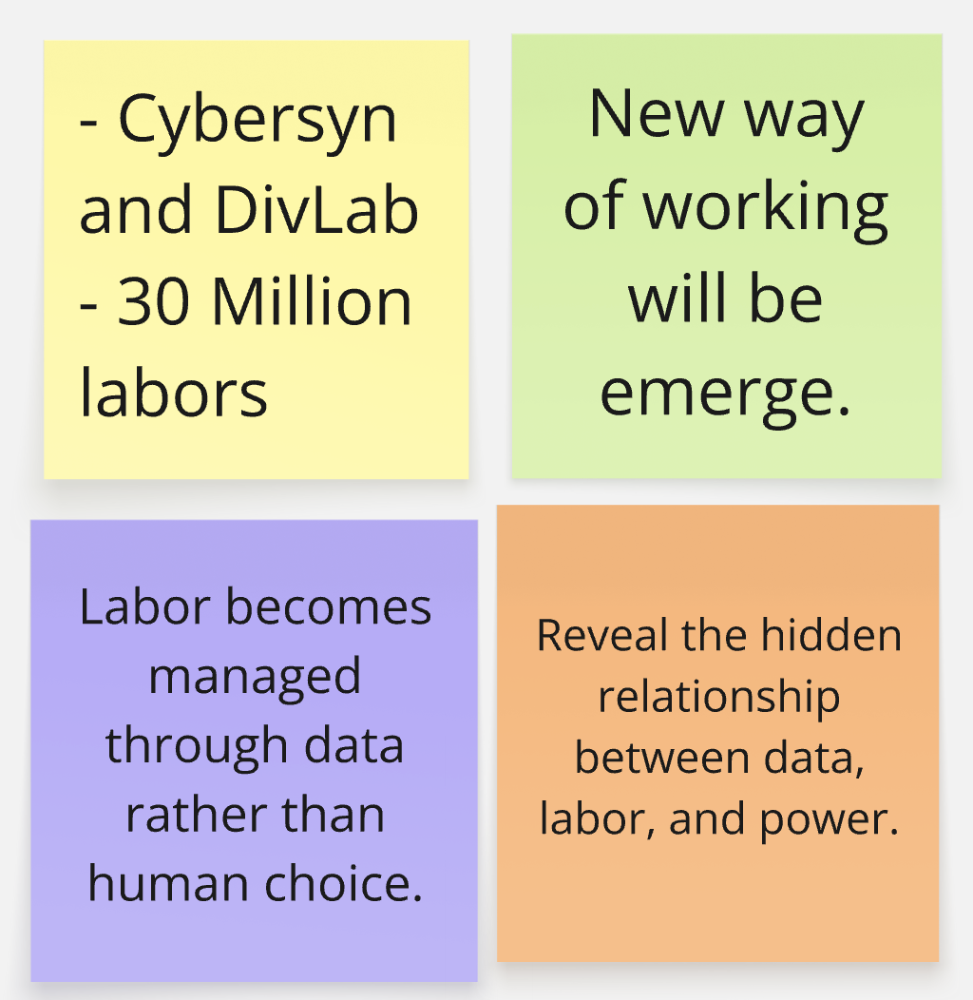
What are the data sources used in this work? 

The data sources used in this work come from both real and fictional references. The project is inspired by Cybersyn, a real computer system developed in Chile in 1971, and DivLab, a fictional computational system described in Ursula K. Le Guin's novel The Dispossessed. The work also uses data from a pool of 30 million American workers. Random number generators are used to assign jobs and labor positions within the system.

What is the future scenario it addresses?

This project explores a future scenario where computers and AI systems are responsible for managing labor and distributing jobs. Instead of people choosing jobs or companies hiring workers, a computational system decides who will perform different tasks. The project imagines an alternative economic system that is organized through data and computation.

What does the statement argue about data and power?

The statement argues that data and AI are closely connected to power. It suggests that technology is not neutral because it is shaped by the social, political, and economic systems in which it operates. The project highlights how computational systems can influence labor, decision-making, and the distribution of resources. It encourages viewers to think about who controls these systems and who benefits from them.

What might be the intended impact, and is this included in the statement?

I think the intended impact is to encourage people to think critically about the relationship between AI, labor, and society. The project asks viewers to question how technology shapes everyday life and whether alternative systems could exist in the future. 

### Project Statement: First Draft
My project is a physical data visualisation that explores the relationship between eating habits, calorie intake, and personal wellbeing. Inspired by artists such as Hangjie Cai, Dear Data, and Nathalie Miebach, I transform food diary records into laser-cut objects that people can see and touch. Each food item is represented by a physical piece, and the thickness of the piece corresponds to its calorie value. Missing meals are represented through absence, making irregular eating habits visible.

The primary data source is a food diary collected from myself, family members, and friends. The dataset includes meal records, estimated calorie intake, and daily energy levels. By comparing multiple participants, the project reveals different eating behaviours and the reasons behind meal skipping.

The subject matter focuses on the importance of regular eating and self-care. The future scenario imagines a world where people become more aware of their eating habits through tangible and interactive data experiences rather than traditional charts and calorie trackers.

The intended impact is to encourage people to reflect on their own eating habits and understand that skipping meals can have long-term effects on physical and mental wellbeing. Rather than judging food choices, the project aims to raise awareness about the importance of nourishing and caring for the body.
### Drafting with NotebookLM
<iframe src="https://www.youtube.com/embed/SJjjS4nDMLQ" width="560" height="315"> </iframe>

### Evaluation:
What is working well in the Notebook response is that it helps me identify the main strengths and challenges of my project. It clearly explains why physical thickness is an important part of my design, because it turns calorie data into something people can see and touch. It also helps me recognise that missing meals can be represented through absence, gaps, or thickness. However, some parts are still missing or underdeveloped. The response gives many possible directions, such as sound, weaving, hanging paper, and colour coding, but it does not help me decide which direction is the most realistic for my final project. Some ideas are interesting, but they may make the project too large and difficult to finish. Some parts also feel overly generalised and AI-like. For example, phrases such as “data humanism,” “social intervention,” and “tactile community experience” sound too broad and academic. I need to use simpler language and focus more on my actual making process. I need to research further into calorie data accuracy, sustainable materials, and how to represent energy levels clearly. I also need to test whether paper or laser-cut materials work better for showing thickness.

### Peer share
What is clear and compelling?
She really like the idea of using thickness to represent calories because it is easy to understand and different from a normal graph. The physical aspect of the project makes the data feel more real, and the idea of showing missed meals through gaps is memorable. The personal story behind the project also makes the topic more meaningful.

What still needs to be developed or resolved?
She think the project needs to further develop how energy levels and food types will be shown. I am also curious about how interactive the final outcome will be and whether people will be allowed to touch and rearrange the pieces. Another challenge is the amount of laser cutting required, so finding a more efficient production method may be important. 

## 2. Making Sprint
Based on the feedback I received from my classmate, I realised that my current laser-cut concept would require a very large number of pieces and a significant amount of material. This could become difficult to fabricate within the available time and resources. Therefore, I decided to use this sprint to explore alternative ways of reducing the amount of laser cutting while maintaining the core message of the project.

For this sprint, I developed two quick concept sketches. The first concept uses a stomach-shaped frame as the main structure. Inside the stomach, information such as date, food items, total calorie intake, and energy level are arranged in sequence. Inspired by the Data Strings activity, these elements are connected using coloured strings. Different colours represent different daily eating conditions: green for low intake, blue for adequate intake, purple for healthy intake, and red for unhealthy or insufficient intake. The food pieces still retain different thicknesses to represent calorie values, but they can be made much smaller than in my previous design.

The goal of this sprint is to test whether combining strings, colour, and thickness can communicate the data more efficiently while reducing fabrication requirements. The materials required include paper sketches, coloured pens, string, and laser-cut prototypes from previous experiments.
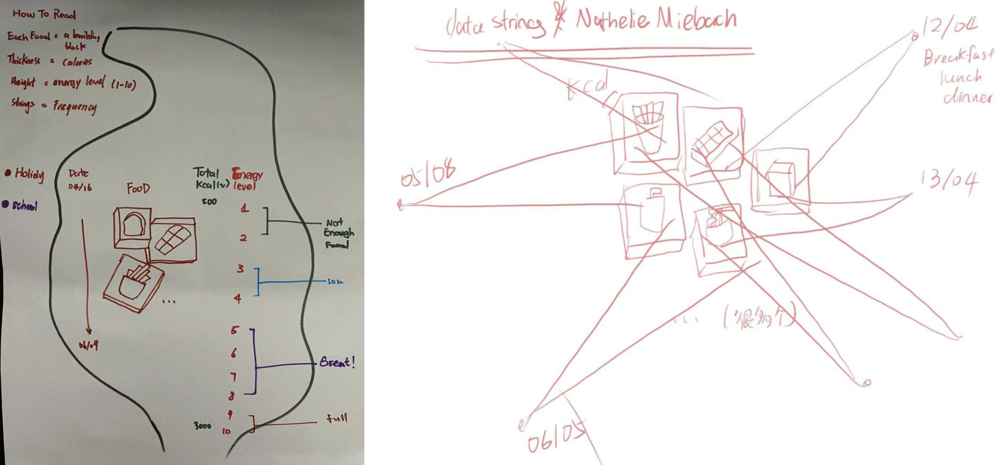

## 3. Round Robin Rapid Reactions
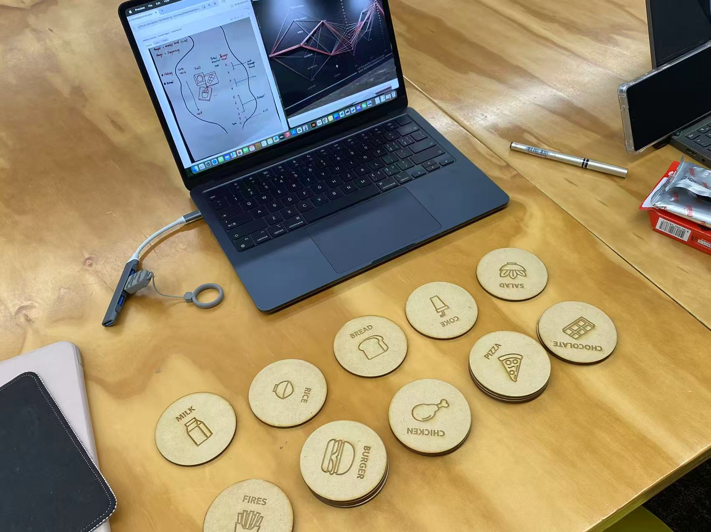
### Reactions and Feedback
During the discussion, one classmate responded very positively to the stomach-shaped structure of my design. They felt that using the stomach as the main form created a strong connection between the data and the topic of eating habits and wellbeing. However, they also pointed out a potential issue with my use of coloured strings. Since each day could have a different eating condition, the colours would become mixed together over time, making it difficult to clearly distinguish the different categories.

After hearing this feedback, my first idea was to reorganise the data and group similar colours together instead of arranging them chronologically. I thought this might create clearer colour zones and make the visualisation easier to read. However, the tutor suggested that I should not sacrifice the timeline aspect of the data, even if it makes the visualisation less visually organised. Maintaining the chronological sequence is important because it preserves the story of changing eating habits over time.

The tutor also proposed an alternative direction. Rather than relying on laser-cut food pieces and thickness as the primary visual language, I could use coloured strings as the main material and suspend them from a physical structure. This would make the colour distinctions much clearer while significantly reducing fabrication time and material usage.

This feedback made me reflect on the practicality of my current design. Although the stomach-shaped concept successfully communicates healthy and unhealthy eating patterns, the amount of fabrication required remains very high. As a result, I am now considering whether a string-based installation might be a more effective and achievable direction for the final outcome.

## Indiviudal study：
### 1. Project Development
From Week 6 to Week 8, my project development was relatively slow. Through different classroom activities, discussions, and feedback sessions, I received many new ideas and perspectives from both tutors and classmates. During this period, I was constantly questioning whether I should continue developing my original data visualisation approach or step back and explore more artist references and existing data installations.

I felt quite anxious because my initial concept was becoming increasingly difficult to realise. The fabrication workload was growing, and many aspects of the design were still unresolved. At the same time, the semester was already more than halfway through, which made me feel pressured to make a clear decision about the direction of the project.

Eventually, I decided to let go of my original concept and start again. I first used p5.js to test some of the ideas suggested by my tutors. By creating quick digital prototypes, I was able to evaluate whether these ideas could eventually be translated into a physical outcome.
<iframe src="https://www.youtube.com/embed/z6bpGiqWunc" width="560" height="315"> </iframe>

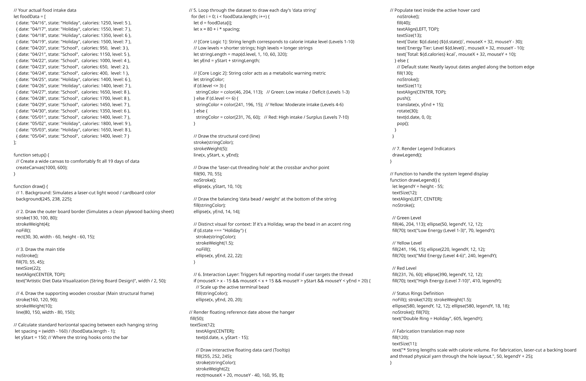

A day later, after a long and busy day, I suddenly remembered a comment from one of the tutors. They suggested that shorter strings could represent earlier dates, while longer strings could represent more recent dates. This simple idea immediately sparked a new direction. I began wondering: what if all of these strings came together to form a tree?

Excited by this possibility, I quickly opened p5.js and started experimenting. Using Google Gemini as a creative and technical support tool, I rapidly tested different arrangements and visual structures. The result was a tree-like form made from strings representing time and eating data. For the first time in several weeks, I felt genuinely excited about the project again. This concept eventually became the foundation for the Wind Chime Tree direction that I am currently developing.
<iframe src="https://www.youtube.com/embed/i9QJMwGp3e4" width="560" height="315"> </iframe>

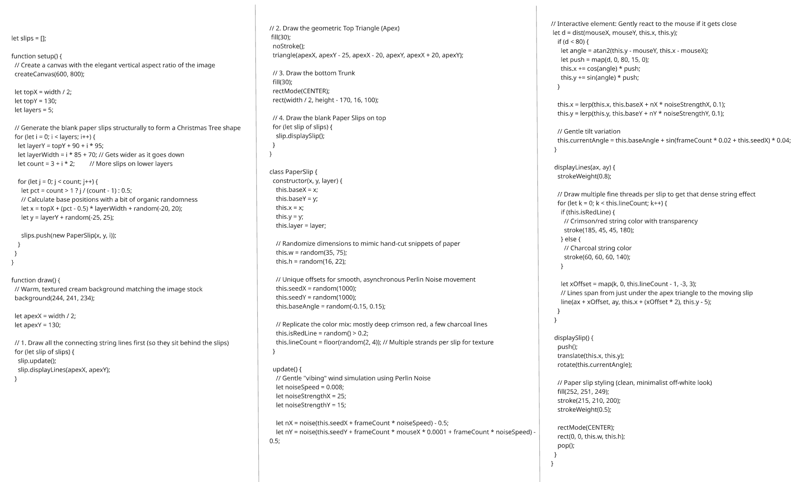

At the same time, I spent a lot of time browsing Xiaohongshu and Pinterest for inspiration. One day, I came across several images of trees covered with hanging wind chimes. Something about these images immediately resonated with me. At that moment, many of the ideas I had been struggling with suddenly came together.

I began thinking about the tree structure I had previously created in p5.js. In that experiment, each string represented one day of food intake and calorie data. Looking at the wind chimes, I realised that each string could become more than just a line of data—it could become a complete wind chime. Instead of visualising food data as abstract information, I could transform it into a collection of personal objects hanging from a tree.
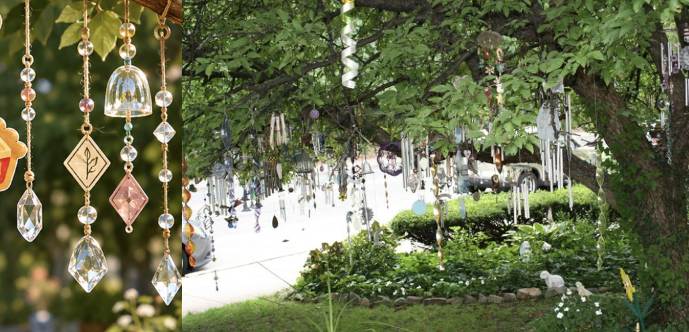
Inspired by this idea, I immediately opened Figma and began sketching the interface. In this new concept, one wind chime represents one day of food intake. The food items attached to the wind chime are selected from a library of food icons that I designed in Figma. Each food item carries its own energy value and contributes to the daily record. Following the feedback from my tutor, the length of the string represents time: shorter strings represent earlier dates, while longer strings represent more recent days.

As I continued developing the concept, I felt that simply displaying food items and notes was not visually engaging enough. Therefore, I introduced a decoration library that allows users to personalise their wind chimes. Users can add decorative elements and sticky notes alongside their food selections, making each wind chime feel unique while still functioning as a record of eating habits.

This was the moment when the project shifted from a calorie-tracking visualisation into what I now call the Wind Chime Tree—a growing collection of daily food memories displayed as personalised wind chimes hanging from a tree.
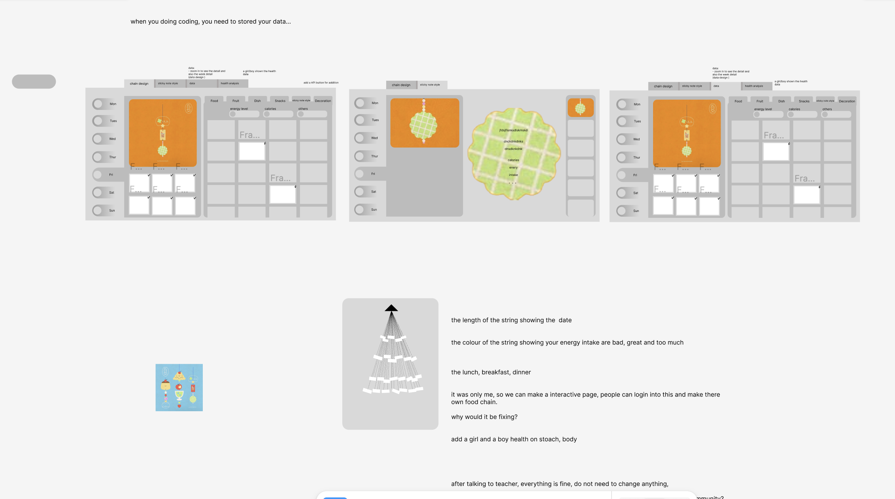

### 2. Progress Report
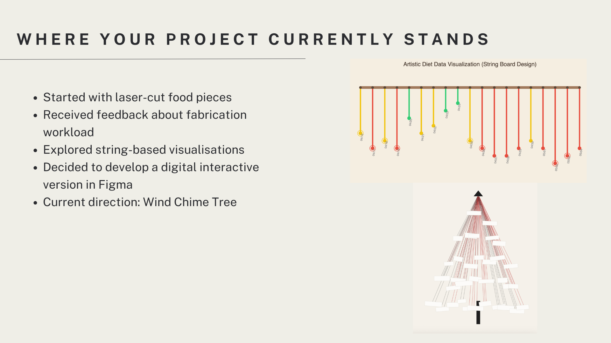
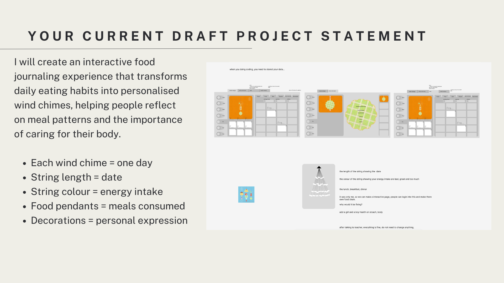
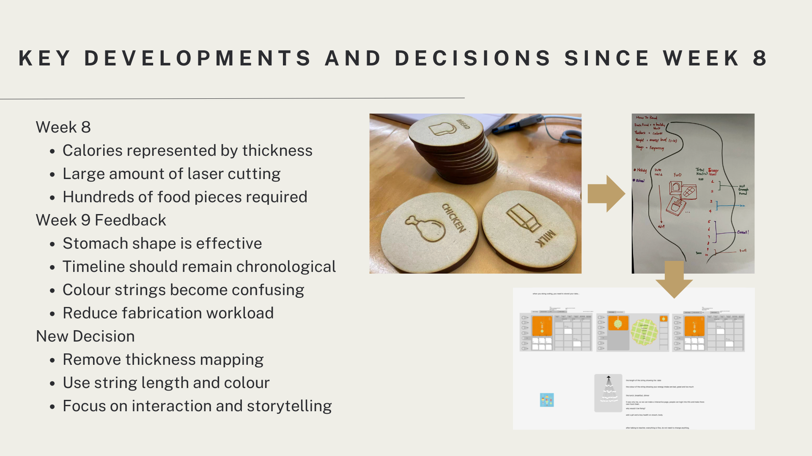
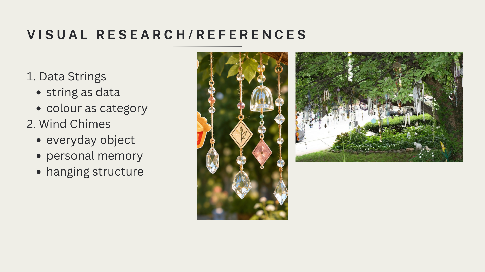
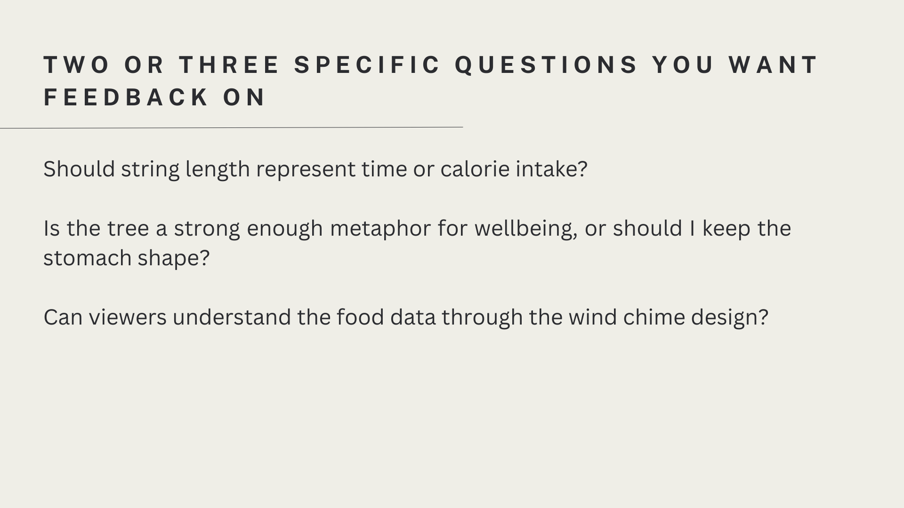

## AI Usage Statement
During Week 9, I used NotebookLM as part of a class activity assigned by the lecturer. In addition, Google Gemini was used to support the development of two p5.js prototypes. Rather than writing all of the code independently, I used Gemini to generate and refine code based on my design ideas and requirements. The AI-assisted code helped me experiment with different visualisation approaches and implement interactive features within p5.js. While AI supported the coding process, all design decisions, visual outcomes, and project directions were determined and evaluated by the me.

Google. (2026a). Gemini [Large language model]. https://gemini.google.com/

Google. (2026b). NotebookLM [Large language model]. https://notebooklm.google.com/
