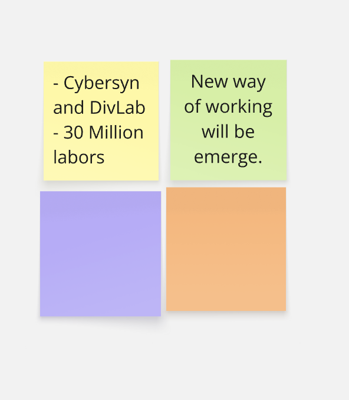
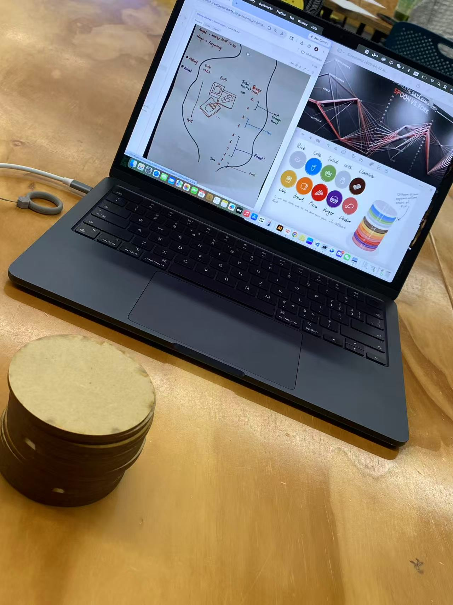
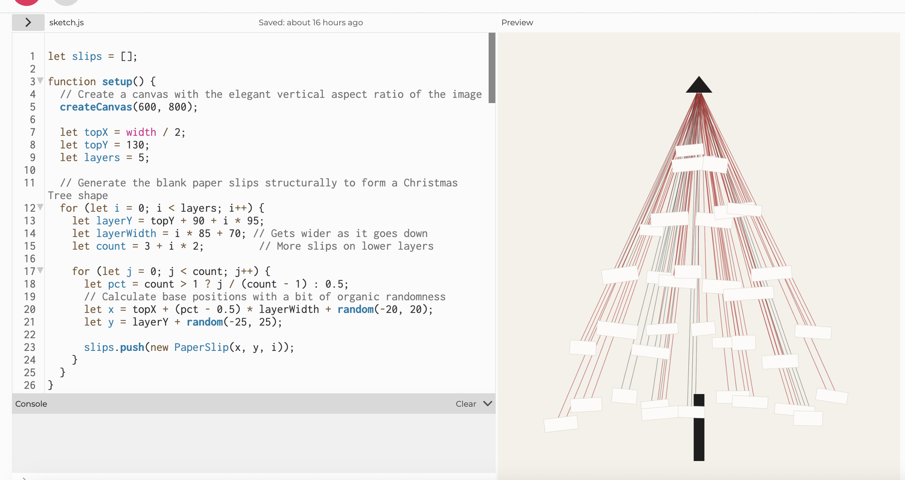
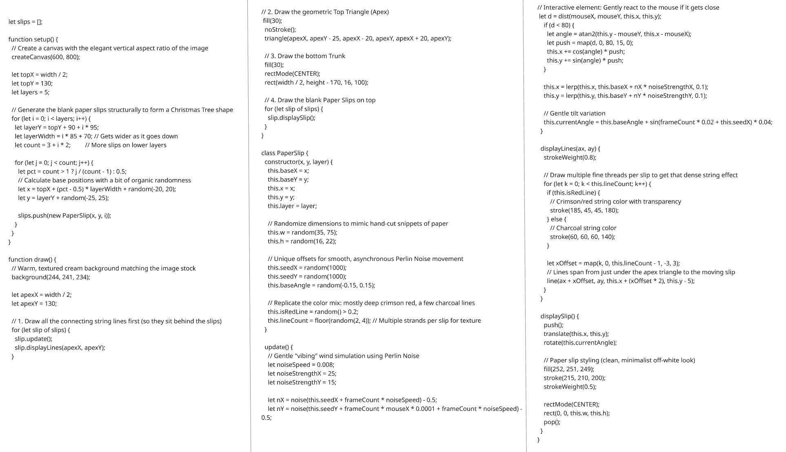

# Week 09

[← Back to Home](../index.md)

## Documentation 

(task brief): As we move into the second phase of the course, which focuses on the Data-Driven Visualisation project, you will continue documenting your work on your GitHub Pages website. This includes recording experiments, technical learning, conceptual development, and engagement with peer critique and exchange activities. Journal entries for weeks 6–12 will be assessed as your process documentation for the project.

It is important to complete all in-class activities (this is still the case if you are absent for a class). Include documentation of these activities in your journal entries, along with the independent study tasks.

- notebook vidoe  (in-class task, shown in the powerpoint in week09 module. a video to show your work)

- you testing idea image. 

week 9 (feedback)
While discussing my idea with the instructor, she pointed out that my current plan did not display the data clearly. Originally, I wanted to disrupt the chronological timeline in order to prioritize showing the energy intake levels through colored lines. However, she advised that the timeline should remain unchanged, which meant my initial ideas—using a section of string and a stomach graphic to show health levels—would not work well.

Instead, she suggested a much better approach: use the length of the string to represent time (where a shorter string represents a specific date) and use the color of the string to indicate the energy intake level. These strings could then be hung on a board. I realized this was an excellent idea, and I will now focus on finding a clearer, more effective way to present my concept based on this feedback.
- 从data string 变成 挂着的方式

<iframe src="https://www.youtube.com/embed/i9QJMwGp3e4" width="560" height="315"> </iframe>

(code 和单独的视频）

（同时看一下vibe coding 一个精美的便利贴装置，可以用的webisite

## Images & Media

*Use the format below to embed images from your assets folder:*

``
`*Your caption here*`

*The text inside the square brackets is alt text (a description for accessibility), not a visible caption. To add a caption, place a line of italic text below the image.*

## AI Usage Statement

*Document any use of AI tools under an AI Usage Statement heading. Explain which tools you used and describe how you used them. Reference any AI-generated content (see [QuickCite](https://auckland.libguides.com/referencing-generative-ai-tools) for guidance).*
