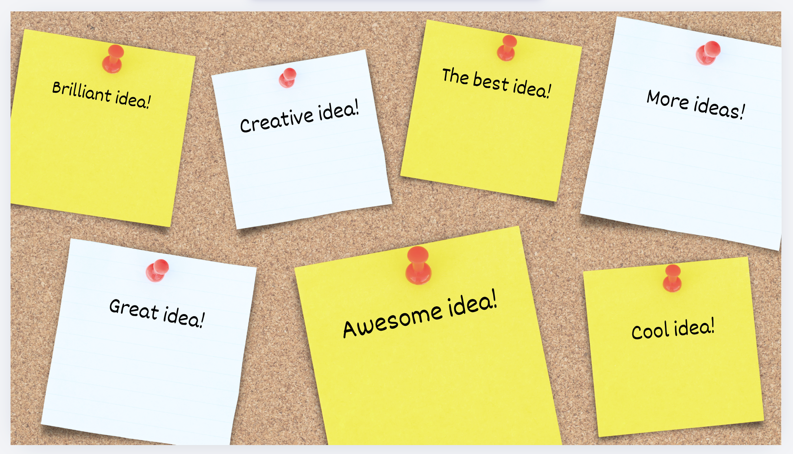
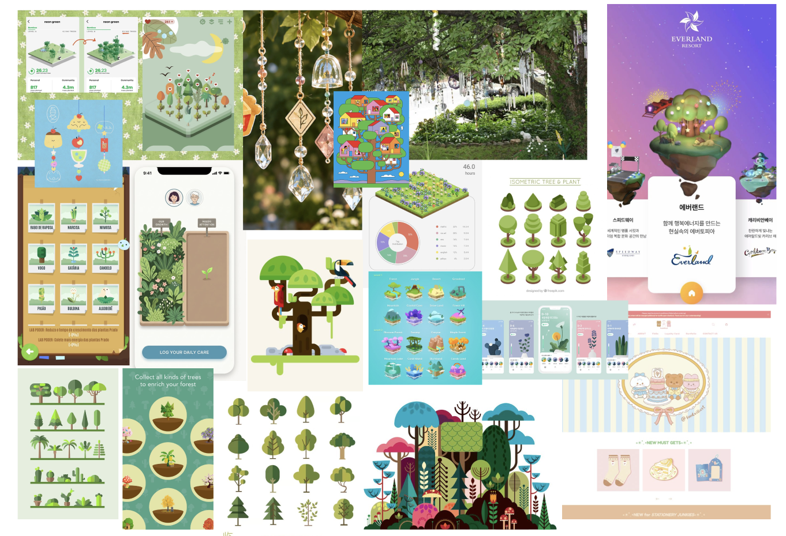
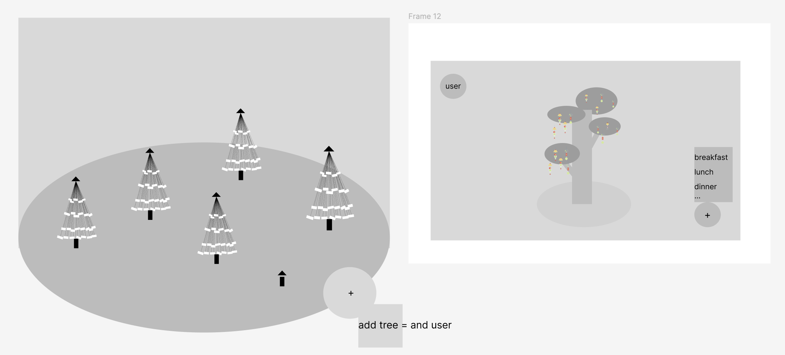
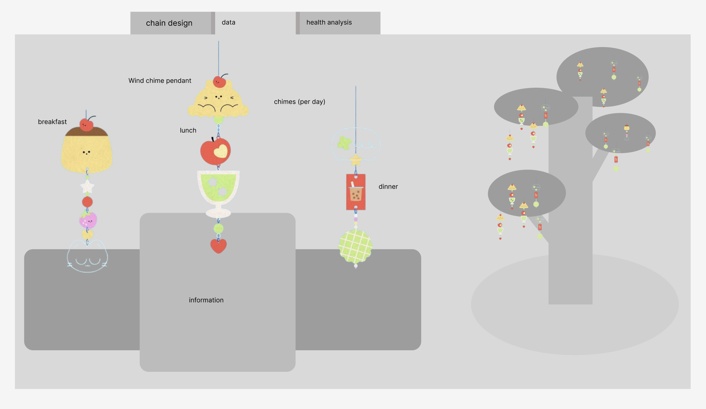
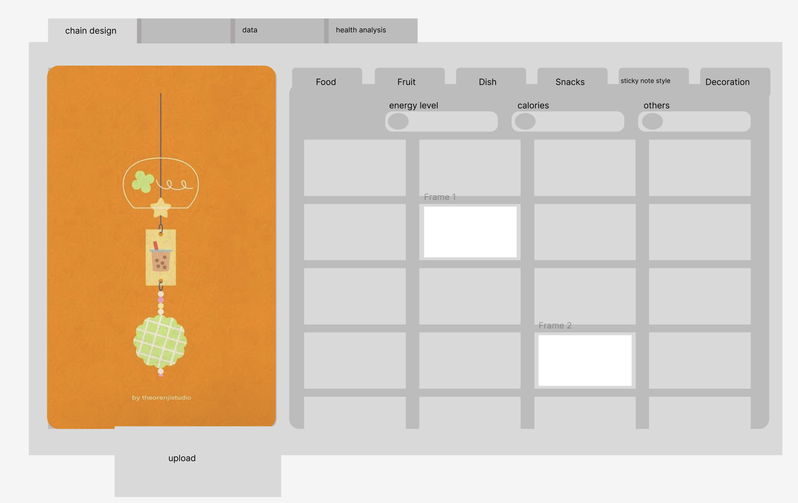
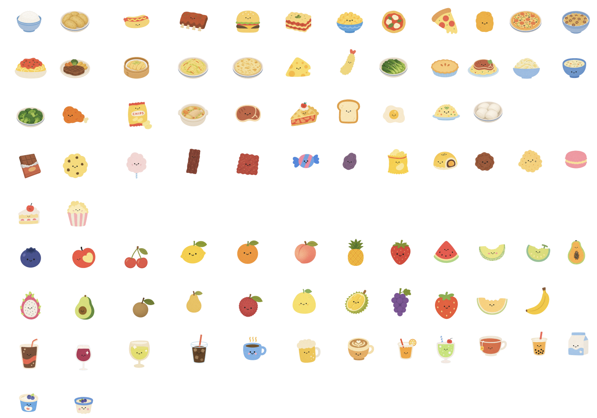
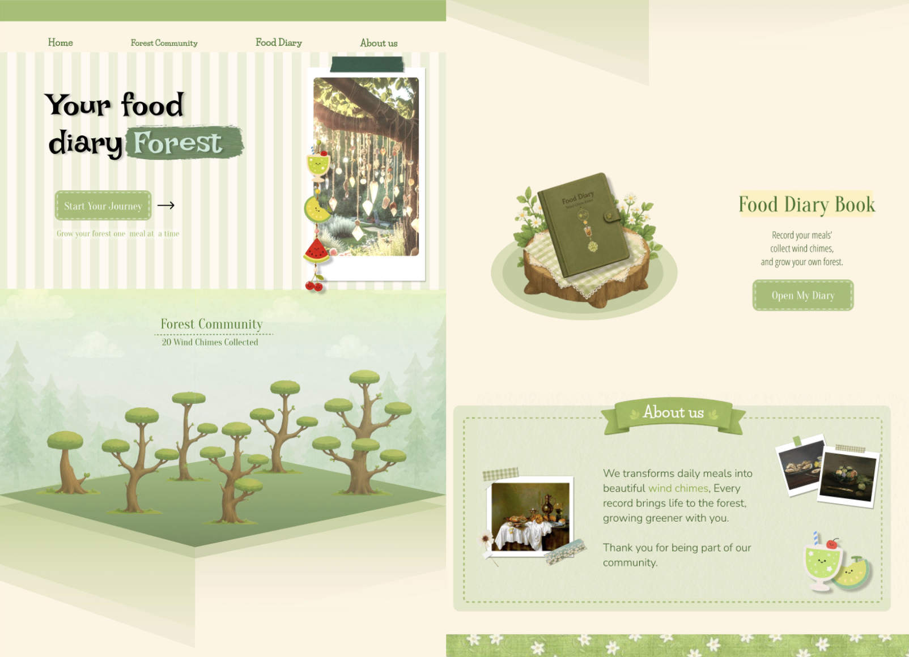

# Week 10

[← Back to Home](../index.md)

## Documentation 

## 1. Progress Report

## ACTION PLAN (下面的是你的写作要回答的问题）

Today, I presented the project images and data concepts to the teacher. The overall feedback was highly positive; the core structure, logic, and visual presentation were approved as they are, with no modifications required. During the review, we discussed the core "why" behind the design choices, specifically focusing on the purpose of the data collection and the necessity of the community feature.

Key Discussion Points & Rationales
The Purpose of the Food Intake Data The teacher questioned the underlying purpose of tracking daily dietary habits. I explained that just as the Apple Watch monitors heart rate/blood pressure for cardiovascular health, or WeChat tracks daily steps to promote physical activity, our app captures food intake to make nutritional habits visible and measurable. It transforms abstract daily eating into concrete, actionable data.

The Purpose of the Community Feature We discussed why a shared space is vital rather than keeping the data strictly private. The community is designed to build an ecosystem of mutual care:
- Shared Care & Accountability: It creates a space where users can observe the data of peers or family members, allowing them to actively look out for each other’s well-being and offer real-time support.
- Analysis & Learning: It enables users to not only track and analyze their own personal health trends over time but also study the data patterns of others to learn healthier lifestyles and best practices.

## Independant study
(table of their data, i only recorded them at 22/05, since im doing a physical 3d data design, so im justing going to use my own data. 
1. 我看到了树上挂风铃，所以灵感来自这里。
2. 随着这一周跟老师的深入交流。老师一直在问我为什么，我要传递的data。我为什么要传递。这使我不得不开始思考，因为我收集的data都来源于我自己，虽然我展示出来我的data，但是这并不能影响更多的人。在交流过程里，我提出了community这个想法，大家get involved in. 但是老师还是觉得不够，不够回答这个问题。所以我又提出来，现在有一些data collection的产品，例如apple watch上的运动量，心率等，这些都是传达了对身体的关注，然后他们能够看到自己的data，也让他们更加积极的保持良好的运动习惯。和老师交流完后，我想到了很多关于data的community，比较有代表性的是wechat上的步数，大家能够看到他们这一天走了多少步，所以拥有的竞争的意识，因为这里呈现了第一第二名。在回家的路上，我想到了很多回答老师这些问题的想法。
3. 在车上快速的整理了想法：现在的人经常因为他们的快节奏生活忘记吃饭，忘记照顾自己的身体。所以我想要创建一个森林community让大家互相照看其他的树。future scenario，我们收集到了不同年龄段的用户群像后，分析所有年龄段的用户，可以发现存在的一些问题。例如忙碌的人或许不会太在意身体健康等等问题，但是形成一个community后，你可以帮忙照看身边重要的人的饮食情况，这样你可以帮助他或者提醒他要好好照顾身体。这个community会用森林的方式呈现，因为树木表达了生命力，经常关注自身饮食的人一定会让树苗长得非常好。
4. 回家后我快速的推翻之前的设计。 我在保留之前的设计的情况下，我把吊坠变成了风铃，一个风铃的吊坠代表了早餐/中餐/晚餐。然后你的小树苗会随着你的记录，慢慢的长大。然后你有一个share space,大家可以建立自己的树苗，然后互相照看对方。

5. 搜索竞品，思考每一个竞品的中心思想传达，每一个component如何影响传达，如何用数据流增强传达体验，然后自己的设计是如何推导出来的。 看这个youtube: https://www.bilibili.com/video/BV1EAQgBXEYh/?spm_id_from=333.337.search-card.all.click&vd_source=100c3d31aac041bf3b15403f227447a5
6. 灵感来源在哪里需要提到。 和姐姐聊了我的想法后，她告诉我她正在用的软件，名为pikmin bloom （步数游戏）。这是一款可以邀请朋友记录步数的app，同时可以与朋友进行互动。

回家后，我开始重新设计，这是我设计的：
## second interation: 

the next improve:

## action plan wrap-up

your development stage, any plan and idea development...

## individual work

## AI Usage Statement

*Document any use of AI tools under an AI Usage Statement heading. Explain which tools you used and describe how you used them. Reference any AI-generated content (see [QuickCite](https://auckland.libguides.com/referencing-generative-ai-tools) for guidance).*
