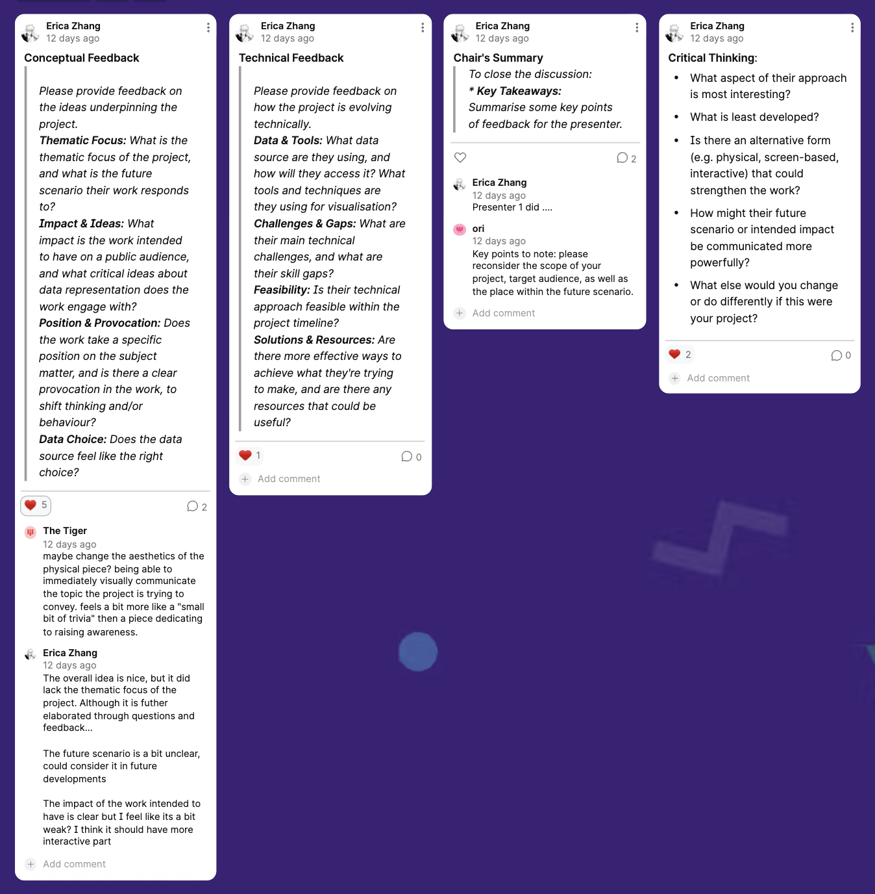
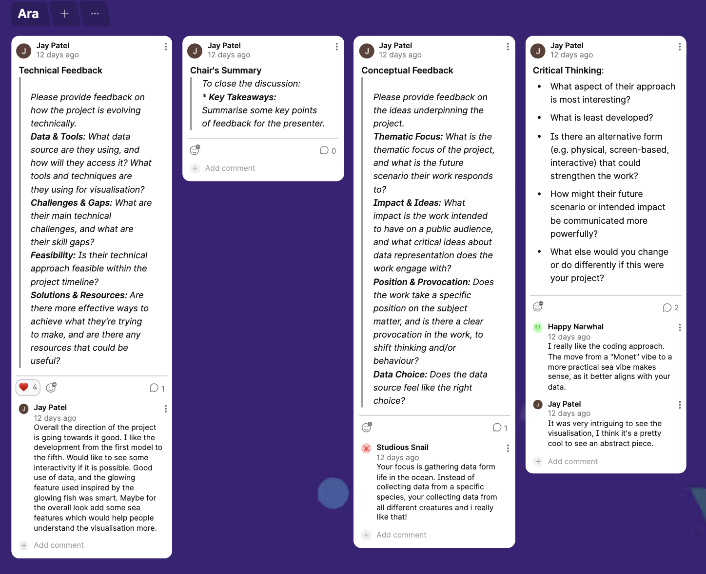
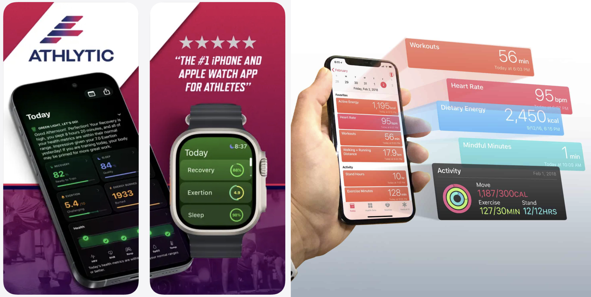
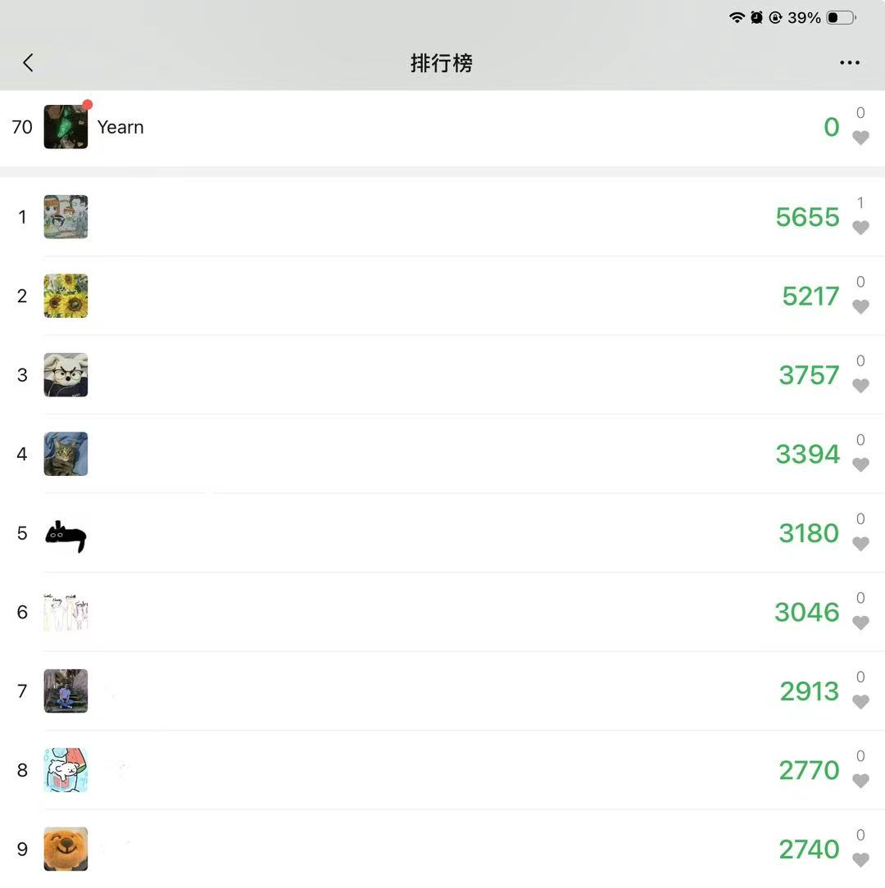
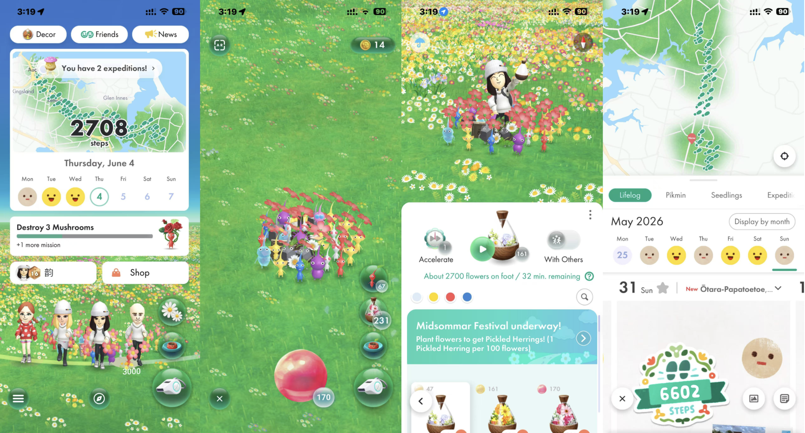

fwe---
layout: default
---

# Week 10

[← Back to Home](../index.md)

## 1. Progress Report

## 2. Gallery Walk

## ACTION PLAN 
The critique session provided valuable feedback that helped me better understand both the strengths and weaknesses of my project. One of the most significant points raised was that the thematic focus of the project is clear. Several classmates commented that using personal food diary data creates a strong connection between everyday eating habits and data visualisation. They felt that transforming food records into visual forms makes the data feel more personal and meaningful rather than simply presenting numbers.

Another important piece of feedback was that audience interaction remains underdeveloped. While the visual concept is becoming clearer, classmates suggested that the project could benefit from more opportunities for viewers to engage with the data. Suggestions included experimenting with different presentation formats and considering how interaction could help communicate the message more effectively.

I also received feedback about the future development of the project. One classmate suggested separating data from different participants rather than combining everything together. This would make comparisons easier to understand and could strengthen the project's ability to communicate different eating behaviours and patterns.

Based on this feedback, I have identified several action points. First, I will continue developing the interactive aspects of the project through Figma rather than p5.js. Second, I will explore ways to clearly separate and compare data from different participants. Third, I will further refine the Wind Chime Tree concept to ensure that viewers can easily understand the relationship between food choices, energy intake, and daily habits. Finally, I will focus on simplifying the visual system so that the project remains engaging while clearly communicating its message about self-care and eating habits.

## Independant study
Today, I presented my project visuals and data concepts to the tutor. The overall feedback was very positive. The core structure, logic, and visual presentation were approved, and the tutor felt that the project was moving in a strong direction. Most of the discussion focused on the "why" behind my design decisions, particularly the purpose of the data collection and the necessity of including a community feature.

One of the first questions the tutor asked was why I was collecting food intake data and what message I wanted to communicate through it. This question made me reflect deeply on the purpose of the project. Although I had collected data from myself, my family members, and a friend, I only recorded their data for a short period (22/05 onwards). My inspiration came from seeing wind chimes hanging from trees, which eventually became the foundation of the Wind Chime Garden concept.

Throughout this week, the tutor repeatedly asked me what data I wanted to communicate and why it was important. This was difficult for me to answer because simply displaying my personal food data does not necessarily create a meaningful impact on others. During our conversations, I proposed the idea of a community where people could become involved with each other's data. However, the tutor felt that this still did not fully answer the question.

As we continued discussing the project, I began looking at existing health-tracking ecosystems such as the Apple Watch, Apple Health, and Athlytic. The Apple Watch collects health information including heart rate, sleep, and physical activity. Apple Health organises and visualises this data, allowing users to monitor trends over time. Athlytic further analyses the collected data and translates it into actionable health insights and recommendations. These products helped me realise that successful health technologies do more than simply collect data. They transform personal information into meaningful feedback that encourages behavioural change. This insight influenced the direction of my project. Rather than simply recording what people eat, I want Wind Chime Garden to help users reflect on their eating habits and become more aware of how they care for their bodies. The community forest extends this idea further by allowing people to support and look after one another through shared food data.

On the way home, I continued thinking about how to answer these questions. I realised that many people today live busy lives and often forget to eat properly or take care of their bodies. This led me to imagine a future scenario where a community forest allows people to look after one another through food data. By collecting data from different age groups, we may begin to identify patterns and issues related to health and lifestyle. Some people may neglect their health because they are busy, but within a community, friends and family members could notice these patterns and remind each other to eat well and take care of themselves. I chose a forest as the visual metaphor because trees represent life, growth, and wellbeing. People who consistently care for their eating habits would gradually grow stronger and healthier trees.

When I arrived home, I quickly reconsidered my previous design. While keeping the core wind chime concept, I changed the structure so that each wind chime represents one day, while individual pendants represent breakfast, lunch, dinner, and additional meals or snacks. As users continue recording their meals, their trees gradually grow larger. I also introduced a shared community space where users can create their own trees and observe the growth of others.

I looked at how different design components influence user engagement and how data flows can strengthen the overall experience. This helped me understand how my own design decisions were evolving and how the different elements of the project support my message. One example that influenced my thinking was the WeChat step-counting feature, which records users' daily walking activity and allows them to compare their results with friends through a ranking system. Although the data itself is relatively simple, the social aspect encourages people to become more active and aware of their habits. I realised that the value of data is not only in personal tracking but also in creating opportunities for motivation, reflection, and community engagement. This observation helped shape the community aspect of my project. Similar to how people can view and compare step counts on WeChat, the Wind Chime Garden allows users to share and observe each other's food diaries through a community forest. Rather than promoting competition, the goal is to encourage mutual care, helping people become more aware of their eating habits while supporting friends and family members in maintaining their wellbeing.

Another source of inspiration came from a conversation with my sister. After discussing my project with her, she introduced me to a mobile application called Pikmin Bloom. The app encourages users to track their daily steps while interacting with friends and growing a virtual environment together. This reinforced my belief that health-related data can become more meaningful when it is connected to a community experience.

This new direction also helped solve an issue raised by one of my classmates about how to distinguish between different users' data. By presenting data as a forest of individual trees rather than combining everything into one visualisation, each person can maintain their own identity while still contributing to a larger community. This approach allows personal stories and collective patterns to coexist within the same system.

I spent several hours browsing Pinterest and collecting visual references related to forests, community-based platforms, trees, and wind chimes. At this stage, I realised that the project needed to move beyond a single data visualisation and become a complete experience. Therefore, I began thinking about how the Wind Chime Garden could function as both a personal food diary and a shared community space.

Building on the first Figma prototype, I developed a new version that introduced a forest community feature. At the same time, I created several quick prototypes to test different layouts and interactions. I also searched online for food illustrations and icons that could be used as the wind chime pendants. However, I was not satisfied with the available resources, so I used ChatGPT to generate a complete set of food assets that better matched the visual style of the project.

As the concept evolved, I started designing the community forest pages in Figma. Rather than presenting food selection as a simple checklist, I transformed it into a diary-like experience where users record what they ate each day. This approach made the process feel more playful, personal, and visually engaging. I also used ChatGPT to generate different tree designs, which I arranged within the community forest page to represent different users.

What surprised me most was how quickly the project began developing once the core idea became clear. For several weeks, I felt stuck and uncertain about the direction of the project. However, after receiving feedback from tutors and classmates, researching references, and rapidly prototyping ideas, everything started to connect. This experience taught me the importance of iteration, feedback, and open discussion within the design process. Often, a single comment or conversation can unlock a completely new direction that would be difficult to discover alone.

More importantly, I experienced a significant shift in my mindset. Earlier in the semester, I felt anxious because I could not see a clear path forward, and many of my ideas seemed unrealistic or too complicated to produce. Now, I feel excited and motivated to continue developing the project. For the first time, I can clearly imagine the final experience, understand the purpose behind the design, and see how each component contributes to the overall concept. This confidence has made the project feel less like a collection of experiments and more like a coherent design system that I genuinely want to bring to life.

In the following week, I will continue refining the design and begin the development phase of the project. My focus will be on improving the user experience of the Wind Chime Garden, expanding the food and tree asset library, and testing how the community forest functions as a space for reflection and mutual care. I also plan to further develop the Figma prototype and explore how different interactions can strengthen the connection between food data, personal wellbeing, and community engagement. Through continued iteration and testing, I hope to transform the current concept into a more complete and meaningful experience.

## Reference： 
Apple. (n.d.). Apple Health. App Store. 
https://apps.apple.com/us/app/apple-health/id1242545199

MyndArc, LLC. (n.d.). Athlytic: AI Fitness Coach. App Store. 
https://apps.apple.com/us/app/athlytic-ai-fitness-coach/id1543571755

Niantic. (n.d.). Pikmin Bloom. 
https://pikminbloom.com/

Pikmin Bloom │ ピクミンブルーム. (2025, October 22). *Ice Pikmin are finally here! - Pikmin Bloom [Nov. 1 Release]* [Video]. YouTube. 
https://www.youtube.com/watch?v=2B_iR0MhihA

## AI Usage Statement
During Week 10, I used ChatGPT to generate a range of visual assets based on my design concepts, including food icons, tree variations, and interface elements. While AI contributed to the creation of visual materials and data organisation, all final design decisions, visual compositions, and interface layouts were determined and completed by the me.

OpenAI. (2026). ChatGPT (GPT-5.5 version) [Large language model]. https://chatgpt.com/
