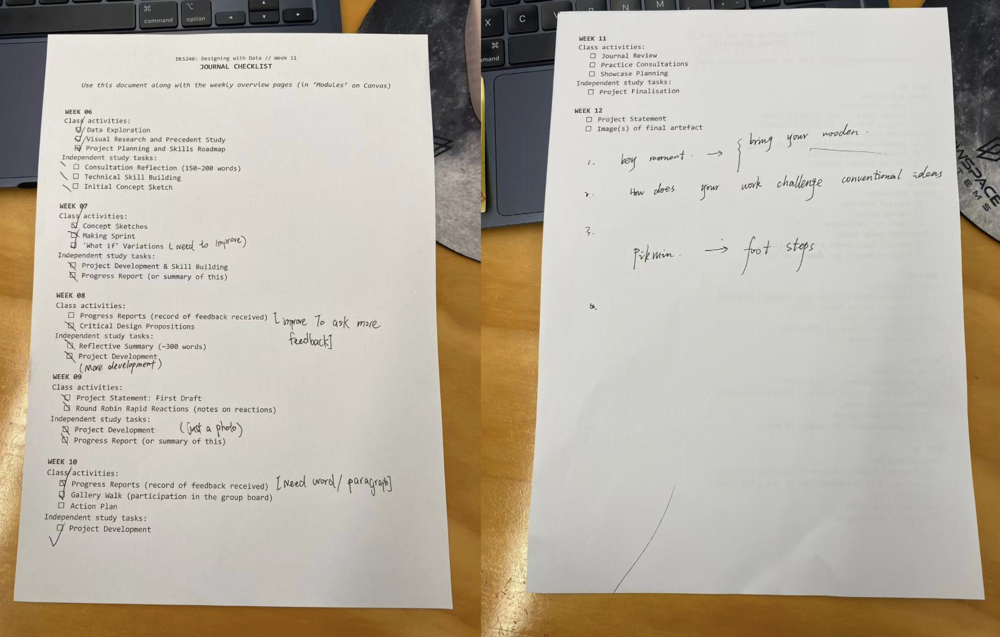

# Week 11

[← Back to Home](../index.md)

## Documentation 
in-class task:
using this check point sheet to check my weekly journey, here's what i check at class (The instructor gave me feedback on the sheet (answering the in-class question shown on the powerpoint):

### add your project's development pictures

## vibe coding & techique

https://www.youtube.com/watch?v=g6AiSVqSqZo

*The text inside the square brackets is alt text (a description for accessibility), not a visible caption. To add a caption, place a line of italic text below the image.*

## AI Usage Statement

*Document any use of AI tools under an AI Usage Statement heading. Explain which tools you used and describe how you used them. Reference any AI-generated content (see [QuickCite](https://auckland.libguides.com/referencing-generative-ai-tools) for guidance).*
