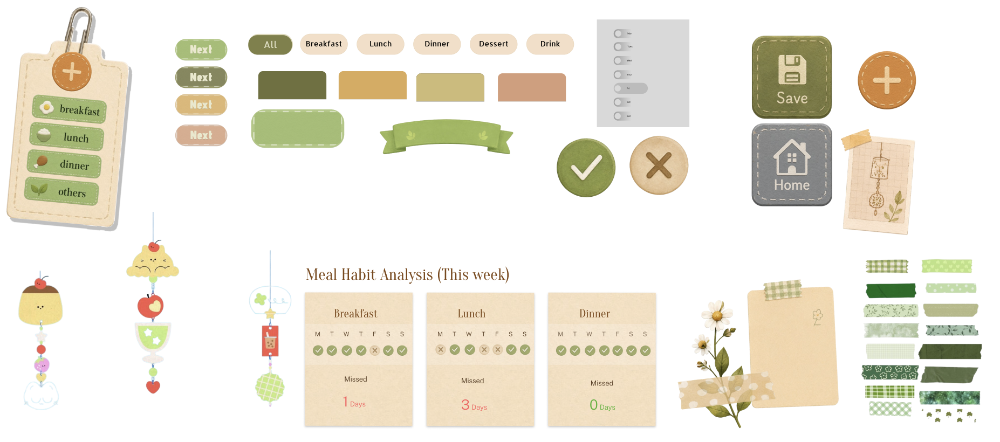
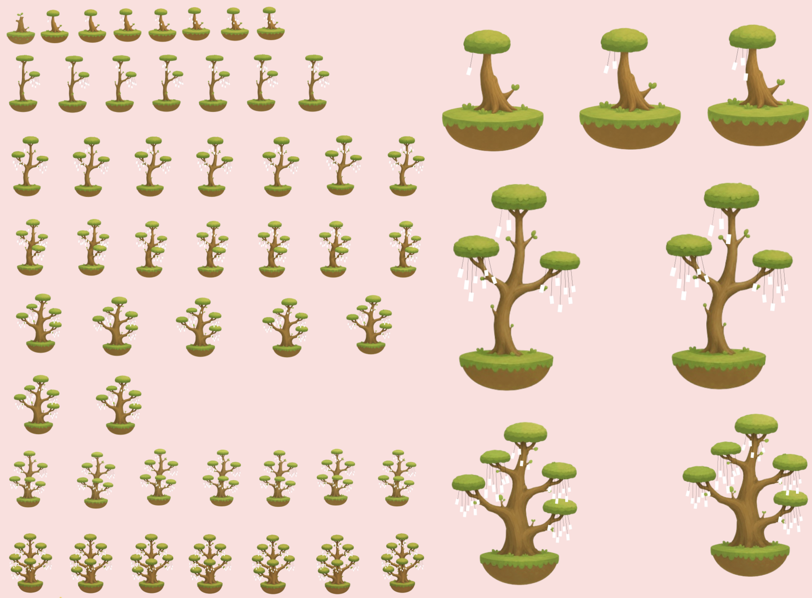
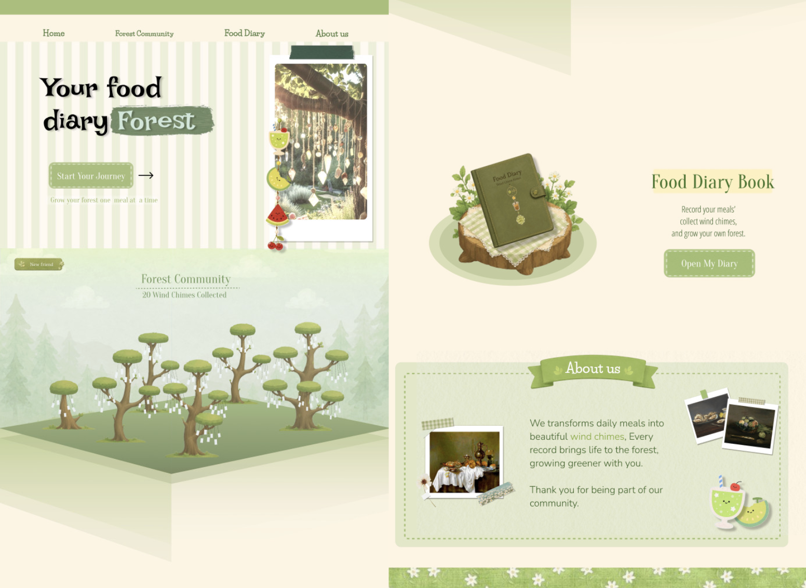
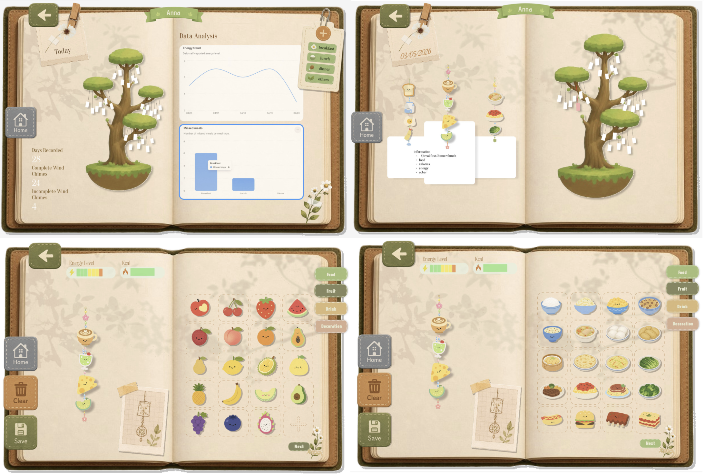
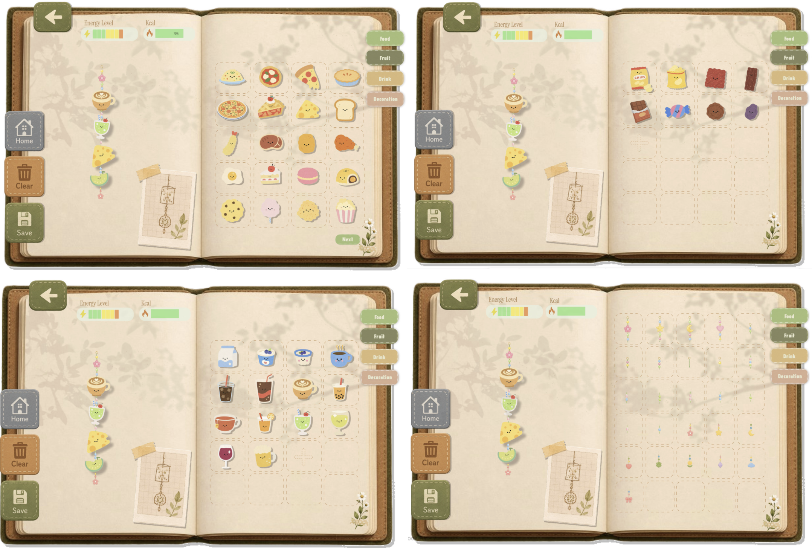
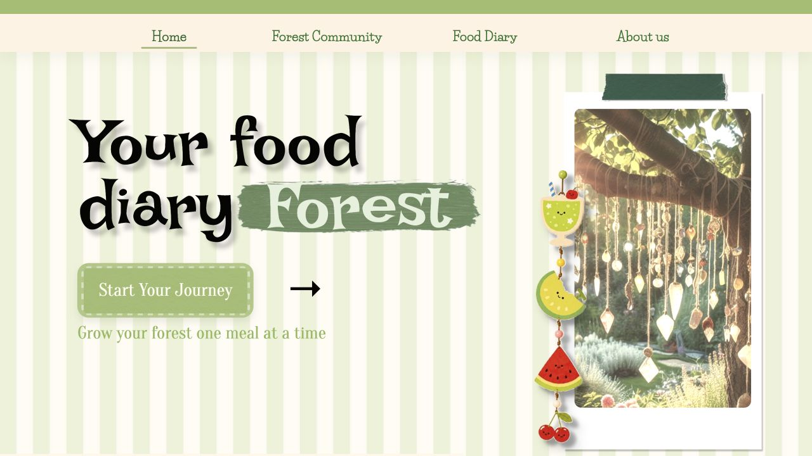
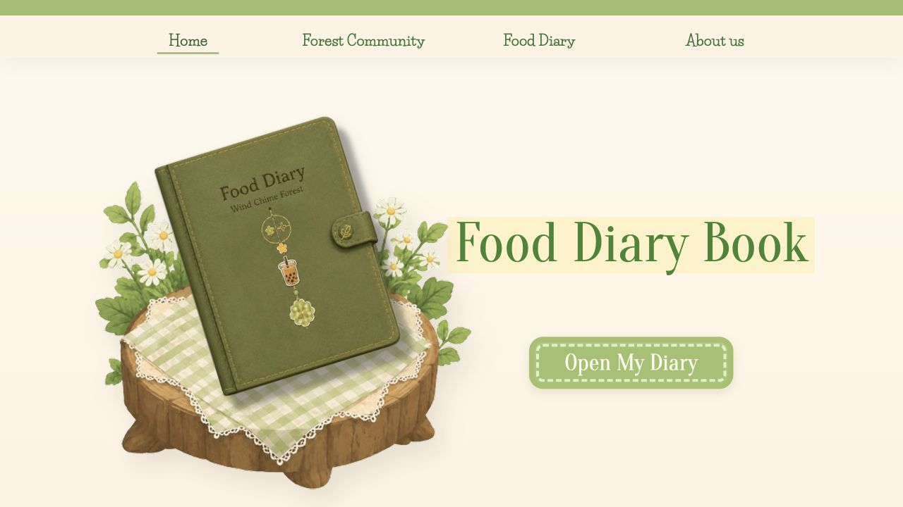
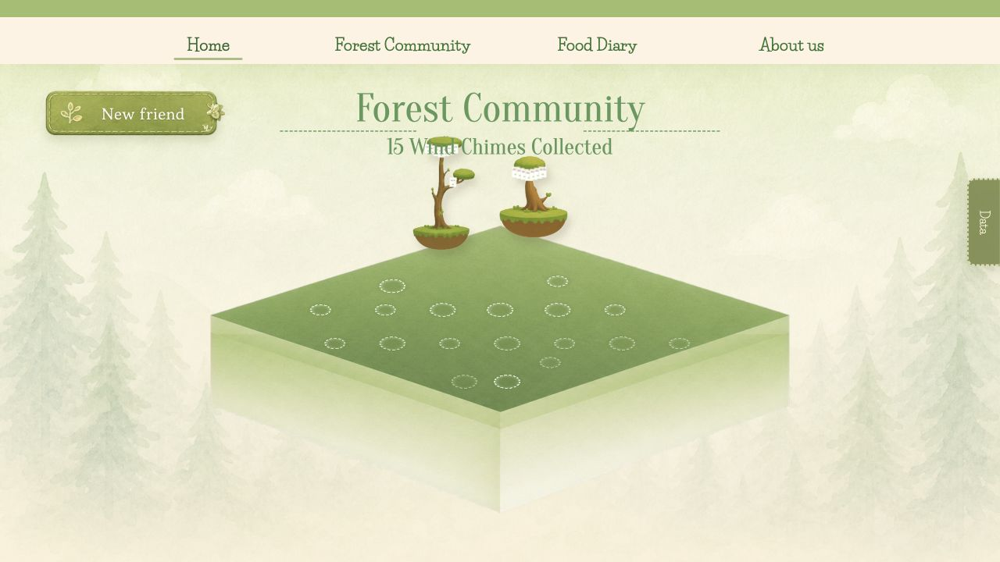
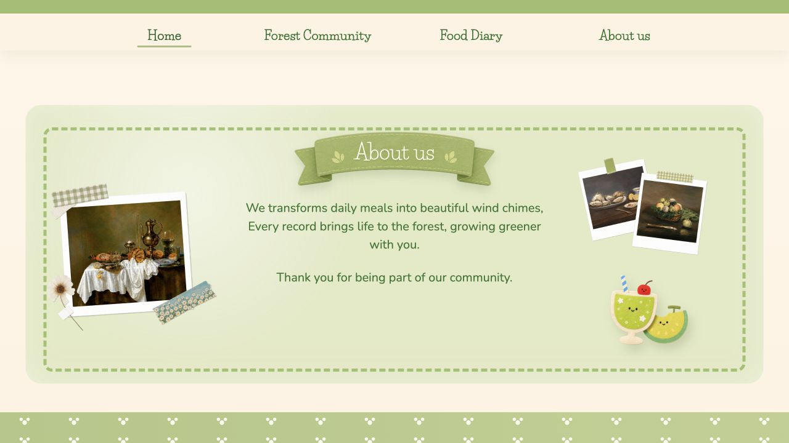

# Week 11

[← Back to Home](../index.md)

## Documentation 
in-class task:
using this check point sheet to check my weekly journey, here's what i check at class (The instructor gave me feedback on the sheet (answering the in-class question shown on the powerpoint):

### add your project's development pictures

## vibe coding & techique

<iframe src="https://www.youtube.com/embed/g6AiSVqSqZo" width="560" height="315"> </iframe>

## Technical Consideration, Decisions, and Learning Process

This week I focused on turning the Figma design for **Your Food Diary Forest** into a working React frontend. The goal was not only to copy the visual style, but also to build the project in a way that can be edited and extended later.

I chose **React + Vite + TypeScript** because the website is made from several reusable page sections: Home, Forest Community, Food Diary, and About. React makes each page easier to manage as a separate component, Vite keeps development fast, and TypeScript helps keep page data and section settings clear.

The project was structured around independent components instead of one large static screenshot. Shared behavior such as navigation, page switching, scrolling, and keyboard control stays in `App`, while each page owns its own layout and assets. This made later visual changes easier because I could adjust one page without breaking the others.

For assets, I used a hybrid workflow. I inspected the Figma design, reused supplied assets where possible, generated missing bitmap elements when needed, and cleaned some images locally to create transparent PNG layers. Separating assets into layers was important. For example, the food diary book and tree stump were split so they can be moved or animated independently in the future.

The page interaction uses a full-screen section model. Instead of normal continuous scrolling, the site moves between pages by changing the active section index. Wheel, keyboard, touch, and navigation clicks all update the same state, which keeps the interaction controlled and consistent.

Responsive layout was another key challenge. I used `svh`, `clamp()`, container-based sizing, and page-local absolute positioning so the design could scale across different screen sizes. Some decorative elements still needed manual tuning, but keeping the CSS page-specific made the adjustments manageable.

One important technical decision was to make future interactive parts data-driven. On the Forest Community page, possible tree positions are stored as placement data instead of being hard-coded one by one. This means a future food diary entry could generate a tree and place it into one of these slots.

Testing was done through repeated build and browser checks. After visual changes, I ran the production build, opened the app, checked fonts and layout positions, and used screenshots or annotations to identify details that needed correction. This helped me understand that visual implementation is a loop: design reference, frontend version, screenshot, annotation, code adjustment, and verification.

Overall, the biggest learning was that asset separation and component structure matter a lot. A single flat image is faster at first, but separate components and image layers make the project much more flexible. The current frontend is now a better base for future features, such as food diary entries generating trees, wind chimes, or other forest objects.

*The text inside the square brackets is alt text (a description for accessibility), not a visible caption. To add a caption, place a line of italic text below the image.*

## AI Usage Statement

*Document any use of AI tools under an AI Usage Statement heading. Explain which tools you used and describe how you used them. Reference any AI-generated content (see [QuickCite](https://auckland.libguides.com/referencing-generative-ai-tools) for guidance).*
