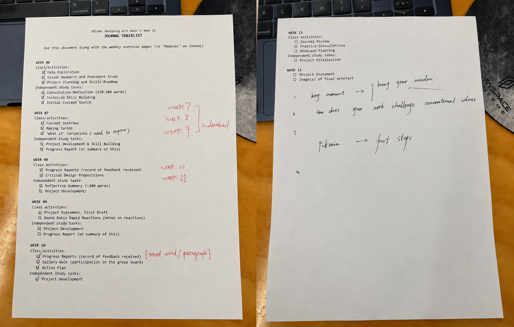

# Week 11

[← Back to Home](../index.md)

## Journal Review:

## 2. Practice Planning
### 1. Tell me about your project's theme.
My project explores the relationship between eating habits, self-care, and wellbeing. I want to investigate how daily food choices and meal patterns can be transformed into a meaningful visual experience. The project encourages people to pay more attention to their eating habits and reminds them to take care of their bodies, especially in busy lifestyles where meals are often skipped or forgotten.

### 2. What is your data source? How did you access or collect it?
The primary data source is my personal food diary. I recorded what I ate for breakfast, lunch, and dinner, along with estimated calorie intake and daily energy levels. I also briefly collected data from my family members and a friend to compare different eating patterns. The data was manually recorded and later organised into a structured dataset for analysis and visualisation.

### 3. Tell me about a key moment in your design journey.
A key moment happened when I decided to move away from my original laser-cut concept. I was struggling with the amount of fabrication required and felt stuck. During a discussion, a tutor suggested using string length to represent time. Later, while looking at images of wind chimes hanging from trees, I suddenly realised that each string could become a wind chime representing a day of food intake. This idea became the foundation of the Wind Chime Garden concept.

### 4. How does your work challenge conventional ideas?
Most health-tracking applications present data through graphs, numbers, and dashboards. My project challenges this approach by transforming food data into a playful and personal visual archive. Instead of focusing on statistics alone, it uses visual storytelling, personalisation, and community interaction to make food data more meaningful and emotionally engaging.

### 5. What impact do you want your visualisation to have?
I want the project to encourage people to reflect on their eating habits and become more aware of how they care for their bodies. Through the community forest, I also hope to create a sense of mutual care where people can observe, support, and learn from one another's habits rather than tracking their health alone.

### 6. What surprised you most in the making process?
The most surprising part was how quickly the project developed once I found the right concept. For several weeks, I felt uncertain and struggled to connect my data with a meaningful visual form. However, after receiving feedback, researching references, and rapidly prototyping ideas, everything suddenly came together. This experience showed me how important iteration, discussion, and feedback are in the design process.

## Showcase Planning
My project will require a large screen or monitor for display, as the final outcome is an interactive Figma prototype. The screen is important because visitors need to clearly see the details of the Wind Chime Garden interface, including the community forest, food selection process, and personalised wind chime creation. The project will require a laptop and a power supply throughout the showcase. An extension cord may also be needed depending on the location of the power outlets.

## Individual study
This week was the final development week for the project. Since I already had some experience with vibe coding and AI-assisted development, building the app felt much easier than I expected. I was able to quickly test ideas and make changes through rapid iteration. My main focus was developing the Wind Chime Garden prototype and refining the community forest, food diary, and wind chime features. As I continued working on the design, I realised how much the project had evolved from my original laser-cut data visualisation concept. The project is now focused on helping people reflect on their eating habits through a playful and interactive experience. This week also showed me the importance of iteration and feedback. Many of the final features came from discussions with tutors and classmates. Moving forward, I will focus on polishing the prototype and preparing it for the final showcase.

Many of the interface elements in the final prototype were created with the assistance of ChatGPT. Components such as the Save button, Home button, and the Breakfast, Lunch, Dinner, and Other category buttons were generated based on my descriptions and visual requirements. This significantly reduced the amount of time needed to design repetitive interface elements and allowed me to focus on developing the overall user experience.

Some decorative elements, including the three wind chimes, scrapbook-style tape stickers, and flower graphics, were sourced from Pinterest. I removed the backgrounds and adapted them to fit the visual style of the project. All remaining layouts, interactions, page structures, visual systems, and the overall Wind Chime Garden concept were designed by myself.

## Vibe coding & techique

<iframe src="https://www.youtube.com/embed/g6AiSVqSqZo" width="560" height="315"> </iframe>

## Technical Consideration, Decisions, and Learning Process

This week I focused on turning the Figma design for **Your Food Diary Forest** into a working React frontend. The goal was not only to copy the visual style, but also to build the project in a way that can be edited and extended later.

I chose **React + Vite + TypeScript** because the website is made from several reusable page sections: Home, Forest Community, Food Diary, and About. React makes each page easier to manage as a separate component, Vite keeps development fast, and TypeScript helps keep page data and section settings clear.

The project was structured around independent components instead of one large static screenshot. Shared behavior such as navigation, page switching, scrolling, and keyboard control stays in `App`, while each page owns its own layout and assets. This made later visual changes easier because I could adjust one page without breaking the others.

For assets, I used a hybrid workflow. I inspected the Figma design, reused supplied assets where possible, generated missing bitmap elements when needed, and cleaned some images locally to create transparent PNG layers. Separating assets into layers was important. For example, the food diary book and tree stump were split so they can be moved or animated independently in the future.

The page interaction uses a full-screen section model. Instead of normal continuous scrolling, the site moves between pages by changing the active section index. Wheel, keyboard, touch, and navigation clicks all update the same state, which keeps the interaction controlled and consistent.

Responsive layout was another key challenge. I used `svh`, `clamp()`, container-based sizing, and page-local absolute positioning so the design could scale across different screen sizes. Some decorative elements still needed manual tuning, but keeping the CSS page-specific made the adjustments manageable.

One important technical decision was to make future interactive parts data-driven. On the Forest Community page, possible tree positions are stored as placement data instead of being hard-coded one by one. This means a future food diary entry could generate a tree and place it into one of these slots.

Testing was done through repeated build and browser checks. After visual changes, I ran the production build, opened the app, checked fonts and layout positions, and used screenshots or annotations to identify details that needed correction. This helped me understand that visual implementation is a loop: design reference, frontend version, screenshot, annotation, code adjustment, and verification.

Overall, the biggest learning was that asset separation and component structure matter a lot. A single flat image is faster at first, but separate components and image layers make the project much more flexible. The current frontend is now a better base for future features, such as food diary entries generating trees, wind chimes, or other forest objects.

## Reference

## AI Usage Statement

*Document any use of AI tools under an AI Usage Statement heading. Explain which tools you used and describe how you used them. Reference any AI-generated content (see [QuickCite](https://auckland.libguides.com/referencing-generative-ai-tools) for guidance).*
